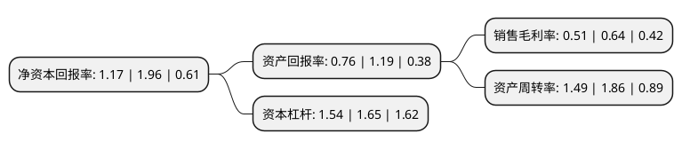

> 本页面由自动化程序生成于 2022年5月20日 01:27
> 内容可能存在错误，如有bug请提交issue至：https://github.com/Eroleice/doc-pi/issues
{.is-warning}

# 上市公司基本情况

## 基本资料

上海智汇未来医疗服务股份有限公司（以下简称“未来股份”）成立于1999年12月30日，上海市。于2002年10月31日在上交所主板上市。

未来股份注册资本51,606.572万元，主营业务为开采铁矿石，加工，销售铁精粉。对采矿业的投资，开发，管理。以下是详细信息：

- 公司名称: 上海智汇未来医疗服务股份有限公司
- 股票代码: 600532.SH
- 所在地: 上海 - 上海市
- 成立日期: 1999年12月30日
- 注册资本: 51,606.572万元
- 法定代表人: 俞倪荣
- 主营业务: 主营业务为开采铁矿石，加工，销售铁精粉对采矿业的投资，开发，管理
- 公司官网: www.hdky600532.com/www.wlylcn.com
- 公司介绍: 公司是我国A股上海证券交易所主板上市公司。公司主要经营范围包括：对采矿业的投资、开发、管理，矿产品销售，矿山设备及备件备品的购销，采选矿技术服务，供应链管理，金属材料及制品、橡塑制品、化工原料及产品(除危险化学品、监控化学品、民用爆炸物品、易制毒化学品、烟花爆竹)、机电设备及配件、食用农产品的销售，货物运输代理，仓储、装卸服务(除危险品)，煤炭经营，从事货物及技术的进出口业务。

## 股东及高管情况

上市公司第一大股东为上海晶茨投资管理有限公司，持股135,142,264股，占比26.19%，**疑似为**上市公司实际控制人。

截至2021年12月28日，上市公司的前十大股东中，共有3名自然人股东，7名机构股东，其中5%以上大股东共有4名。上市公司前十大股东明细如下：

> 未能通过持股比例判定出上市公司实际控制人（持股30%以上）
> 可能存在通过间接持股、联合持股、协议控制等方式拥有实际控制权的主体，具体请参考上市公司定期公告！
{.is-warning}

> 截至2021年12月28日，上市公司前十大股东信息如下：

| 股东名称 | 持股数量（股） | 持股比例 |
| --- | --- | --- |
| 上海晶茨投资管理有限公司 | 135,142,264 | 26.19% |
| 上海晶茨投资管理有限公司 | 135,142,264 | 26.19% |
| 上海晶茨投资管理有限公司 | 135,142,264 | 26.19% |
| 上海澜邝化工有限公司 | 31,015,101 | 6.0099% |
| 上海澜邝化工有限公司 | 25,803,227 | 5% |
| 济南高新控股集团有限公司 | 25,367,500 | 4.92% |
| 崔之火 | 10,824,744 | 2.1% |
| 周东 | 10,656,400 | 2.06% |
| 上海中能企业发展(集团)有限公司 | 9,651,887 | 1.87% |
| 朱秀芬 | 8,860,000 | 1.72% |

## 杜邦分析

> 数据列示周期：2020年 | 2019年 | 2018年
{.is-info}

上市公司的净资产收益率在近一年有所下降，下降幅度为-40.31%，其变化情况分解如下：
- 上市公司的销售毛利率在近一年下降了-20.31%，可能是生产效率的下降、商品原材料价格上涨或商品价格的下跌所致。
- 上市公司的资产周转率在近一年下降了-19.89%，可能是源自于更慢的销售回款或库存管理效果下降。
- 上市公司的财务杠杆比率在近一年下降了-6.67%，可能是减少负债降低财务费用。

