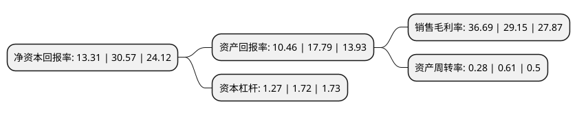

> 本页面由自动化程序生成于 2022年5月20日 01:32
> 内容可能存在错误，如有bug请提交issue至：https://github.com/Eroleice/doc-pi/issues
{.is-warning}

# 上市公司基本情况

## 基本资料

北京昭衍新药研究中心股份有限公司（以下简称“昭衍新药”）成立于1998年02月25日，北京市。于2017年08月25日在上交所主板上市。

昭衍新药注册资本38,124.649万元，公司主营业务为以药物非临床安全性评价服务为主的药物临床前研究服务和实验动物及附属产品的销售业务。业务范围包括非临床安全性评价服务，药效学研究服务，动物药代动力学研究服务。以下是详细信息：

- 公司名称: 北京昭衍新药研究中心股份有限公司
- 股票代码: 603127.SH
- 所在地: 北京 - 北京市
- 成立日期: 1998年02月25日
- 注册资本: 38,124.649万元
- 法定代表人: 冯宇霞
- 主营业务: 公司主营业务为以药物非临床安全性评价服务为主的药物临床前研究服务和实验动物及附属产品的销售业务业务范围包括非临床安全性评价服务，药效学研究服务，动物药代动力学研究服务
- 公司官网: www.joinn-lab.com
- 公司介绍: 公司主要从事以药物非临床安全性评价服务为主的药物临床前研究服务和实验动物及附属产品的销售业务；其中，药物临床前研究服务为公司的核心业务，业务范围包括非临床安全性评价服务、药效学研究服务、动物药代动力学研究服务等。公司还从事少量药物筛选等药物发现研究、临床试验、政策法规咨询等医药研发外包服务及相关的技术服务。

## 股东及高管情况

上市公司第一大股东为冯宇霞，持股89,702,855股，占比23.51%，**疑似为**上市公司实际控制人。

截至2022年03月31日，上市公司的前十大股东中，共有5名自然人股东，3个产品账户，2个海外主体，其中5%以上大股东共有3名。上市公司前十大股东明细如下：

> 未能通过持股比例判定出上市公司实际控制人（持股30%以上）
> 可能存在通过间接持股、联合持股、协议控制等方式拥有实际控制权的主体，具体请参考上市公司定期公告！
{.is-warning}

> 截至2022年03月31日，上市公司前十大股东信息如下：

| 股东名称 | 持股数量（股） | 持股比例 |
| --- | --- | --- |
| 冯宇霞 | 89,702,855 | 23.51% |
| 香港中央结算(代理人)有限公司 | 60,704,278 | 15.91% |
| 周志文 | 48,396,580 | 12.68% |
| 顾晓磊 | 18,472,397 | 4.84% |
| 中国工商银行股份有限公司-中欧医疗健康混合型证券投资基金 | 15,675,143 | 4.11% |
| 顾美芳 | 13,871,330 | 3.63% |
| 左从林 | 13,208,445 | 3.46% |
| 全国社保基金四零六组合 | 7,929,429 | 2.08% |
| 香港中央结算有限公司(陆股通) | 6,257,309 | 1.64% |
| 中国建设银行股份有限公司-工银瑞信前沿医疗股票型证券投资基金 | 2,700,000 | 0.71% |

## 利润表分析

上市公司2021年总收入为15.16亿元，净利润为5.56亿元，实现盈利。

## 杜邦分析

> 数据列示周期：2021年 | 2020年 | 2019年
{.is-info}

上市公司的净资产收益率在近一年有所下降，下降幅度为-56.46%，其变化情况分解如下：
- 上市公司的销售毛利率在近一年上升了25.87%，可能是生产效率的提升、商品原材料价格下跌或商品价格的上涨所致。
- 上市公司的资产周转率在近一年下降了-54.1%，可能是源自于更慢的销售回款或库存管理效果下降。
- 上市公司的财务杠杆比率在近一年下降了-26.16%，可能是减少负债降低财务费用。

