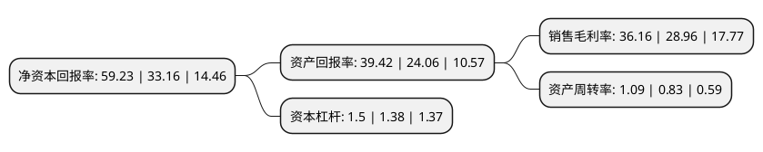

> 本页面由自动化程序生成于 2022年5月20日 01:34
> 内容可能存在错误，如有bug请提交issue至：https://github.com/Eroleice/doc-pi/issues
{.is-warning}

# 上市公司基本情况

## 基本资料

北京万泰生物药业股份有限公司（以下简称“万泰生物”）成立于1991年04月24日，北京市。于2020年04月29日在上交所主板上市。

万泰生物注册资本60,704万元，主营业务:主要从事体外诊断试剂，体外诊断仪器与疫苗的研发，生产及销售。主要产品:体外诊断仪器及体外诊断试剂。以下是详细信息：

- 公司名称: 北京万泰生物药业股份有限公司
- 股票代码: 603392.SH
- 所在地: 北京 - 北京市
- 成立日期: 1991年04月24日
- 注册资本: 60,704万元
- 法定代表人: 邱子欣
- 主营业务: 主营业务:主要从事体外诊断试剂，体外诊断仪器与疫苗的研发，生产及销售主要产品:体外诊断仪器及体外诊断试剂
- 公司官网: www.ystwt.com
- 公司介绍: 公司是从事体外诊断试剂、体外诊断仪器与疫苗的研发、生产及销售的高新技术企业。公司坚持自主创新、坚持关键技术攻关，走产学研结合道路，现已发展成为我国创新免疫诊断产品和创新疫苗研发的领先企业。经过多年的研发投入、持续的技术创新，截至本招股说明书签署之日，公司在体外诊断试剂领域已取得了5项新药证书、9项药品注册证书、300余项国家医疗器械注册证、16项欧盟CE认证、2项世界卫生组织PQ认证，还获得150个国家二级标准物质证书。公司体外诊断领域的核心产品有艾滋病毒诊断试剂，病毒性肝炎系列诊断试剂，全自动管式化学发光免疫分析系统等。公司先后完成国家科技重大专项、863计划重大项目，荣获国家技术发明二等奖、国家科技进步二等奖、中国发明专利金奖、国家高技术产业化示范工程十年成就奖等重要国家级科技创新奖励。

## 股东及高管情况

上市公司第一大股东为养生堂有限公司，持股345,905,000股，占比56.98%，为上市公司实际控制人。

截至2022年03月31日，上市公司的前十大股东中，共有8名自然人股东，1名机构股东，1个海外主体，其中5%以上大股东共有2名。上市公司前十大股东明细如下：

> 截至2022年03月31日，上市公司前十大股东信息如下：

| 股东名称 | 持股数量（股） | 持股比例 |
| --- | --- | --- |
| 养生堂有限公司 | 345,905,000 | 56.98% |
| 钟睒睒 | 110,320,725 | 18.17% |
| 邱子欣 | 22,092,000 | 3.64% |
| 邱明静 | 9,661,700 | 1.59% |
| 香港中央结算有限公司(陆股通) | 9,198,007 | 1.52% |
| 丁京林 | 7,829,585 | 1.29% |
| 洪维岗 | 7,735,377 | 1.27% |
| 李莎燕 | 4,780,080 | 0.79% |
| 严迎娣 | 4,172,600 | 0.69% |
| 李益民 | 3,736,915 | 0.62% |

## 利润表分析

上市公司2021年总收入为57.5亿元，净利润为20.79亿元，实现盈利。

## 杜邦分析

> 数据列示周期：2021年 | 2020年 | 2019年
{.is-info}

上市公司的净资产收益率在近一年有所上升，上升幅度为78.62%，其变化情况分解如下：
- 上市公司的销售毛利率在近一年上升了24.86%，可能是生产效率的提升、商品原材料价格下跌或商品价格的上涨所致。
- 上市公司的资产周转率在近一年上升了31.33%，可能是源自于更快的销售回款或库存管理效果提升。
- 上市公司的财务杠杆比率在近一年上升了8.7%，可能是增加负债扩大生产规模。

