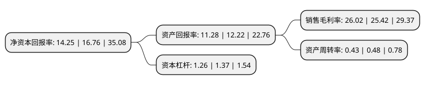

> 本页面由自动化程序生成于 2022年5月20日 01:34
> 内容可能存在错误，如有bug请提交issue至：https://github.com/Eroleice/doc-pi/issues
{.is-warning}

# 上市公司基本情况

## 基本资料

郑州安图生物工程股份有限公司（以下简称“安图生物”）成立于1999年09月15日，郑州市。于2016年09月01日在上交所主板上市。

安图生物注册资本58,627.226万元，主营业务:专业从事体外诊断试剂及仪器的研发，生产和销售，形成了以免疫诊断产品为主，微生物检测产品特色发展的格局。主要产品有:免疫诊断产品，微生物检测产品，仪器。以下是详细信息：

- 公司名称: 郑州安图生物工程股份有限公司
- 股票代码: 603658.SH
- 所在地: 河南 - 郑州市
- 成立日期: 1999年09月15日
- 注册资本: 58,627.226万元
- 法定代表人: 杨增利
- 主营业务: 主营业务:专业从事体外诊断试剂及仪器的研发，生产和销售，形成了以免疫诊断产品为主，微生物检测产品特色发展的格局主要产品有:免疫诊断产品，微生物检测产品，仪器
- 公司官网: www.autobio.com.cn
- 公司介绍: 公司专业从事体外诊断试剂及仪器的研发、生产和销售，形成了以免疫诊断产品为主、微生物检测产品特色发展的格局，产品品种齐全，能够为临床诊断提供一系列解决方案。公司产品覆盖了传染病到非传染病应用的各类检测领域，能够满足终端用户的各种检测需求。试剂品种涉及传染病、肿瘤、生殖内分泌、甲状腺功能、肝纤维化、优生优育、糖尿病、高血压、心脏病、泌尿生殖道疾病、呼吸系统疾病以及细菌分离培养、鉴定和药敏分析等多个检测领域。此外，公司一直坚持试剂与仪器共同发展，相关配套仪器涵盖了化学发光免疫分析仪、酶标仪、洗板机、联检分析仪、全自动样品处理系统、全自动化学发光测定仪等产品。公司努力打造具有全球品牌影响力的体外诊断产业公司。

## 股东及高管情况

上市公司第一大股东为郑州安图实业集团股份有限公司，持股323,904,473股，占比55.25%，为上市公司实际控制人。

截至2022年03月31日，上市公司的前十大股东中，共有3名机构股东，4个产品账户，3个海外主体，其中5%以上大股东共有3名。上市公司前十大股东明细如下：

> 截至2022年03月31日，上市公司前十大股东信息如下：

| 股东名称 | 持股数量（股） | 持股比例 |
| --- | --- | --- |
| 郑州安图实业集团股份有限公司 | 323,904,473 | 55.25% |
| Z&F INTERNATIONAL TRADING LIMITED | 76,892,416 | 13.12% |
| 香港中央结算有限公司(陆股通) | 37,403,218 | 6.38% |
| UBS   AG | 10,024,781 | 1.71% |
| 华夏人寿保险股份有限公司-自有资金 | 3,540,390 | 0.6% |
| 中国银行股份有限公司-招商国证生物医药指数分级证券投资基金 | 3,096,185 | 0.53% |
| 中国工商银行股份有限公司-景顺长城新兴成长混合型证券投资基金 | 3,042,630 | 0.52% |
| 中国银行股份有限公司-华宝中证医疗交易型开放式指数证券投资基金 | 2,848,541 | 0.49% |
| 华融瑞通股权投资管理有限公司 | 2,150,039 | 0.37% |
| 首域投资管理(英国)有限公司-首域中国A股基金 | 1,998,844 | 0.34% |

## 利润表分析

上市公司2021年总收入为37.65亿元，净利润为9.79亿元，实现盈利。

## 杜邦分析

> 数据列示周期：2021年 | 2020年 | 2019年
{.is-info}

上市公司的净资产收益率在近一年有所下降，下降幅度为-14.98%，其变化情况分解如下：
- 上市公司的销售毛利率在近一年上升了2.36%，可能是生产效率的提升、商品原材料价格下跌或商品价格的上涨所致。
- 上市公司的资产周转率在近一年下降了-10.42%，可能是源自于更慢的销售回款或库存管理效果下降。
- 上市公司的财务杠杆比率在近一年下降了-8.03%，可能是减少负债降低财务费用。

