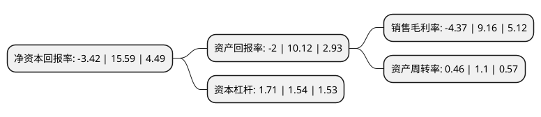

> 本页面由自动化程序生成于 2022年5月20日 01:35
> 内容可能存在错误，如有bug请提交issue至：https://github.com/Eroleice/doc-pi/issues
{.is-warning}

# 上市公司基本情况

## 基本资料

江苏南方卫材医药股份有限公司（以下简称“南卫股份”）成立于1990年07月04日，常州市。于2017年08月07日在上交所主板上市。

南卫股份注册资本29,247.4万元，公司主要从事透皮产品，医用胶布胶带及绷带，运动保护产品，急救包，护理产品等产品的研发，生产和销售。目前已形成创可贴，贴膏剂，医用胶布胶带，敷贴，运动保护产品，急救包，护理产品等产品系列。以下是详细信息：

- 公司名称: 江苏南方卫材医药股份有限公司
- 股票代码: 603880.SH
- 所在地: 江苏 - 常州市
- 成立日期: 1990年07月04日
- 注册资本: 29,247.4万元
- 法定代表人: 李平
- 主营业务: 公司主要从事透皮产品，医用胶布胶带及绷带，运动保护产品，急救包，护理产品等产品的研发，生产和销售目前已形成创可贴，贴膏剂，医用胶布胶带，敷贴，运动保护产品，急救包，护理产品等产品系列
- 公司官网: www.nfmedical.com.cn
- 公司介绍: 公司系由南卫有限于2012年10月31日整体变更设立的股份有限公司。本公司多年来高度重视产品研发，在粘胶吹孔技术、高吸水率水凝胶制备技术、双面微孔膏药贴技术、EVA膜创口贴技术、浸药技术、丝绸透气胶带打孔技术、万向精密调整模架技术、水胶体敷料技术等方面在行业内居于领先水平。本公司通过了符合国家《药品生产质量管理规范》要求的GMP认证，取得了药品生产许可证和医疗器械生产许可证，是少数同时兼有GMP证书、药品生产许可证及医疗器械生产许可证的公司之一。公司多项产品先后通过了TüVSüD的ISO13485质量体系认证和CE认证；医用胶带等产品通过了美国FDA注册；公司通过了日本厚生劳动省的认证。公司坚持“以市场为导向、以质量求生存、以产品求发展”的质量宗旨，通过不断完善内部管理机制，加强产品质量的检验和监督，致力于为境内外客户提供优质可靠的医用敷料产品。

## 股东及高管情况

上市公司第一大股东为李平，持股127,025,048股，占比43.4312%，为上市公司实际控制人。

截至2022年04月11日，上市公司的前十大股东中，共有9名自然人股东，1名机构股东，其中5%以上大股东共有5名。上市公司前十大股东明细如下：

> 截至2022年04月11日，上市公司前十大股东信息如下：

| 股东名称 | 持股数量（股） | 持股比例 |
| --- | --- | --- |
| 李平 | 127,025,048 | 43.4312% |
| 李平 | 127,025,048 | 43.43% |
| 徐东 | 17,598,780 | 6.02% |
| 徐东 | 17,518,780 | 5.9899% |
| 苏州蓝盈创业投资合伙企业(有限合伙) | 17,136,605 | 5.8592% |
| 李永平 | 9,639,338 | 3.3% |
| 李永中 | 8,080,029 | 2.76% |
| 王旋 | 4,400,000 | 1.5% |
| 李菲 | 4,365,660 | 1.49% |
| 徐凯华 | 1,910,076 | 0.65% |

## 杜邦分析

> 数据列示周期：2021年 | 2020年 | 2019年
{.is-info}

上市公司的净资产收益率在近一年有所下降，下降幅度为-121.94%，其变化情况分解如下：
- 上市公司的销售毛利率在近一年下降了-147.71%，可能是生产效率的下降、商品原材料价格上涨或商品价格的下跌所致。
- 上市公司的资产周转率在近一年下降了-58.18%，可能是源自于更慢的销售回款或库存管理效果下降。
- 上市公司的财务杠杆比率在近一年上升了11.04%，可能是增加负债扩大生产规模。

