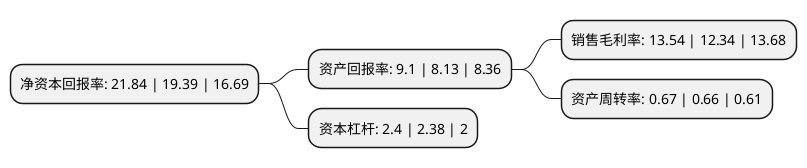

> 本页面由自动化程序生成于 2022年5月20日 01:36
> 内容可能存在错误，如有bug请提交issue至：https://github.com/Eroleice/doc-pi/issues
{.is-warning}

# 上市公司基本情况

## 基本资料

上海康德莱企业发展集团股份有限公司（以下简称“康德莱”）成立于1998年07月01日，上海市。于2016年11月21日在上交所主板上市。

康德莱注册资本44,156.9万元，主要产品:医用穿刺针和医用穿刺器械。主要业务:医用穿刺器械的研发，生产和销售。以下是详细信息：

- 公司名称: 上海康德莱企业发展集团股份有限公司
- 股票代码: 603987.SH
- 所在地: 上海 - 上海市
- 成立日期: 1998年07月01日
- 注册资本: 44,156.9万元
- 法定代表人: 张维鑫
- 主营业务: 主要产品:医用穿刺针和医用穿刺器械医用穿刺器械的研发，生产和销售
- 公司官网: www.kdlchina.cn
- 公司介绍: 公司作为国内医用穿刺器械领域的龙头企业，以“创造KDL品牌，取信亿万用户”的质量方针为准则，自创立起专注于为国内外客户提供医用穿刺器械、医用高分子耗材、介入类耗材、医疗器械市场供应链等领域的医疗产品和服务，是国内少数拥有医用穿刺器械完整产业链的生产企业之一。公司坚持产品质量第一的原则，严格按照国家法规要求建立了完备的医疗器械质量管理体系，并在研发、生产、检验、销售、售后服务等各环节实施严格的质量控制。公司连续多年被上海市评为“上海制造业企业百强”，产品先后荣获“上海名牌产品”、“上海市著名商标”以及国家行业协会的优秀品牌产品等称号。同时与国内多所知名高等院校建立了良好的合作关系，先后被认定为上海市“高新技术企业”、“专利示范企业”、“上海市科技小巨人企业”和上海市“市级技术研发中心”。

## 股东及高管情况

上市公司第一大股东为上海康德莱控股集团有限公司，持股143,509,010股，占比32.5%，为上市公司实际控制人。

截至2022年05月10日，上市公司的前十大股东中，共有3名机构股东，7个产品账户，其中5%以上大股东共有2名。上市公司前十大股东明细如下：

> 截至2022年05月10日，上市公司前十大股东信息如下：

| 股东名称 | 持股数量（股） | 持股比例 |
| --- | --- | --- |
| 上海康德莱控股集团有限公司 | 143,509,010 | 32.5% |
| 上海康德莱控股集团有限公司-上海康德莱控股集团有限公司2021年非公开发行可交换公司债券质押专户 | 32,000,000 | 7.25% |
| 中国建设银行股份有限公司-国泰大健康股票型证券投资基金 | 15,664,943 | 3.55% |
| 中国工商银行股份有限公司-海富通改革驱动灵活配置混合型证券投资基金 | 11,828,569 | 2.68% |
| 交通银行股份有限公司-国泰金鹰增长灵活配置混合型证券投资基金 | 8,397,970 | 1.9% |
| 中国建设银行股份有限公司-国泰医药健康股票型证券投资基金 | 5,664,745 | 1.28% |
| 国泰基金-人民人寿-传统普保产品-国泰基金-中国人民人寿保险股份有限公司A股混合类组合单一资产管理计划 | 5,467,388 | 1.24% |
| 招商银行股份有限公司-汇添富医疗服务灵活配置混合型证券投资基金 | 5,309,172 | 1.2% |
| 上海利捷企业投资有限公司 | 4,952,200 | 1.12% |
| 中国银行股份有限公司-富国周期优势混合型证券投资基金 | 4,828,035 | 1.09% |

## 利润表分析

上市公司2021年总收入为30.97亿元，净利润为4.19亿元，实现盈利。

## 杜邦分析

> 数据列示周期：2021年 | 2020年 | 2019年
{.is-info}

上市公司的净资产收益率在近一年有所上升，上升幅度为12.64%，其变化情况分解如下：
- 上市公司的销售毛利率在近一年上升了9.72%，可能是生产效率的提升、商品原材料价格下跌或商品价格的上涨所致。
- 上市公司的资产周转率在近一年上升了1.52%，可能是源自于更快的销售回款或库存管理效果提升。
- 上市公司的财务杠杆比率在近一年上升了0.84%，可能是增加负债扩大生产规模。

