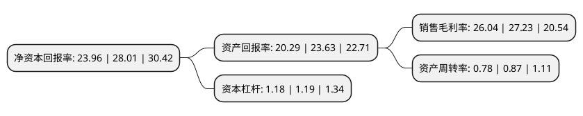

> 本页面由自动化程序生成于 2022年5月20日 01:37
> 内容可能存在错误，如有bug请提交issue至：https://github.com/Eroleice/doc-pi/issues
{.is-warning}

# 上市公司基本情况

## 基本资料

浙江拱东医疗器械股份有限公司（以下简称“拱东医疗”）成立于2009年08月17日，台州市。于2020年09月16日在上交所主板上市。

拱东医疗注册资本11,262.712万元，公司主营业务为一次性医用耗材的研发，生产和销售，主要产品可分为真空采血系统，实验检测类耗材，体液采集类耗材，医用护理类耗材和药品包装材料等类型，产品广泛应用于临床诊断和护理，科研检测，药品包装等领域。以下是详细信息：

- 公司名称: 浙江拱东医疗器械股份有限公司
- 股票代码: 605369.SH
- 所在地: 浙江 - 台州市
- 成立日期: 2009年08月17日
- 注册资本: 11,262.712万元
- 法定代表人: 施慧勇
- 主营业务: 公司主营业务为一次性医用耗材的研发，生产和销售，主要产品可分为真空采血系统，实验检测类耗材，体液采集类耗材，医用护理类耗材和药品包装材料等类型，产品广泛应用于临床诊断和护理，科研检测，药品包装等领域
- 公司官网: www.chinagongdong.com
- 公司介绍: 公司是一家主营业务为一次性医用耗材的研发、生产和销售的高新技术企业,主要产品可分为真空采血系统、实验检测类耗材、体液采集类耗材、医用护理类耗材和药品包装材料等类型，产品广泛应用于临床诊断和护理、科研检测、药品包装等领域。经过三十余年的发展，公司不断拓展产品线的深度和广度，目前已成为国内一次性医用耗材生产企业中产品种类较齐全、规模较大的企业。公司一贯重视产品的研发和技术创新，不断提升生产技术和工艺水平，并建立了完善的质量控制体系。公司已通过ISO13485质量管理体系认证，“实验室及医用耗材”被浙江省质量技术监督局认定为浙江名牌产品，多个产品通过欧盟CE认证，一次性使用无菌阴道扩张器及锐器收集桶产品获得美国FDA(510K)许可。凭借高质量的产品和优质的服务，公司获得了境内、外客户的认可，产品覆盖了境内绝大部分省市，并销往北美洲、亚洲、南美洲、非洲、欧洲的多个国家和地区。

## 股东及高管情况

上市公司第一大股东为施慧勇，持股58,800,000股，占比52.21%，为上市公司实际控制人。

截至2022年03月31日，上市公司的前十大股东中，共有6名自然人股东，1名机构股东，3个产品账户，其中5%以上大股东共有3名。上市公司前十大股东明细如下：

> 截至2022年03月31日，上市公司前十大股东信息如下：

| 股东名称 | 持股数量（股） | 持股比例 |
| --- | --- | --- |
| 施慧勇 | 58,800,000 | 52.21% |
| 施依贝 | 8,400,000 | 7.46% |
| 台州金驰投资管理合伙企业(有限合伙) | 8,400,000 | 7.46% |
| 中国工商银行股份有限公司-中欧医疗健康混合型证券投资基金 | 2,909,613 | 2.58% |
| 施何云 | 2,520,000 | 2.24% |
| 施荷芳 | 2,520,000 | 2.24% |
| 施梅花 | 2,520,000 | 2.24% |
| 中国建设银行股份有限公司-汇添富创新医药主题混合型证券投资基金 | 1,417,758 | 1.26% |
| 中国工商银行股份有限公司-汇添富医药保健混合型证券投资基金 | 1,083,620 | 0.96% |
| 钟卫峰 | 865,200 | 0.77% |

## 利润表分析

上市公司2021年总收入为11.94亿元，净利润为3.1亿元，实现盈利。

## 杜邦分析

> 数据列示周期：2021年 | 2020年 | 2019年
{.is-info}

上市公司的净资产收益率在近一年有所下降，下降幅度为-14.46%，其变化情况分解如下：
- 上市公司的销售毛利率在近一年下降了-4.37%，可能是生产效率的下降、商品原材料价格上涨或商品价格的下跌所致。
- 上市公司的资产周转率在近一年下降了-10.34%，可能是源自于更慢的销售回款或库存管理效果下降。
- 上市公司的财务杠杆比率在近一年下降了-0.84%，可能是减少负债降低财务费用。

