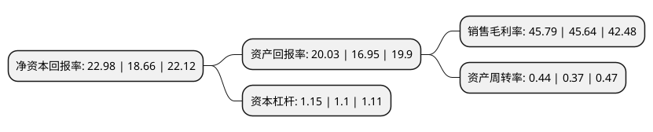

> 本页面由自动化程序生成于 2022年5月20日 01:37
> 内容可能存在错误，如有bug请提交issue至：https://github.com/Eroleice/doc-pi/issues
{.is-warning}

# 上市公司基本情况

## 基本资料

上海微创心脉医疗科技(集团)股份有限公司（以下简称“心脉医疗”）成立于2012年08月17日，上海市。于2019年07月22日在上交所科创板上市。

心脉医疗注册资本7,197.815万元，主营业务:主动脉及外周血管介入医疗器械的研发，生产和销售。以下是详细信息：

- 公司名称: 上海微创心脉医疗科技(集团)股份有限公司
- 股票代码: 688016.SH
- 所在地: 上海 - 上海市
- 成立日期: 2012年08月17日
- 注册资本: 7,197.815万元
- 法定代表人: 彭博
- 主营业务: 主营业务:主动脉及外周血管介入医疗器械的研发，生产和销售
- 公司官网: www.endovastec.com
- 公司介绍: 公司是一家从事主动脉及外周血管介入医疗器械研发,生产及销售的高新技术企业,在主动脉介入医疗器械领域，公司是国内产品种类齐全、规模领先、具有市场竞争力的企业之一，公司在该领域的主要产品为主动脉覆膜支架系统；在外周血管介入医疗器械领域，公司深耕多年，目前拥有外周血管支架系统、外周血管球囊扩张导管等产品；公司掌握了涉及治疗主动脉疾病的覆膜支架系统的核心设计及制造技术，成功开发出第一个国产腹主动脉覆膜支架、国内唯一获批上市的可在胸主动脉夹层外科手术中使用的术中支架系统,根据弗若斯特沙利文公司的相关研究报告，按照产品应用的手术量排名，公司在我国主动脉血管介入医疗器械市场份额排名第二，国产品牌中市场份额排名第一。

## 股东及高管情况

上市公司第一大股东为MicroPort Endovascular CHINA Corp. Limited，持股32,902,933股，占比45.71%，为上市公司实际控制人。

截至2022年03月31日，上市公司的前十大股东中，共有2名机构股东，7个产品账户，1个海外主体，其中5%以上大股东共有1名。上市公司前十大股东明细如下：

> 截至2022年03月31日，上市公司前十大股东信息如下：

| 股东名称 | 持股数量（股） | 持股比例 |
| --- | --- | --- |
| MicroPort Endovascular CHINA Corp. Limited | 32,902,933 | 45.71% |
| 上海虹皓投资管理中心(有限合伙) | 2,879,252 | 4% |
| 全国社保基金四零六组合 | 1,719,805 | 2.39% |
| 招商银行股份有限公司-华夏上证科创板50成份交易型开放式指数证券投资基金 | 1,062,991 | 1.48% |
| 中国建设银行股份有限公司-工银瑞信前沿医疗股票型证券投资基金 | 889,917 | 1.24% |
| 上海联新投资咨询有限公司-上海联木企业管理中心(有限合伙) | 823,630 | 1.14% |
| 中国农业银行股份有限公司-嘉实新兴产业股票型证券投资基金 | 753,252 | 1.05% |
| 中国农业银行股份有限公司-嘉实核心成长混合型证券投资基金 | 700,394 | 0.97% |
| 中国建设银行股份有限公司-富国转型机遇混合型证券投资基金 | 610,986 | 0.85% |
| 招商银行股份有限公司-嘉实远见精选两年持有期混合型证券投资基金 | 567,100 | 0.79% |

## 利润表分析

上市公司2021年总收入为6.84亿元，净利润为3.13亿元，实现盈利。

## 杜邦分析

> 数据列示周期：2021年 | 2020年 | 2019年
{.is-info}

上市公司的净资产收益率在近一年有所上升，上升幅度为23.15%，其变化情况分解如下：
- 上市公司的销售毛利率在近一年上升了0.33%，可能是生产效率的提升、商品原材料价格下跌或商品价格的上涨所致。
- 上市公司的资产周转率在近一年上升了18.92%，可能是源自于更快的销售回款或库存管理效果提升。
- 上市公司的财务杠杆比率在近一年上升了4.55%，可能是增加负债扩大生产规模。

