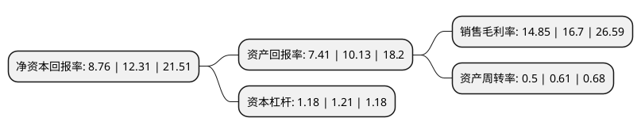

> 本页面由自动化程序生成于 2022年5月20日 01:37
> 内容可能存在错误，如有bug请提交issue至：https://github.com/Eroleice/doc-pi/issues
{.is-warning}

# 上市公司基本情况

## 基本资料

爱威科技股份有限公司（以下简称“爱威科技”）成立于2000年03月16日，长沙市。于2021年06月16日在上交所科创板上市。

爱威科技注册资本6,800万元，医疗临床检验和诊断仪器及配套试剂，试纸产品的研发，设计，制造，销售和服务以下是详细信息：

- 公司名称: 爱威科技股份有限公司
- 股票代码: 688067.SH
- 所在地: 湖南 - 长沙市
- 成立日期: 2000年03月16日
- 注册资本: 6,800万元
- 法定代表人: 丁建文
- 主营业务: 医疗临床检验和诊断仪器及配套试剂，试纸产品的研发，设计，制造，销售和服务
- 公司官网: www.c-ave.com
- 公司介绍: 公司是一家主营业务为医疗临床检验分析仪器及配套体外诊断试剂、医用耗材的研发、生产、销售和服务一体化的高新技术企业。公司基于原创性医学显微镜自动镜检技术开发出全自动尿液、粪便、生殖道分泌物等多系列医学检验仪器，并自主开发生产与检验仪器相配套的试剂及医用耗材产品，产品广泛应用于各类医疗卫生机构检验科室。公司的检验仪器已在国内外累计实现装机万余台，累计在全国千余家医院实现了终端装机,公司近20年来一直专注于“基于人工智能和机器视觉技术的医学显微镜形态学检验自动化”关键共性技术的原创性研究和相关产品开发，将“机器视觉技术”应用到医疗卫生机构临床病理标本的形态学检验中，填补了医学显微镜形态学检验自动化领域的技术空白，在技术路线、技术方法和技术水平上属于原始创新。

## 股东及高管情况

上市公司第一大股东为丁建文，持股25,997,143股，占比38.23%，为上市公司实际控制人。

截至2022年03月31日，上市公司的前十大股东中，共有5名自然人股东，3名机构股东，2个产品账户，其中5%以上大股东共有2名。上市公司前十大股东明细如下：

> 截至2022年03月31日，上市公司前十大股东信息如下：

| 股东名称 | 持股数量（股） | 持股比例 |
| --- | --- | --- |
| 丁建文 | 25,997,143 | 38.23% |
| 周丰良 | 4,714,286 | 6.93% |
| 赣州超逸投资中心(有限合伙) | 3,060,000 | 4.5% |
| 琚新军 | 2,571,429 | 3.78% |
| 宁波梅山保税港区宝顶赢股权投资合伙企业(有限合伙) | 2,464,000 | 3.62% |
| 林常青 | 2,142,857 | 3.15% |
| 长沙先导硅谷天堂企业管理咨询有限公司 | 2,000,143 | 2.94% |
| 湖南红钻创业投资私募基金管理股份有限公司 | 1,800,000 | 2.65% |
| 华泰证券资管-招商银行-华泰爱威科技家园1号科创板员工持股集合资产管理计划 | 1,700,000 | 2.5% |
| 邓朝晖 | 1,198,714 | 1.76% |

## 利润表分析

上市公司2021年总收入为2.1亿元，净利润为0.31亿元，实现盈利。

## 杜邦分析

> 数据列示周期：2021年 | 2020年 | 2019年
{.is-info}

上市公司的净资产收益率在近一年有所下降，下降幅度为-28.84%，其变化情况分解如下：
- 上市公司的销售毛利率在近一年下降了-11.08%，可能是生产效率的下降、商品原材料价格上涨或商品价格的下跌所致。
- 上市公司的资产周转率在近一年下降了-18.03%，可能是源自于更慢的销售回款或库存管理效果下降。
- 上市公司的财务杠杆比率在近一年下降了-2.48%，可能是减少负债降低财务费用。

