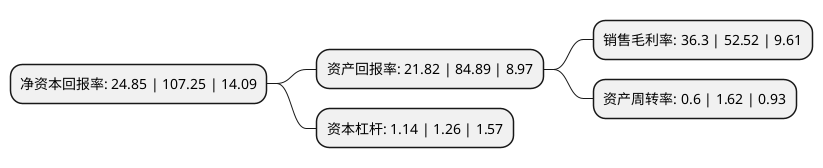

> 本页面由自动化程序生成于 2022年5月20日 01:38
> 内容可能存在错误，如有bug请提交issue至：https://github.com/Eroleice/doc-pi/issues
{.is-warning}

# 上市公司基本情况

## 基本资料

南京诺唯赞生物科技股份有限公司（以下简称“诺唯赞”）成立于2012年03月16日，南京市。于2021年11月15日在上交所科创板上市。

诺唯赞注册资本40,001万元，对酶，抗原，抗体等功能性蛋白及高分子有机材料进行技术研发和产品开发。以下是详细信息：

- 公司名称: 南京诺唯赞生物科技股份有限公司
- 股票代码: 688105.SH
- 所在地: 江苏 - 南京市
- 成立日期: 2012年03月16日
- 注册资本: 40,001万元
- 法定代表人: 曹林
- 主营业务: 对酶，抗原，抗体等功能性蛋白及高分子有机材料进行技术研发和产品开发
- 公司官网: www.vazyme.com
- 公司介绍: 公司是一家围绕酶、抗原、抗体等功能性蛋白及高分子有机材料进行技术研发和产品开发的生物科技企业，依托于自主建立的关键共性技术平台，先后进入了生物试剂、体外诊断业务领域，并正在进行抗体药物的研发，是国内少数同时具有自主可控上游技术开发能力和终端产品生产能力的研发创新型企业。公司先后建立了江苏省工程研究中心、江苏省企业技术中心、江苏省博士后创新实践基地，承担了江苏省科技厅科技成果转化专项、江苏省工信厅重点领域共性技术攻关项目、江苏省发展和改革委核酸检测试剂和疫苗药物生产研发企业专项等多项省市重大专项和专项资金项目，荣获了江苏省科技小巨人企业、江苏省服务型制造示范培育企业和南京市培育独角兽等众多荣誉称号。

## 股东及高管情况

上市公司第一大股东为南京诺唯赞投资管理有限公司，持股161,907,305股，占比40.48%，为上市公司实际控制人。

截至2022年03月31日，上市公司的前十大股东中，共有3名自然人股东，7名机构股东，其中5%以上大股东共有4名。上市公司前十大股东明细如下：

> 截至2022年03月31日，上市公司前十大股东信息如下：

| 股东名称 | 持股数量（股） | 持股比例 |
| --- | --- | --- |
| 南京诺唯赞投资管理有限公司 | 161,907,305 | 40.48% |
| 国寿成达(上海)健康产业股权投资中心(有限合伙) | 30,957,960 | 7.74% |
| 杨奇 | 21,803,890 | 5.45% |
| 曹林 | 21,388,971 | 5.35% |
| 深圳旦恩先锋投资管理有限公司-深圳旦恩创业投资合伙企业(有限合伙) | 16,978,883 | 4.24% |
| 南京诺泰投资合伙企业(有限合伙) | 16,031,476 | 4.01% |
| 南京博英维投资合伙企业(有限合伙) | 14,428,328 | 3.61% |
| 南京唯赞投资合伙企业(有限合伙) | 12,758,750 | 3.19% |
| 珠海广发信德敖东医药产业股权投资中心(有限合伙) | 10,173,073 | 2.54% |
| 段颖 | 7,773,247 | 1.94% |

## 利润表分析

上市公司2021年总收入为18.68亿元，净利润为6.78亿元，实现盈利。

## 杜邦分析

> 数据列示周期：2021年 | 2020年 | 2019年
{.is-info}

上市公司的净资产收益率在近一年有所下降，下降幅度为-76.83%，其变化情况分解如下：
- 上市公司的销售毛利率在近一年下降了-30.88%，可能是生产效率的下降、商品原材料价格上涨或商品价格的下跌所致。
- 上市公司的资产周转率在近一年下降了-62.96%，可能是源自于更慢的销售回款或库存管理效果下降。
- 上市公司的财务杠杆比率在近一年下降了-9.52%，可能是减少负债降低财务费用。

