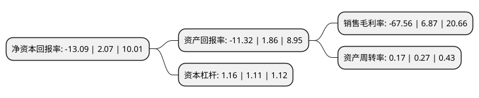

> 本页面由自动化程序生成于 2022年5月20日 01:38
> 内容可能存在错误，如有bug请提交issue至：https://github.com/Eroleice/doc-pi/issues
{.is-warning}

# 上市公司基本情况

## 基本资料

赛诺医疗科学技术股份有限公司（以下简称“赛诺医疗”）成立于2007年09月21日，天津市。于2019年10月30日在上交所科创板上市。

赛诺医疗注册资本41,000万元，公司专注于高端介入医疗器械研发，生产，销售，公司的产品包括冠状动脉支架系统和球囊扩张导管(冠脉及神经)两大类以下是详细信息：

- 公司名称: 赛诺医疗科学技术股份有限公司
- 股票代码: 688108.SH
- 所在地: 天津 - 天津市
- 成立日期: 2007年09月21日
- 注册资本: 41,000万元
- 法定代表人: 孙箭华
- 主营业务: 公司专注于高端介入医疗器械研发，生产，销售，公司的产品包括冠状动脉支架系统和球囊扩张导管(冠脉及神经)两大类
- 公司官网: www.sinomed.com
- 公司介绍: 公司是一家专注于高端介入医疗器械的研发、生产和销售的企业，主营业务涵盖心脑血管、结构性心脏病等介入治疗的重点领域。公司上市的产品包括冠状动脉支架系统和球囊扩张导管(冠脉及神经)两大类。其中具有自主知识产权的生物降解药物涂层冠脉支架BuMA是公司的主打产品，目前位居国内冠脉支架市场占有率第四名。而公司的Neuro RX产品是首款国家药监局批准上市的采用快速交换技术的颅内球囊导管。公司销售模式以经销模式为主、直销模式为辅，在个别地区实行配送模式。公司在研产品丰富，拥有多个国家和地区的多项发明专利。公司在研发方面重视与国外进行先进技术的交流和合作，是国内目前唯一获准在美国展开大规模临床试验的本土心脏支架企业。

## 股东及高管情况

上市公司第一大股东为天津伟信阳光企业管理咨询有限公司，持股90,902,330股，占比22.17%，**疑似为**上市公司实际控制人。

截至2022年05月06日，上市公司的前十大股东中，共有2名机构股东，8个海外主体，其中5%以上大股东共有7名。上市公司前十大股东明细如下：

> 未能通过持股比例判定出上市公司实际控制人（持股30%以上）
> 可能存在通过间接持股、联合持股、协议控制等方式拥有实际控制权的主体，具体请参考上市公司定期公告！
{.is-warning}

> 截至2022年05月06日，上市公司前十大股东信息如下：

| 股东名称 | 持股数量（股） | 持股比例 |
| --- | --- | --- |
| 天津伟信阳光企业管理咨询有限公司 | 90,902,330 | 22.17% |
| 天津伟信阳光企业管理咨询有限公司 | 90,902,330 | 22.17% |
| Great Noble Investment Limited | 37,289,378 | 9.095% |
| Great Noble Investment Limited | 34,217,378 | 8.3457% |
| CSF Stent Limited | 24,458,395 | 5.97% |
| CSF Stent Limited | 24,458,395 | 5.97% |
| CSF Stent Limited | 24,458,395 | 5.97% |
| DENLUX   MICROPORT INVEST INC. | 15,390,616 | 3.75% |
| Decheng   Capital China Life Sciences USD Fund I, L.P. | 9,007,345 | 2.2% |
| Decheng Capital China Life Sciences USD Fund I, L.P. | 9,007,345 | 2.2% |

## 利润表分析

上市公司2021年总收入为1.94亿元，净利润为-1.32亿元，**未实现盈利**。

## 杜邦分析

> 数据列示周期：2021年 | 2020年 | 2019年
{.is-info}

上市公司的净资产收益率在近一年有所下降，下降幅度为-732.37%，其变化情况分解如下：
- 上市公司的销售毛利率在近一年下降了-1083.41%，可能是生产效率的下降、商品原材料价格上涨或商品价格的下跌所致。
- 上市公司的资产周转率在近一年下降了-37.04%，可能是源自于更慢的销售回款或库存管理效果下降。
- 上市公司的财务杠杆比率在近一年上升了4.5%，可能是增加负债扩大生产规模。

