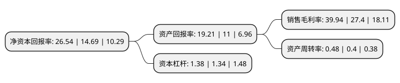

> 本页面由自动化程序生成于 2022年5月20日 01:38
> 内容可能存在错误，如有bug请提交issue至：https://github.com/Eroleice/doc-pi/issues
{.is-warning}

# 上市公司基本情况

## 基本资料

青岛海尔生物医疗股份有限公司（以下简称“海尔生物”）成立于2005年10月28日，青岛市。于2019年10月25日在上交所科创板上市。

海尔生物注册资本31,707.176万元，始于生物医疗低温存储设备的研发，生产和销售，是基于物联网转型的生物科技综合解决方案服务商。以下是详细信息：

- 公司名称: 青岛海尔生物医疗股份有限公司
- 股票代码: 688139.SH
- 所在地: 山东 - 青岛市
- 成立日期: 2005年10月28日
- 注册资本: 31,707.176万元
- 法定代表人: 刘占杰
- 主营业务: 始于生物医疗低温存储设备的研发，生产和销售，是基于物联网转型的生物科技综合解决方案服务商
- 公司官网: www.haierbiomedical.com
- 公司介绍: 公司是基于物联网转型的生物科技综合解决方案服务商。公司主要为生物样本库、药品与试剂安全、血液安全、疫苗安全、生命科学实验室等五大应用场景提供低温存储解决方案。公司打破国外垄断，突破生物医疗低温技术，荣获行业内唯一的国家科技进步奖。市场份额位居国产品牌公司首位，并成为世界卫生组织(WHO)、联合国儿童基金会(UNICEF)的长期采购供应商。公司的销售模式包括经销和直销，公司盈利模式为向客户提供综合解决方案，既包括销售公司自产的低温存储设备，也会根据客户需求从第三方采购器材和用品。公司具有行业领先的技术实力与产业化经验，建立了覆盖全国的经销网络和售后服务体系。公司致力于低温存储设备制造与物联网平台的融合，在行业内占据了先发优势。

## 股东及高管情况

上市公司第一大股东为青岛海尔生物医疗控股有限公司，持股100,591,463股，占比31.73%，为上市公司实际控制人。

截至2022年05月05日，上市公司的前十大股东中，共有5名机构股东，2个产品账户，3个海外主体，其中5%以上大股东共有9名。上市公司前十大股东明细如下：

> 截至2022年05月05日，上市公司前十大股东信息如下：

| 股东名称 | 持股数量（股） | 持股比例 |
| --- | --- | --- |
| 青岛海尔生物医疗控股有限公司 | 100,591,463 | 31.73% |
| 青岛海尔生物医疗控股有限公司 | 100,591,463 | 31.73% |
| 上海君和立成投资管理中心(有限合伙)-宁波梅山保税港区奇君股权投资合伙企业(有限合伙) | 44,981,776 | 14.1866% |
| 上海君和立成投资管理中心(有限合伙)-宁波梅山保税港区奇君股权投资合伙企业(有限合伙) | 40,871,776 | 12.8904% |
| 青岛海智汇赢股权投资管理有限公司-青岛海创睿股权投资基金中心(有限合伙) | 32,103,659 | 10.13% |
| 青岛海智汇赢股权投资管理有限公司-青岛海创睿股权投资基金中心(有限合伙) | 32,103,659 | 10.13% |
| 香港中央结算有限公司(陆股通) | 26,400,429 | 8.33% |
| 香港中央结算有限公司(陆股通) | 24,553,448 | 7.74% |
| 香港中央结算有限公司(陆股通) | 24,553,448 | 7.74% |
| 天津海盈康企业管理合伙企业(有限合伙) | 11,021,789 | 3.48% |

## 利润表分析

上市公司2021年总收入为21.25亿元，净利润为8.49亿元，实现盈利。

## 杜邦分析

> 数据列示周期：2021年 | 2020年 | 2019年
{.is-info}

上市公司的净资产收益率在近一年有所上升，上升幅度为80.67%，其变化情况分解如下：
- 上市公司的销售毛利率在近一年上升了45.77%，可能是生产效率的提升、商品原材料价格下跌或商品价格的上涨所致。
- 上市公司的资产周转率在近一年上升了20%，可能是源自于更快的销售回款或库存管理效果提升。
- 上市公司的财务杠杆比率在近一年上升了2.99%，可能是增加负债扩大生产规模。

