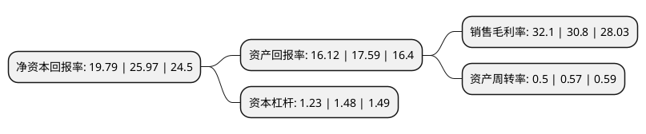

> 本页面由自动化程序生成于 2022年5月20日 01:38
> 内容可能存在错误，如有bug请提交issue至：https://github.com/Eroleice/doc-pi/issues
{.is-warning}

# 上市公司基本情况

## 基本资料

山东威高骨科材料股份有限公司（以下简称“威高骨科”）成立于2005年04月06日，威海市。于2021年06月30日在上交所科创板上市。

威高骨科注册资本40,000万元，主营业务为骨科医疗器械的研发，生产和销售，主要产品包括骨科植入医疗器械以及骨科手术器械工具。以下是详细信息：

- 公司名称: 山东威高骨科材料股份有限公司
- 股票代码: 688161.SH
- 所在地: 山东 - 威海市
- 成立日期: 2005年04月06日
- 注册资本: 40,000万元
- 法定代表人: 弓剑波
- 主营业务: 主营业务为骨科医疗器械的研发，生产和销售，主要产品包括骨科植入医疗器械以及骨科手术器械工具
- 公司官网: www.wegortho.com
- 公司介绍: 公司在骨科植入医疗器械领域是国内产品线齐备、规模领先、具有较强市场竞争力的龙头企业之一,主营业务为骨科医疗器械的研发、生产和销售，主要产品包括骨科植入医疗器械以及骨科手术器械工具,公司始终以技术和产品为导向，专注于骨科医疗器械的创新与研发。经过多年的潜心研发，公司已经掌握倒钩偏梯形螺纹技术、新型嵌入式马鞍形压环技术、半开口弹性臂经皮微创技术、组织特异性牵拉技术等多项核心技术，全面覆盖了脊柱、创伤、关节及运动医学等骨科植入医疗器械细分领域,公司作为骨科医疗器械领域的领先企业，参与了多项行业标准的起草制定、国家高技术研究发展计划(863计划)和国家重点研发计划的项目研究、参与国家生物医用材料生产应用示范平台建设，并被评为山东省示范工程技术研究中心、山东省企业技术中心和山东省工业设计中心等。

## 股东及高管情况

上市公司第一大股东为山东威高集团医用高分子制品股份有限公司，持股202,500,000股，占比50.63%，为上市公司实际控制人。

截至2022年03月31日，上市公司的前十大股东中，共有8名机构股东，2个产品账户，其中5%以上大股东共有4名。上市公司前十大股东明细如下：

> 截至2022年03月31日，上市公司前十大股东信息如下：

| 股东名称 | 持股数量（股） | 持股比例 |
| --- | --- | --- |
| 山东威高集团医用高分子制品股份有限公司 | 202,500,000 | 50.63% |
| 威高国际医疗有限公司 | 67,500,000 | 16.88% |
| 威高國際醫療有限公司 | 67,500,000 | 16.88% |
| 山东省财金投资集团有限公司 | 25,252,467 | 6.31% |
| 威海永耀贸易中心(有限合伙) | 10,000,000 | 2.5% |
| 中保投资有限责任公司-中国保险投资基金(有限合伙) | 3,375,000 | 0.84% |
| 上海高毅资产管理合伙企业(有限合伙)-高毅利伟精选唯实基金 | 1,478,057 | 0.37% |
| 华泰创新投资有限公司 | 1,378,643 | 0.34% |
| 通用技术集团投资管理有限公司 | 1,312,500 | 0.33% |
| 上海国鑫投资发展有限公司 | 1,312,500 | 0.33% |

## 利润表分析

上市公司2021年总收入为21.53亿元，净利润为6.91亿元，实现盈利。

## 杜邦分析

> 数据列示周期：2021年 | 2020年 | 2019年
{.is-info}

上市公司的净资产收益率在近一年有所下降，下降幅度为-23.8%，其变化情况分解如下：
- 上市公司的销售毛利率在近一年上升了4.22%，可能是生产效率的提升、商品原材料价格下跌或商品价格的上涨所致。
- 上市公司的资产周转率在近一年下降了-12.28%，可能是源自于更慢的销售回款或库存管理效果下降。
- 上市公司的财务杠杆比率在近一年下降了-16.89%，可能是减少负债降低财务费用。

