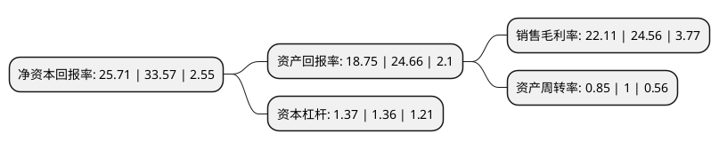

> 本页面由自动化程序生成于 2022年5月20日 01:38
> 内容可能存在错误，如有bug请提交issue至：https://github.com/Eroleice/doc-pi/issues
{.is-warning}

# 上市公司基本情况

## 基本资料

上海仁度生物科技股份有限公司（以下简称“仁度生物”）成立于2007年06月13日，上海市。于2022年03月30日在上交所科创板上市。

仁度生物注册资本4,000万元，主营业务为研发，生产和销售以该技术平台为基础的分子诊断试剂和设备一体化产品，专注于为生殖，呼吸，消化，血液，食品，环境安全等领域病原体的精准诊断，有效防控和个性化诊疗提供解决方案。以下是详细信息：

- 公司名称: 上海仁度生物科技股份有限公司
- 股票代码: 688193.SH
- 所在地: 上海 - 上海市
- 成立日期: 2007年06月13日
- 注册资本: 4,000万元
- 法定代表人: 居金良
- 主营业务: 主营业务为研发，生产和销售以该技术平台为基础的分子诊断试剂和设备一体化产品，专注于为生殖，呼吸，消化，血液，食品，环境安全等领域病原体的精准诊断，有效防控和个性化诊疗提供解决方案
- 公司官网: www.rdbio.com
- 公司介绍: 公司自成立以来，积极致力于“健康中国”国家战略，是国内最早一批专注于RNA分子诊断技术和产品的生命科学企业之一，致力于开发临床需求尚未满足的创新诊断技术和产品。发公司拥有RNA实时荧光恒温扩增(SAT)的独家专利技术平台，区别于以DNA和蛋白质为检测靶标的传统诊断技术，SAT技术以RNA为检测靶标，实现了靶标和方法学的创新。公司研发成功的SAT专利技术已通过“核酸恒温同步放大检测方法及其应用”专利(专利号：2008101114790)予以了保护，RNA实时荧光恒温扩增的专利技术平台，相较于分子诊断领域目前使用最广泛的PCR方法，该技术平台在扩增效率、检测灵敏度和特异性、生物安全性等方面有独特优势，是公司的核心技术平台。同时，公司的AutoSAT仪器全程自动化、无需人工操作，可以实现“样本进、结果出”的高通量检测，可以将高通量分子诊断的临床应用从传统的分子诊断实验室拓展到门诊、急诊以及基层医院、移动检测车和方舱等多种场景。

## 股东及高管情况

上市公司第一大股东为居金良，持股7,858,357股，占比19.65%，**疑似为**上市公司实际控制人。

截至2022年03月31日，上市公司的前十大股东中，共有3名自然人股东，4名机构股东，3个海外主体，其中5%以上大股东共有4名。上市公司前十大股东明细如下：

> 未能通过持股比例判定出上市公司实际控制人（持股30%以上）
> 可能存在通过间接持股、联合持股、协议控制等方式拥有实际控制权的主体，具体请参考上市公司定期公告！
{.is-warning}

> 截至2022年03月31日，上市公司前十大股东信息如下：

| 股东名称 | 持股数量（股） | 持股比例 |
| --- | --- | --- |
| 居金良 | 7,858,357 | 19.65% |
| MING LI INVESTMENTS LIMITED | 6,176,624 | 15.44% |
| 常州金新创业投资有限公司 | 2,843,812 | 7.11% |
| CENTRAL CHIEF LIMITED | 2,497,691 | 6.24% |
| 润聪(上海)企业管理中心(有限合伙) | 1,310,826 | 3.28% |
| 苏州启明创智股权投资合伙企业(有限合伙) | 1,161,989 | 2.9% |
| 南京高科新浚成长一期股权投资合伙企业(有限合伙) | 955,413 | 2.39% |
| 张保宁 | 915,714 | 2.29% |
| LIU XIFU | 826,883 | 2.07% |
| 刘伟 | 784,262 | 1.96% |

## 利润表分析

上市公司2021年总收入为2.92亿元，净利润为0.64亿元，实现盈利。

## 杜邦分析

> 数据列示周期：2021年 | 2020年 | 2019年
{.is-info}

上市公司的净资产收益率在近一年有所下降，下降幅度为-23.41%，其变化情况分解如下：
- 上市公司的销售毛利率在近一年下降了-9.98%，可能是生产效率的下降、商品原材料价格上涨或商品价格的下跌所致。
- 上市公司的资产周转率在近一年下降了-15%，可能是源自于更慢的销售回款或库存管理效果下降。
- 上市公司的财务杠杆比率在近一年上升了0.74%，可能是增加负债扩大生产规模。

