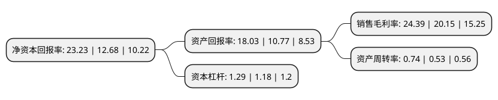

> 本页面由自动化程序生成于 2022年5月20日 01:38
> 内容可能存在错误，如有bug请提交issue至：https://github.com/Eroleice/doc-pi/issues
{.is-warning}

# 上市公司基本情况

## 基本资料

上海美迪西生物医药股份有限公司（以下简称“美迪西”）成立于2004年02月02日，上海市。于2019年11月05日在上交所科创板上市。

美迪西注册资本6,207.955万元，公司致力于为医药企业和其他新药研发机构提供全方位的新药研发外包服务。公司可以为医药企业和其他新药研发机构的新药研发提供包括药物探索与发现，药学研究及临床前研究全方位服务，协助客户快速，高效地完成新药研发临床前研究各个阶段。以下是详细信息：

- 公司名称: 上海美迪西生物医药股份有限公司
- 股票代码: 688202.SH
- 所在地: 上海 - 上海市
- 成立日期: 2004年02月02日
- 注册资本: 6,207.955万元
- 法定代表人: 陈金章
- 主营业务: 公司致力于为医药企业和其他新药研发机构提供全方位的新药研发外包服务公司可以为医药企业和其他新药研发机构的新药研发提供包括药物探索与发现，药学研究及临床前研究全方位服务，协助客户快速，高效地完成新药研发临床前研究各个阶段
- 公司官网: www.medicilon.com.cn
- 公司介绍: 公司是一家专业的生物医药临床前综合研发服务CRO，为全球的医药企业和科研机构提供全方位的符合国内及国际申报标准的一站式新药研发服务。公司的CRO服务涵盖药物发现、药学研究以及临床前研究。公司为国内大型制药企业及众多新兴的知名创新生物技术企业提供全方位新药临床前研发服务，是少数拥有国内领先、国际先进、符合国际临床前研究标准的综合性技术服务平台的临床前CRO企业之一。公司主要通过接受客户的委托，开展新药研究服务，并按照合同约定将研究成果和数据等资料移交给客户，从而向客户收取研究服务费来实现盈利。公司拥有全面的临床前新药研发能力及丰富的研发经验，公司创始人CHUN-LIN CHEN先生是“千人计划”国家特聘专家，各业务板块主要管理人员都在医药研发领域经验丰富，公司的研究质量控制体系达到国际先进水平。

## 股东及高管情况

上市公司第一大股东为陈建煌，持股6,142,576股，占比9.89%，**疑似为**上市公司实际控制人。

截至2022年03月31日，上市公司的前十大股东中，共有5名自然人股东，2个产品账户，3个海外主体，其中5%以上大股东共有4名。上市公司前十大股东明细如下：

> 未能通过持股比例判定出上市公司实际控制人（持股30%以上）
> 可能存在通过间接持股、联合持股、协议控制等方式拥有实际控制权的主体，具体请参考上市公司定期公告！
{.is-warning}

> 上市公司第一大股东持股不超过10%，请检查是否存在公司控制权风险！
{.is-danger}

> 截至2022年03月31日，上市公司前十大股东信息如下：

| 股东名称 | 持股数量（股） | 持股比例 |
| --- | --- | --- |
| 陈建煌 | 6,142,576 | 9.89% |
| 陈春来 | 4,957,612 | 7.99% |
| 林长青 | 3,721,252 | 5.99% |
| 陈国兴 | 3,308,752 | 5.33% |
| 中国工商银行股份有限公司-中欧医疗健康混合型证券投资基金 | 3,034,138 | 4.89% |
| 王国林 | 2,854,597 | 4.6% |
| CHEN CHUN-LIN | 2,041,352 | 3.29% |
| 中国建设银行股份有限公司-工银瑞信前沿医疗股票型证券投资基金 | 1,920,029 | 3.09% |
| MEDICILON INCORPORATED | 1,806,552 | 2.91% |
| MEDICILON  INCORPORATED | 1,806,552 | 2.91% |

## 利润表分析

上市公司2021年总收入为11.67亿元，净利润为2.84亿元，实现盈利。

## 杜邦分析

> 数据列示周期：2021年 | 2020年 | 2019年
{.is-info}

上市公司的净资产收益率在近一年有所上升，上升幅度为83.2%，其变化情况分解如下：
- 上市公司的销售毛利率在近一年上升了21.04%，可能是生产效率的提升、商品原材料价格下跌或商品价格的上涨所致。
- 上市公司的资产周转率在近一年上升了39.62%，可能是源自于更快的销售回款或库存管理效果提升。
- 上市公司的财务杠杆比率在近一年上升了9.32%，可能是增加负债扩大生产规模。

