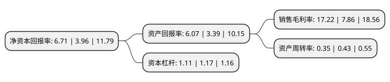

> 本页面由自动化程序生成于 2022年5月20日 01:38
> 内容可能存在错误，如有bug请提交issue至：https://github.com/Eroleice/doc-pi/issues
{.is-warning}

# 上市公司基本情况

## 基本资料

上海澳华内镜股份有限公司（以下简称“澳华内镜”）成立于1994年10月27日，上海市。于2021年11月15日在上交所科创板上市。

澳华内镜注册资本13,334万元，主要从事电子内窥镜设备及内窥镜诊疗手术耗材研发，生产和销售的高新技术企业。以下是详细信息：

- 公司名称: 上海澳华内镜股份有限公司
- 股票代码: 688212.SH
- 所在地: 上海 - 上海市
- 成立日期: 1994年10月27日
- 注册资本: 13,334万元
- 法定代表人: 顾康
- 主营业务: 主要从事电子内窥镜设备及内窥镜诊疗手术耗材研发，生产和销售的高新技术企业
- 公司官网: www.aohua.com
- 公司介绍: 公司是一家主要从事电子内窥镜设备及内窥镜诊疗手术耗材研发、生产和销售的高新技术企业。公司以“成为国际领先的内镜整体解决方案提供商”为愿景，经过20多年的专注与创新，产品已应用于消化科、呼吸科、耳鼻喉科、妇科、急诊科等临床科室。公司是国内较早从事软性电子内窥镜研发和制造的企业之一，围绕内镜诊疗领域进行了系统性的产品布局，长期坚持底层技术创新和跨领域人才培养，突破了内窥镜光学成像、图像处理、镜体设计、电气控制等领域的多项关键技术，具备较强的竞争优势，在国外厂商处于市场垄断地位的软性内窥镜领域占有一席之地，产品已进入德国、英国、韩国等发达国家市场。此外，公司还获得上海市科技小巨人企业、上海市“专精特新”中小企业等荣誉称号。公司的AQ-100和AQ-200系列产品被中国医学装备协会列入优秀国产医疗设备名录、被上海市工信委列入上海市创新产品推荐目录。公司产品还多次荣获IF设计奖(IF designAward)、日本优良设计奖(Good Design Award)、红点奖(Red Dot Award)等产品外观设计类国际奖项。

## 股东及高管情况

上市公司第一大股东为顾小舟，持股21,740,500股，占比16.3%，**疑似为**上市公司实际控制人。

截至2022年03月31日，上市公司的前十大股东中，共有3名自然人股东，3名机构股东，2个产品账户，2个海外主体，其中5%以上大股东共有4名。上市公司前十大股东明细如下：

> 未能通过持股比例判定出上市公司实际控制人（持股30%以上）
> 可能存在通过间接持股、联合持股、协议控制等方式拥有实际控制权的主体，具体请参考上市公司定期公告！
{.is-warning}

> 截至2022年03月31日，上市公司前十大股东信息如下：

| 股东名称 | 持股数量（股） | 持股比例 |
| --- | --- | --- |
| 顾小舟 | 21,740,500 | 16.3% |
| 顾康 | 16,950,200 | 12.71% |
| Appalachian Mountains Limited | 11,632,000 | 8.72% |
| 上海千骥生物医药创业投资有限公司 | 11,054,500 | 8.29% |
| 高燊有限公司 | 5,574,900 | 4.18% |
| 谢天宇 | 5,158,800 | 3.87% |
| QM35 LIMITED | 4,969,300 | 3.73% |
| 深圳市招商盈葵股权投资基金管理有限公司-深圳市招商招银股权投资基金合伙企业(有限合伙) | 4,545,500 | 3.41% |
| 中国工商银行股份有限公司-中欧医疗健康混合型证券投资基金 | 4,126,102 | 3.09% |
| 苏州启明融合创业投资合伙企业(有限合伙) | 4,075,300 | 3.06% |

## 利润表分析

上市公司2021年总收入为3.47亿元，净利润为0.59亿元，实现盈利。

## 杜邦分析

> 数据列示周期：2021年 | 2020年 | 2019年
{.is-info}

上市公司的净资产收益率在近一年有所上升，上升幅度为69.44%，其变化情况分解如下：
- 上市公司的销售毛利率在近一年上升了119.08%，可能是生产效率的提升、商品原材料价格下跌或商品价格的上涨所致。
- 上市公司的资产周转率在近一年下降了-18.6%，可能是源自于更慢的销售回款或库存管理效果下降。
- 上市公司的财务杠杆比率在近一年下降了-5.13%，可能是减少负债降低财务费用。

