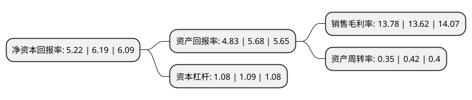

> 本页面由自动化程序生成于 2022年5月20日 01:38
> 内容可能存在错误，如有bug请提交issue至：https://github.com/Eroleice/doc-pi/issues
{.is-warning}

# 上市公司基本情况

## 基本资料

上海睿昂基因科技股份有限公司（以下简称“睿昂基因”）成立于2012年02月17日，上海市。于2021年05月17日在上交所科创板上市。

睿昂基因注册资本5,557.706万元，主营业务为体外诊断产品的研发，生产，销售及科研服务，主要为血液病(白血病，淋巴瘤)，实体瘤(肺癌，结直肠癌，黑色素瘤等)和传染病(乙型肝炎，风疹，单纯疱疹等)患者提供基因及抗原的精准检测，为疾病诊断，风险评估，疾病分型，靶向药物选择和疗效监测等个体化治疗方案的制定提供依据。以下是详细信息：

- 公司名称: 上海睿昂基因科技股份有限公司
- 股票代码: 688217.SH
- 所在地: 上海 - 上海市
- 成立日期: 2012年02月17日
- 注册资本: 5,557.706万元
- 法定代表人: 熊慧
- 主营业务: 主营业务为体外诊断产品的研发，生产，销售及科研服务，主要为血液病(白血病，淋巴瘤)，实体瘤(肺癌，结直肠癌，黑色素瘤等)和传染病(乙型肝炎，风疹，单纯疱疹等)患者提供基因及抗原的精准检测，为疾病诊断，风险评估，疾病分型，靶向药物选择和疗效监测等个体化治疗方案的制定提供依据
- 公司官网: www.rightongene.com
- 公司介绍: 公司是一家拥有自主品牌分子诊断产品的生命科学企业，积极致力于“精准医疗”国家战略，主营业务为体外诊断产品的研发、生产、销售及科研服务，主要为血液病(白血病、淋巴瘤)、实体瘤(肺癌、结直肠癌、黑色素瘤等)和传染病(乙型肝炎、风疹、单纯疱疹等)患者提供基因及抗原的精准检测，为疾病诊断、风险评估、疾病分型、靶向药物选择和疗效监测等个体化治疗方案的制定提供依据,同时，也在大力拓展免疫诊断的抗原检测试剂产品。公司自主研发的白血病分子诊断试剂盒为国内同类产品中首个获得国家药监局第三类医疗器械注册证的产品，适用于白血病诊断的全病程；三款实体瘤分子诊断试剂盒为国内最早一批获得国家药监局第三类医疗器械注册证的产品；多款传染病分子诊断试剂盒为国内首家或独家获得国家药监局第三类医疗器械注册证的产品。公司已建立了覆盖分子诊断领域四大技术平台的技术体系，部分技术达到国际先进水平；拥有涵盖血液病、实体瘤和传染病的丰富产品储备，检测试剂及科研服务获得了国内各领域知名医院、第三方检测实验室、医药企业的认可和使用，拥有较高的市场地位。

## 股东及高管情况

上市公司第一大股东为熊慧，持股10,176,397股，占比18.31%，**疑似为**上市公司实际控制人。

截至2022年03月31日，上市公司的前十大股东中，共有1名自然人股东，6名机构股东，2个产品账户，1名其他股东，其中5%以上大股东共有4名。上市公司前十大股东明细如下：

> 未能通过持股比例判定出上市公司实际控制人（持股30%以上）
> 可能存在通过间接持股、联合持股、协议控制等方式拥有实际控制权的主体，具体请参考上市公司定期公告！
{.is-warning}

> 截至2022年03月31日，上市公司前十大股东信息如下：

| 股东名称 | 持股数量（股） | 持股比例 |
| --- | --- | --- |
| 熊慧 | 10,176,397 | 18.31% |
| 杭州迪通创健股权投资基金管理有限公司-浙江大健康产业股权投资基金(有限合伙) | 6,251,559 | 11.25% |
| 上海伯慈投资合伙企业(有限合伙) | 4,924,723 | 8.86% |
| 杭州睿泓投资合伙企业(有限合伙) | 2,845,100 | 5.12% |
| 歐芮科技有限公司 | 2,165,042 | 3.9% |
| 上海力漾投资合伙企业(有限合伙) | 2,000,000 | 3.6% |
| 上海辰贺投资中心(有限合伙) | 1,616,564 | 2.91% |
| 天津康士蕴达医疗科技发展合伙企业(有限合伙) | 1,465,734 | 2.64% |
| 富诚海富资管-海通证券-富诚海富通睿昂基因员工参与科创板战略配售集合资产管理计划 | 1,376,200 | 2.48% |
| 上海涟京投资管理中心 | 1,299,025 | 2.34% |

## 利润表分析

上市公司2021年总收入为2.9亿元，净利润为0.4亿元，实现盈利。

## 杜邦分析

> 数据列示周期：2021年 | 2020年 | 2019年
{.is-info}

上市公司的净资产收益率在近一年有所下降，下降幅度为-15.67%，其变化情况分解如下：
- 上市公司的销售毛利率在近一年上升了1.17%，可能是生产效率的提升、商品原材料价格下跌或商品价格的上涨所致。
- 上市公司的资产周转率在近一年下降了-16.67%，可能是源自于更慢的销售回款或库存管理效果下降。
- 上市公司的财务杠杆比率在近一年下降了-0.92%，可能是减少负债降低财务费用。

