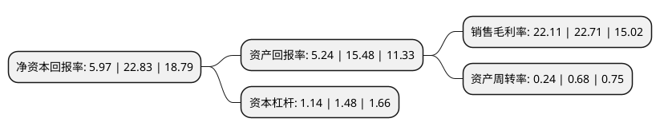

> 本页面由自动化程序生成于 2022年5月20日 01:38
> 内容可能存在错误，如有bug请提交issue至：https://github.com/Eroleice/doc-pi/issues
{.is-warning}

# 上市公司基本情况

## 基本资料

上海南方模式生物科技股份有限公司（以下简称“南模生物”）成立于2000年09月20日，上海市。于2021年12月28日在上交所科创板上市。

南模生物注册资本7,796.351万元，主要提供基因修饰动物模型产品和技术服务，主要从事基因修饰动物模型产品及技术服务相关业务。以下是详细信息：

- 公司名称: 上海南方模式生物科技股份有限公司
- 股票代码: 688265.SH
- 所在地: 上海 - 上海市
- 成立日期: 2000年09月20日
- 注册资本: 7,796.351万元
- 法定代表人: 费俭
- 主营业务: 主要提供基因修饰动物模型产品和技术服务，主要从事基因修饰动物模型产品及技术服务相关业务
- 公司官网: www.modelorg.com
- 公司介绍: 公司秉承“编辑基因，解码生命”为己任，聚焦生命科学研究和新药研发领域。通过以CRISPR/Cas、ES细胞打靶等基因编辑技术的应用创新为先导，公司打造了以模式生物基因组精准修饰、基因功能表型分析、药物筛选与评价为核心的技术平台，构建了覆盖人类基因的活体模型资源库，为人类基因组功能诠释、疾病发病机制阐明和新药新靶点发现提供相应的研究模型和技术手段，助力科研单位、创新药公司及CRO公司提升研发效率和创新水平。凭借规模化的模型研发构建能力和丰富的模型资源储备，公司良好服务于国家和地方的产业创新战略，先后成为国家科技部“863”计划生物技术领域疾病动物模型研发基地、上海市模式动物工程技术研究中心、上海市模式生物技术专业服务平台、上海市比较医学专业技术服务平台，是上海市“小巨人”企业和高新技术企业；同时，公司与中国科学院、复旦大学、上海交通大学、浙江大学、清华大学、北京大学等著名科所院校，瑞金医院、中山医院、华山医院等知名医院，药明生物、信达生物、恒瑞医药、百济神州、中美冠科等知名创新药研发公司和CRO公司建立了良好合作关系。

## 股东及高管情况

上市公司第一大股东为上海砥石企业管理咨询有限公司，持股27,771,000股，占比35.62%，为上市公司实际控制人。

截至2022年03月31日，上市公司的前十大股东中，共有8名机构股东，2个产品账户，其中5%以上大股东共有4名。上市公司前十大股东明细如下：

> 截至2022年03月31日，上市公司前十大股东信息如下：

| 股东名称 | 持股数量（股） | 持股比例 |
| --- | --- | --- |
| 上海砥石企业管理咨询有限公司 | 27,771,000 | 35.62% |
| 上海科技创业投资有限公司 | 10,760,733 | 13.8% |
| 深圳前海海润荣丰投资合伙企业(有限合伙) | 6,716,352 | 8.61% |
| 康君投资管理(北京)有限公司-北京康君宁元股权投资合伙企业(有限合伙) | 5,847,261 | 7.5% |
| 上海恒赛青熙创业投资中心(有限合伙) | 2,631,267 | 3.37% |
| 中国工商银行股份有限公司-中欧医疗健康混合型证券投资基金 | 2,584,439 | 3.31% |
| 上海浦东新兴产业投资有限公司 | 2,160,000 | 2.77% |
| 上海张江集体资产投资经营管理有限公司 | 1,782,000 | 2.29% |
| 中国农业银行股份有限公司-摩根士丹利华鑫健康产业混合型证券投资基金 | 828,296 | 1.06% |
| 海通创新证券投资有限公司 | 620,052 | 0.8% |

## 利润表分析

上市公司2021年总收入为2.75亿元，净利润为0.6亿元，实现盈利。

## 杜邦分析

> 数据列示周期：2021年 | 2020年 | 2019年
{.is-info}

上市公司的净资产收益率在近一年有所下降，下降幅度为-73.85%，其变化情况分解如下：
- 上市公司的销售毛利率在近一年下降了-2.64%，可能是生产效率的下降、商品原材料价格上涨或商品价格的下跌所致。
- 上市公司的资产周转率在近一年下降了-64.71%，可能是源自于更慢的销售回款或库存管理效果下降。
- 上市公司的财务杠杆比率在近一年下降了-22.97%，可能是减少负债降低财务费用。

