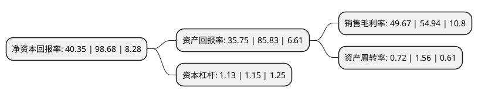

> 本页面由自动化程序生成于 2022年5月20日 01:39
> 内容可能存在错误，如有bug请提交issue至：https://github.com/Eroleice/doc-pi/issues
{.is-warning}

# 上市公司基本情况

## 基本资料

圣湘生物科技股份有限公司（以下简称“圣湘生物”）成立于2008年04月23日，长沙市。于2020年08月28日在上交所科创板上市。

圣湘生物注册资本40,000万元，以自主创新基因技术为核心，诊断试剂和仪器的研发，生产，销售，以及为第三方医学检验服务提供体外诊断整体解决方案。以下是详细信息：

- 公司名称: 圣湘生物科技股份有限公司
- 股票代码: 688289.SH
- 所在地: 湖南 - 长沙市
- 成立日期: 2008年04月23日
- 注册资本: 40,000万元
- 法定代表人: 戴立忠
- 主营业务: 以自主创新基因技术为核心，诊断试剂和仪器的研发，生产，销售，以及为第三方医学检验服务提供体外诊断整体解决方案
- 公司官网: www.sansure.com.cn
- 公司介绍: 公司是一家以自主创新基因技术为核心，集诊断试剂和仪器的研发、生产、销售，以及第三方医学检验服务于一体的体外诊断整体解决方案提供商，是国内技术先进、产品齐全的体外诊断领军企业之一，致力于成为全球领先的创新型高端分子诊断企业和基因科技的普惠者，服务于各类疾病防控、突发疫情防控等全民健康事业，助力国家精准医疗体系和分级诊疗体系建设，公司建立了完善的全流程质控体系和营销服务体系，产品已在全国2,000多家标杆医院、第三方医学检验机构及其他医疗机构广泛使用，并远销全球40多个国家，公司自主研发的创新型技术和产品，填补了国内多项空白，获得国家科技进步二等奖、中国专利优秀奖等国家级重大奖项20余项，被评为国家知识产权示范企业、国家高新技术企业。

## 股东及高管情况

上市公司第一大股东为戴立忠，持股128,072,848股，占比32.02%，为上市公司实际控制人。

截至2022年03月31日，上市公司的前十大股东中，共有4名自然人股东，5名机构股东，1个产品账户，其中5%以上大股东共有5名。上市公司前十大股东明细如下：

> 截至2022年03月31日，上市公司前十大股东信息如下：

| 股东名称 | 持股数量（股） | 持股比例 |
| --- | --- | --- |
| 戴立忠 | 128,072,848 | 32.02% |
| 朱锦伟 | 28,228,493 | 7.06% |
| 湖南圣维投资管理有限公司 | 25,132,835 | 6.28% |
| 陈文义 | 22,241,466 | 5.56% |
| 安徽志道投资有限公司 | 20,265,660 | 5.07% |
| 上海礼颐投资管理合伙企业(有限合伙)-苏州礼瑞股权投资中心(有限合伙) | 12,422,304 | 3.11% |
| 上海迎水投资管理有限公司-迎水匠心11号私募证券投资基金 | 5,800,000 | 1.45% |
| 湖南圣维鼎立管理咨询中心(有限合伙) | 5,112,896 | 1.28% |
| 湖南圣维华宁管理咨询中心(有限合伙) | 4,910,467 | 1.23% |
| 刘欲晓 | 4,324,077 | 1.08% |

## 利润表分析

上市公司2021年总收入为45.14亿元，净利润为22.42亿元，实现盈利。

## 杜邦分析

> 数据列示周期：2021年 | 2020年 | 2019年
{.is-info}

上市公司的净资产收益率在近一年有所下降，下降幅度为-59.11%，其变化情况分解如下：
- 上市公司的销售毛利率在近一年下降了-9.59%，可能是生产效率的下降、商品原材料价格上涨或商品价格的下跌所致。
- 上市公司的资产周转率在近一年下降了-53.85%，可能是源自于更慢的销售回款或库存管理效果下降。
- 上市公司的财务杠杆比率在近一年下降了-1.74%，可能是减少负债降低财务费用。

