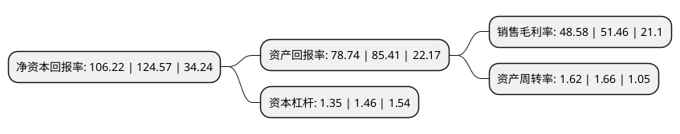

> 本页面由自动化程序生成于 2022年5月20日 01:39
> 内容可能存在错误，如有bug请提交issue至：https://github.com/Eroleice/doc-pi/issues
{.is-warning}

# 上市公司基本情况

## 基本资料

浙江东方基因生物制品股份有限公司（以下简称“东方生物”）成立于2005年12月01日，湖州市。于2020年02月05日在上交所科创板上市。

东方生物注册资本12,000万元，专业从事体外诊断产品研发，生产与销售，形成了以POCT即时诊断试剂为主导产品，重点发展分子诊断，生物原料，诊断仪器和液态生物芯片等产品的业务格局。以下是详细信息：

- 公司名称: 浙江东方基因生物制品股份有限公司
- 股票代码: 688298.SH
- 所在地: 浙江 - 湖州市
- 成立日期: 2005年12月01日
- 注册资本: 12,000万元
- 法定代表人: 方剑秋
- 主营业务: 专业从事体外诊断产品研发，生产与销售，形成了以POCT即时诊断试剂为主导产品，重点发展分子诊断，生物原料，诊断仪器和液态生物芯片等产品的业务格局
- 公司官网: www.orientgene.com
- 公司介绍: 公司是一家专业从事体外诊断产品研发、生产与销售的公司，目前已完成从抗原抗体等生物原料，到体外诊断试剂以及体外诊断仪器的全产业链布局，形成了以POCT即时诊断试剂为主导产品，重点发展分子诊断、生物原料、诊断仪器和液态生物芯片等产品的业务格局。发行人一直秉承全球化发展战略，已取得CFDA产品证书及备案凭证66项，FDA(510K)产品认证31项，欧盟CE产品认证225项，加拿大MDL产品认证67项，墨西哥医疗器械产品认证3项，产品远销北美洲、亚洲、非洲、欧洲、南美洲和大洋洲，客户遍布全球一百多个国家，并在美国、加拿大设立了全资子公司，外销占比约95%，是国内少有的全面打开海外市场的医疗器械生产企业。发行人依托全球化的研发团队，建立了“体外诊断试剂省级高新技术企业研究开发中心”和“院士专家工作站”，与比尔及梅琳达·盖茨基金会、上海交通大学、浙江大学、浙江省生物治疗重点实验室等国内外机构展开了合作，先后承担了国家火炬计划、湖州南太湖精英计划等多项科研项目，成功研发了多项体外诊断产品，获得了国家火炬计划产业化示范项目证书、浙江省重点高新技术产品、湖州市科学技术进步奖、浙江省级科学技术成果登记证书等多项荣誉。

## 股东及高管情况

上市公司第一大股东为安吉福浪莱进出口贸易有限公司，持股23,400,000股，占比19.5%，**疑似为**上市公司实际控制人。

截至2022年03月31日，上市公司的前十大股东中，共有5名机构股东，3个产品账户，2个海外主体，其中5%以上大股东共有4名。上市公司前十大股东明细如下：

> 未能通过持股比例判定出上市公司实际控制人（持股30%以上）
> 可能存在通过间接持股、联合持股、协议控制等方式拥有实际控制权的主体，具体请参考上市公司定期公告！
{.is-warning}

> 截至2022年03月31日，上市公司前十大股东信息如下：

| 股东名称 | 持股数量（股） | 持股比例 |
| --- | --- | --- |
| 安吉福浪莱进出口贸易有限公司 | 23,400,000 | 19.5% |
| 方氏控股有限公司 | 22,500,000 | 18.75% |
| Fangs Holdings Limited Liability Company | 22,500,000 | 18.75% |
| 安吉涌威投资合伙企业(有限合伙) | 12,372,480 | 10.31% |
| 浙江永石股权投资合伙企业(有限合伙) | 3,870,000 | 3.23% |
| 香港中央结算有限公司(陆股通) | 2,027,653 | 1.69% |
| 中国银行股份有限公司-国泰江源优势精选灵活配置混合型证券投资基金 | 875,579 | 0.73% |
| 中国建设银行股份有限公司-国泰大健康股票型证券投资基金 | 769,787 | 0.64% |
| 中国银行股份有限公司-国泰致远优势混合型证券投资基金 | 600,630 | 0.5% |
| 上海涌创铧兴投资合伙企业(有限合伙) | 575,500 | 0.48% |

## 利润表分析

上市公司2021年总收入为101.69亿元，净利润为49.4亿元，实现盈利。

## 杜邦分析

> 数据列示周期：2021年 | 2020年 | 2019年
{.is-info}

上市公司的净资产收益率在近一年有所下降，下降幅度为-14.73%，其变化情况分解如下：
- 上市公司的销售毛利率在近一年下降了-5.6%，可能是生产效率的下降、商品原材料价格上涨或商品价格的下跌所致。
- 上市公司的资产周转率在近一年下降了-2.41%，可能是源自于更慢的销售回款或库存管理效果下降。
- 上市公司的财务杠杆比率在近一年下降了-7.53%，可能是减少负债降低财务费用。

