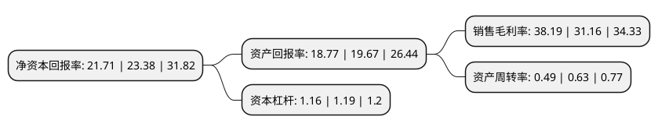

> 本页面由自动化程序生成于 2022年5月20日 01:39
> 内容可能存在错误，如有bug请提交issue至：https://github.com/Eroleice/doc-pi/issues
{.is-warning}

# 上市公司基本情况

## 基本资料

西安康拓医疗技术股份有限公司（以下简称“康拓医疗”）成立于2005年03月14日，西安市。于2021年05月18日在上交所科创板上市。

康拓医疗注册资本5,802.798万元，主要产品包括用于神经外科植入的钛颅骨修补固定产品和PEEK颅骨修补固定产品，以及胸骨固定产品，神经脊柱产品，配套植入工具等其他产品。专注于三类植入医疗器械产品研发，生产，销售。以下是详细信息：

- 公司名称: 西安康拓医疗技术股份有限公司
- 股票代码: 688314.SH
- 所在地: 陕西 - 西安市
- 成立日期: 2005年03月14日
- 注册资本: 5,802.798万元
- 法定代表人: 胡立人
- 主营业务: 主要产品包括用于神经外科植入的钛颅骨修补固定产品和PEEK颅骨修补固定产品，以及胸骨固定产品，神经脊柱产品，配套植入工具等其他产品专注于三类植入医疗器械产品研发，生产，销售
- 公司官网: www.kontourmedical.com
- 公司介绍: 公司是一家专注于三类植入医疗器械产品研发、生产、销售的高新技术企业，主要产品应用于神经外科颅骨修补固定和心胸外科胸骨固定领域。公司已取得12个III类植入医疗器械注册证，涉及多个细分领域首创产品，在PEEK材料颅骨修补和固定产品市场占据国内第一大市场份额，是国内为数不多的能够围绕患者需求提供神经外科颅骨修补固定多样化解决方案的企业。公司重视创新和研发，在紧扣主营业务的基础上，专注于持续的产品创新和工艺提升，已成功实现了多个原始技术向产业化应用的转化，驱动公司在行业内取得突破。公司自2008年取得钛材料颅骨修补固定产品相关注册证后，相继开发了3D打印试模、钛网板蚀刻法加工等工艺，不断升级技术提升钛修补固定产品的性能。2014年，公司实际控制人及核心技术人员胡立人参与研发的“个性化颅颌面骨替代物设计制造技术及应用”项目获得国家技术发明二等奖，在此基础上，公司重点投入PEEK材料产品研发，并于2015年取得首个国产PEEK骨板注册证，并随后开发了PEEK链接片的注塑法新工艺。

## 股东及高管情况

上市公司第一大股东为胡立人，持股28,168,420股，占比48.54%，为上市公司实际控制人。

截至2022年03月31日，上市公司的前十大股东中，共有5名自然人股东，3名机构股东，2个产品账户，其中5%以上大股东共有3名。上市公司前十大股东明细如下：

> 截至2022年03月31日，上市公司前十大股东信息如下：

| 股东名称 | 持股数量（股） | 持股比例 |
| --- | --- | --- |
| 胡立人 | 28,168,420 | 48.54% |
| 朱海龙 | 5,890,000 | 10.15% |
| 上海弘翕投资发展中心(有限合伙) | 4,233,560 | 7.3% |
| 西安合赢企业管理咨询合伙企业(有限合伙) | 2,720,000 | 4.69% |
| 华泰证券资管-招商银行-华泰康拓医疗家园1号科创板员工持股集合资产管理计划 | 1,451,000 | 2.5% |
| 胡立功 | 934,000 | 1.61% |
| 华泰创新投资有限公司 | 652,400 | 1.12% |
| 吴栋 | 590,000 | 1.02% |
| 赵若愚 | 590,000 | 1.02% |
| 兴业银行股份有限公司-华安兴安优选一年持有期混合型证券投资基金 | 467,982 | 0.81% |

## 利润表分析

上市公司2021年总收入为2.12亿元，净利润为0.81亿元，实现盈利。

## 杜邦分析

> 数据列示周期：2021年 | 2020年 | 2019年
{.is-info}

上市公司的净资产收益率在近一年有所下降，下降幅度为-7.14%，其变化情况分解如下：
- 上市公司的销售毛利率在近一年上升了22.56%，可能是生产效率的提升、商品原材料价格下跌或商品价格的上涨所致。
- 上市公司的资产周转率在近一年下降了-22.22%，可能是源自于更慢的销售回款或库存管理效果下降。
- 上市公司的财务杠杆比率在近一年下降了-2.52%，可能是减少负债降低财务费用。

