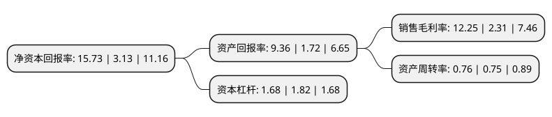

> 本页面由自动化程序生成于 2022年5月20日 01:39
> 内容可能存在错误，如有bug请提交issue至：https://github.com/Eroleice/doc-pi/issues
{.is-warning}

# 上市公司基本情况

## 基本资料

北京诺禾致源科技股份有限公司（以下简称“诺禾致源”）成立于2011年03月15日，北京市。于2021年04月13日在上交所科创板上市。

诺禾致源注册资本40,020万元，主要依托高通量测序技术和生物信息分析技术，建立了通量规模领先的基因测序平台，并结合多组学研究技术手段，为生命科学基础研究，医学及临床应用研究提供多层次的科研技术服务及解决方案;同时，基于在基因测序及其应用领域的技术积累，自主开发创新的基因检测医疗器械。以下是详细信息：

- 公司名称: 北京诺禾致源科技股份有限公司
- 股票代码: 688315.SH
- 所在地: 北京 - 北京市
- 成立日期: 2011年03月15日
- 注册资本: 40,020万元
- 法定代表人: 李瑞强
- 主营业务: 主要依托高通量测序技术和生物信息分析技术，建立了通量规模领先的基因测序平台，并结合多组学研究技术手段，为生命科学基础研究，医学及临床应用研究提供多层次的科研技术服务及解决方案;同时，基于在基因测序及其应用领域的技术积累，自主开发创新的基因检测医疗器械
- 公司官网: www.novogene.com
- 公司介绍: 公司是一个基因组学解决方案提供商，主要依托高通量测序技术和生物信息分析技术，建立了通量规模领先的基因测序平台，并结合多组学研究技术手段，为生命科学基础研究、医学及临床应用研究提供多层次的科研技术服务及解决方案；同时，基于在基因测序及其应用领域的技术积累，自主开发创新的基因检测医疗器械，公司构建了全球化的技术服务网络，在境内设有天津、南京中心实验室，在新加坡、美国、英国建立了本地化运营的实验室和子公司，于香港、荷兰、日本等发达国家和地区设有子公司，业务覆盖全球六大洲超过60个国家和地区，实现对北美、欧洲、东南亚等本地科研需求的快速响应，全面覆盖中国科学院、中国医学科学院、北京大学、清华大学、Stanford University、JohnsHopkins University、Genome Institute of Singapore等境内外一流科研院所，服务客户超过4,000家，公司通过NMPA创新医疗器械特别审评通道审批上市，成为我国首批获准上市的基于高通量测序的肿瘤基因检测试剂盒之一。

## 股东及高管情况

上市公司第一大股东为李瑞强，持股214,810,148股，占比53.68%，为上市公司实际控制人。

截至2022年03月31日，上市公司的前十大股东中，共有2名自然人股东，4名机构股东，4个产品账户，其中5%以上大股东共有3名。上市公司前十大股东明细如下：

> 截至2022年03月31日，上市公司前十大股东信息如下：

| 股东名称 | 持股数量（股） | 持股比例 |
| --- | --- | --- |
| 李瑞强 | 214,810,148 | 53.68% |
| 北京致源禾谷投资管理中心(有限合伙) | 55,039,203 | 13.75% |
| 深圳红树成长投资管理有限公司-成长拾贰号投资(深圳)合伙企业(有限合伙) | 22,895,867 | 5.72% |
| 先进制造产业投资基金(有限合伙) | 18,126,461 | 4.53% |
| 蒋智 | 15,725,486 | 3.93% |
| 北京诺禾禾谷投资管理中心(有限合伙) | 12,580,389 | 3.14% |
| 红杉安辰(厦门)股权投资合伙企业(有限合伙) | 9,530,596 | 2.38% |
| 中国工商银行股份有限公司-中欧医疗健康混合型证券投资基金 | 4,111,071 | 1.03% |
| 中信证券-招商银行-中信证券诺禾致源员工参与科创板战略配售集合资产管理计划 | 4,020,000 | 1% |
| 深圳市招商盈葵股权投资基金管理有限公司-深圳市招商招银股权投资基金合伙企业(有限合伙) | 3,000,000 | 0.75% |

## 利润表分析

上市公司2021年总收入为18.66亿元，净利润为2.28亿元，实现盈利。

## 杜邦分析

> 数据列示周期：2021年 | 2020年 | 2019年
{.is-info}

上市公司的净资产收益率在近一年有所上升，上升幅度为402.56%，其变化情况分解如下：
- 上市公司的销售毛利率在近一年上升了430.3%，可能是生产效率的提升、商品原材料价格下跌或商品价格的上涨所致。
- 上市公司的资产周转率在近一年上升了1.33%，可能是源自于更快的销售回款或库存管理效果提升。
- 上市公司的财务杠杆比率在近一年下降了-7.69%，可能是减少负债降低财务费用。

