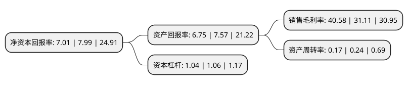

> 本页面由自动化程序生成于 2022年5月20日 01:39
> 内容可能存在错误，如有bug请提交issue至：https://github.com/Eroleice/doc-pi/issues
{.is-warning}

# 上市公司基本情况

## 基本资料

北京赛科希德科技股份有限公司（以下简称“赛科希德”）成立于2003年05月28日，北京市。于2020年08月06日在上交所科创板上市。

赛科希德注册资本8,164.8万元，致力于血栓与止血体外诊断领域的检测仪器，试剂及耗材的研发，生产和销售以下是详细信息：

- 公司名称: 北京赛科希德科技股份有限公司
- 股票代码: 688338.SH
- 所在地: 北京 - 北京市
- 成立日期: 2003年05月28日
- 注册资本: 8,164.8万元
- 法定代表人: 吴仕明
- 主营业务: 致力于血栓与止血体外诊断领域的检测仪器，试剂及耗材的研发，生产和销售
- 公司官网: www.succeeder.com.cn
- 公司介绍: 公司是血栓与止血体外诊断领域领先的国内生产商,是血液学体外诊断领域的领导者之一,自成立以来一直致力于血栓与止血体外诊断领域的检测仪器、试剂及耗材的研发、生产和销售，为医疗机构提供凝血、血液流变、血沉压积、血小板聚集等自动化检测仪器及配套的试剂和耗材，公司已形成了拥有自主核心技术的集仪器、试剂及耗材于一体的产品体系，重点发展凝血检测和血流变检测产品，同时在产品的专业化、系列化及自动化方面不断发展和创新，公司秉承“成功源自专一，服务创造价值”的核心价值观，深耕血栓与止血体外诊断领域，打造行业专业品牌。公司获得“高新技术企业”、“火炬计划重点高新技术企业”、“昌平区科技研发中心”、“北京生物医药产业跨越发展工程(G20工程)-行业领军企业”等荣誉。公司技术水平和产品实力受到政府主管部门及行业的认可，树立了良好的品牌形象。

## 股东及高管情况

上市公司第一大股东为吴仕明，持股28,298,431股，占比34.66%，为上市公司实际控制人。

截至2022年03月31日，上市公司的前十大股东中，共有8名自然人股东，2名机构股东，其中5%以上大股东共有2名。上市公司前十大股东明细如下：

> 截至2022年03月31日，上市公司前十大股东信息如下：

| 股东名称 | 持股数量（股） | 持股比例 |
| --- | --- | --- |
| 吴仕明 | 28,298,431 | 34.66% |
| 张海英 | 4,864,865 | 5.96% |
| 祝连庆 | 3,648,649 | 4.47% |
| 张嘉翃 | 2,432,432 | 2.98% |
| 北京赛诺恒科技中心(有限合伙) | 2,268,000 | 2.78% |
| 吴桐 | 2,091,892 | 2.56% |
| 宁波君度尚左股权投资合伙企业(有限合伙) | 1,600,000 | 1.96% |
| 晏巧霞 | 1,459,459 | 1.79% |
| 申子瑜 | 972,973 | 1.19% |
| 古小峰 | 972,973 | 1.19% |

## 杜邦分析

> 数据列示周期：2021年 | 2020年 | 2019年
{.is-info}

上市公司的净资产收益率在近一年有所下降，下降幅度为-12.27%，其变化情况分解如下：
- 上市公司的销售毛利率在近一年上升了30.44%，可能是生产效率的提升、商品原材料价格下跌或商品价格的上涨所致。
- 上市公司的资产周转率在近一年下降了-29.17%，可能是源自于更慢的销售回款或库存管理效果下降。
- 上市公司的财务杠杆比率在近一年下降了-1.89%，可能是减少负债降低财务费用。

