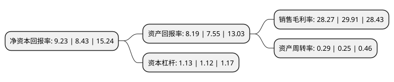

> 本页面由自动化程序生成于 2022年5月20日 01:39
> 内容可能存在错误，如有bug请提交issue至：https://github.com/Eroleice/doc-pi/issues
{.is-warning}

# 上市公司基本情况

## 基本资料

无锡祥生医疗科技股份有限公司（以下简称“祥生医疗”）成立于1996年01月30日，无锡市。于2019年12月03日在上交所科创板上市。

祥生医疗注册资本8,000万元，超声医学影像设备的研发，制造和销售，为国内外医疗机构，科研机构，战略合作伙伴等提供各类超声医学影像设备和专业的技术开发服务以下是详细信息：

- 公司名称: 无锡祥生医疗科技股份有限公司
- 股票代码: 688358.SH
- 所在地: 江苏 - 无锡市
- 成立日期: 1996年01月30日
- 注册资本: 8,000万元
- 法定代表人: 莫善珏
- 主营业务: 超声医学影像设备的研发，制造和销售，为国内外医疗机构，科研机构，战略合作伙伴等提供各类超声医学影像设备和专业的技术开发服务
- 公司官网: www.chison.com
- 公司介绍: 祥生医疗是国内专业的、具有完全自主知识产权的超声医学影像设备及相关技术提供商，其长期专注于超声医学影像设备的研发、制造和销售，可为国内外医疗机构、科研机构、战略合作伙伴等提供各类超声医学影像设备和专业的技术开发服务，辅助医师进行疾病检测和病情诊断。公司主营业务为超声医学影像设备研发,制造和销售,主要产品包括全数字彩超和黑白超,属于医疗器械行业.公司系国内最早从事超声医学影像技术国产化的企业之一，多年来坚持自主研发的技术理念，现已掌握了从二维超声、三维超声到四维超声，从探头核心部件、图像处理算法、图像分析软件到整机设计开发，从临床应用专科化、设备便携化到人工智能云平台解决方案在内的全套超声医学影像的核心技术。截至本招股说明书签署日，公司及控股子公司已合计获得境内外专利165项，其中发明专利45项、另有专利160多项正在申请中，已有软件著作权62项，自主核心技术储备丰厚。凭借丰厚的技术积累和不懈的技术创新，公司现已形成了完善的超声医学影像设备产品线，可为客户提供从高端彩超到黑白超、从全身一体机到专科超声设备、从推车式到便携式设备在内的各类超声医学影像设备。

## 股东及高管情况

上市公司第一大股东为无锡祥生投资有限公司，持股32,400,000股，占比40.5%，为上市公司实际控制人。

截至2022年03月31日，上市公司的前十大股东中，共有2名自然人股东，6名机构股东，2个产品账户，其中5%以上大股东共有3名。上市公司前十大股东明细如下：

> 截至2022年03月31日，上市公司前十大股东信息如下：

| 股东名称 | 持股数量（股） | 持股比例 |
| --- | --- | --- |
| 无锡祥生投资有限公司 | 32,400,000 | 40.5% |
| 莫若理 | 18,900,000 | 23.63% |
| 无锡祥鼎投资企业(有限合伙) | 4,200,000 | 5.25% |
| 无锡祥同投资企业(有限合伙) | 1,800,000 | 2.25% |
| 上海御德科技有限公司 | 1,500,000 | 1.88% |
| 无锡祥鹏投资企业(有限合伙) | 1,200,000 | 1.5% |
| 中国工商银行股份有限公司-富国文体健康股票型证券投资基金 | 1,067,476 | 1.33% |
| 国金创新投资有限公司 | 800,000 | 1% |
| 兴业银行股份有限公司-富国兴远优选12个月持有期混合型证券投资基金 | 681,901 | 0.85% |
| 叶栋华 | 380,000 | 0.48% |

## 利润表分析

上市公司2021年总收入为3.97亿元，净利润为1.12亿元，实现盈利。

## 杜邦分析

> 数据列示周期：2021年 | 2020年 | 2019年
{.is-info}

上市公司的净资产收益率在近一年有所上升，上升幅度为9.49%，其变化情况分解如下：
- 上市公司的销售毛利率在近一年下降了-5.48%，可能是生产效率的下降、商品原材料价格上涨或商品价格的下跌所致。
- 上市公司的资产周转率在近一年上升了16%，可能是源自于更快的销售回款或库存管理效果提升。
- 上市公司的财务杠杆比率在近一年上升了0.89%，可能是增加负债扩大生产规模。

