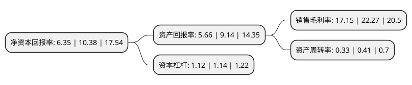

> 本页面由自动化程序生成于 2022年5月20日 01:39
> 内容可能存在错误，如有bug请提交issue至：https://github.com/Eroleice/doc-pi/issues
{.is-warning}

# 上市公司基本情况

## 基本资料

广州安必平医药科技股份有限公司（以下简称“安必平”）成立于2005年07月06日，广州市。于2020年08月20日在上交所科创板上市。

安必平注册资本9,334万元，主要从事体外诊断试剂和仪器的研发，生产和销售以下是详细信息：

- 公司名称: 广州安必平医药科技股份有限公司
- 股票代码: 688393.SH
- 所在地: 广东 - 广州市
- 成立日期: 2005年07月06日
- 注册资本: 9,334万元
- 法定代表人: 蔡向挺
- 主营业务: 主要从事体外诊断试剂和仪器的研发，生产和销售
- 公司官网: www.gzlbp.com
- 公司介绍: 公司主要从事体外诊断试剂和仪器的研发、生产和销售，是一家具有自主研发和创新能力的高新技术企业。公司建立体外诊断的三大技术平台，即细胞学诊断、分子诊断和免疫诊断，较为完整地覆盖从细胞形态到蛋白表达、基因检测等不同诊断层次的临床需求。经过自主研发创新，公司已成熟地掌握了沉降式液基细胞学技术、反向点杂交PCR制备技术、实时荧光PCR制备技术、FISH探针标记技术、IHC病理诊断抗体筛选及质控技术和相关配套仪器制造技术以及“实视”——基于云计算的实时远程病理协作技术等多项核心技术，并依此建立了相应系列产品线。公司产品主要应用于肿瘤病理诊断及医学检验，其产品线丰富，注册/备案产品数量485个，种类齐全，能满足不同层级医疗机构的需求。凭借自主品牌试剂和仪器的协同优势、完善的营销网络及优质的售后服务体系，公司产品市场已辐射国内近1,800家医疗机构。

## 股东及高管情况

上市公司第一大股东为蔡向挺，持股19,817,000股，占比21.23%，**疑似为**上市公司实际控制人。

截至2022年03月31日，上市公司的前十大股东中，共有2名自然人股东，7名机构股东，1个产品账户，其中5%以上大股东共有4名。上市公司前十大股东明细如下：

> 未能通过持股比例判定出上市公司实际控制人（持股30%以上）
> 可能存在通过间接持股、联合持股、协议控制等方式拥有实际控制权的主体，具体请参考上市公司定期公告！
{.is-warning}

> 截至2022年03月31日，上市公司前十大股东信息如下：

| 股东名称 | 持股数量（股） | 持股比例 |
| --- | --- | --- |
| 蔡向挺 | 19,817,000 | 21.23% |
| 广州市凯多投资咨询中心(有限合伙) | 12,951,400 | 13.88% |
| 诸暨高特佳睿安投资合伙企业(有限合伙) | 6,140,523 | 6.58% |
| 广州乾靖企业管理中心(有限合伙) | 5,998,500 | 6.43% |
| 广州市达安基因科技有限公司 | 3,486,000 | 3.73% |
| 道远资本管理(北京)有限公司-厦门运资股权投资合伙企业(有限合伙) | 2,803,533 | 3% |
| 重庆高特佳睿安股权投资基金合伙企业(有限合伙) | 2,610,300 | 2.8% |
| 刘必兰 | 1,860,000 | 1.99% |
| 杭州高特佳睿海投资合伙企业(有限合伙) | 1,820,679 | 1.95% |
| 上海祥禾涌原股权投资合伙企业(有限合伙) | 1,331,870 | 1.43% |

## 利润表分析

上市公司2021年总收入为4.38亿元，净利润为0.75亿元，实现盈利。

## 杜邦分析

> 数据列示周期：2021年 | 2020年 | 2019年
{.is-info}

上市公司的净资产收益率在近一年有所下降，下降幅度为-38.82%，其变化情况分解如下：
- 上市公司的销售毛利率在近一年下降了-22.99%，可能是生产效率的下降、商品原材料价格上涨或商品价格的下跌所致。
- 上市公司的资产周转率在近一年下降了-19.51%，可能是源自于更慢的销售回款或库存管理效果下降。
- 上市公司的财务杠杆比率在近一年下降了-1.75%，可能是减少负债降低财务费用。

