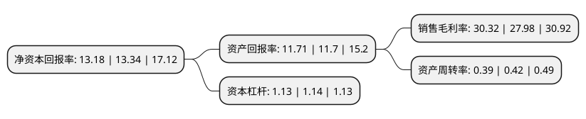

> 本页面由自动化程序生成于 2022年5月20日 01:39
> 内容可能存在错误，如有bug请提交issue至：https://github.com/Eroleice/doc-pi/issues
{.is-warning}

# 上市公司基本情况

## 基本资料

科美诊断技术股份有限公司（以下简称“科美诊断”）成立于2007年05月10日，北京市。于2021年04月09日在上交所科创板上市。

科美诊断注册资本40,100万元，产品主要为基于光激化学发光法的LiCA系列诊断试剂和基于酶促化学发光法的CC系列诊断试剂及仪器，主要从事临床免疫化学发光诊断检测试剂和仪器的研发，生产和销售。以下是详细信息：

- 公司名称: 科美诊断技术股份有限公司
- 股票代码: 688468.SH
- 所在地: 北京 - 北京市
- 成立日期: 2007年05月10日
- 注册资本: 40,100万元
- 法定代表人: 李临
- 主营业务: 产品主要为基于光激化学发光法的LiCA系列诊断试剂和基于酶促化学发光法的CC系列诊断试剂及仪器，主要从事临床免疫化学发光诊断检测试剂和仪器的研发，生产和销售
- 公司官网: www.chemclin.com
- 公司介绍: 公司是国内首个全面掌握光激化学发光技术并实现产业化的企业，经过多年研发探索，建立了拥有自主知识产权的光激化学发光技术平台，覆盖传染病、肿瘤标志物、甲状腺激素、生殖内分泌激素、心肌标志物和炎症等领域内的临床常用检测项目，检测项目丰富度已接近雅培、西门子、贝克曼等进口品牌。公司是国内传染病化学发光检测领域的领先企业，传染病检测项目齐全，检测试剂性能优异，市场竞争力强，在国内传染病检测领域拥有举足轻重的影响力。公司化学发光检测试剂涉及传染病、肿瘤标志物、甲状腺激素、生殖内分泌激素、心肌标志物及炎症等领域，基本覆盖了国内化学发光检测临床使用量较大的主要检测项目。

## 股东及高管情况

上市公司第一大股东为宁波保税区英维力企业管理合伙企业(有限合伙)，持股108,000,008股，占比26.93%，**疑似为**上市公司实际控制人。

截至2022年03月31日，上市公司的前十大股东中，共有6名机构股东，2个产品账户，2个海外主体，其中5%以上大股东共有5名。上市公司前十大股东明细如下：

> 未能通过持股比例判定出上市公司实际控制人（持股30%以上）
> 可能存在通过间接持股、联合持股、协议控制等方式拥有实际控制权的主体，具体请参考上市公司定期公告！
{.is-warning}

> 截至2022年03月31日，上市公司前十大股东信息如下：

| 股东名称 | 持股数量（股） | 持股比例 |
| --- | --- | --- |
| 宁波保税区英维力企业管理合伙企业(有限合伙) | 108,000,008 | 26.93% |
| 横琴君联致康投资企业(有限合伙) | 41,617,066 | 10.38% |
| 敦信有限公司 | 26,514,556 | 6.61% |
| LOYAL CLASS LIMITED | 26,514,556 | 6.61% |
| 中金康瑞壹期(宁波)股权投资基金合伙企业(有限合伙) | 22,710,535 | 5.66% |
| 宁波保税区科倍奥企业管理合伙企业(有限合伙) | 17,999,998 | 4.49% |
| 嘉兴申贸叁号股权投资合伙企业(有限合伙) | 14,323,056 | 3.57% |
| 杭州创乾投资合伙企业(有限合伙) | 11,355,268 | 2.83% |
| 平安鼎创股权投资管理(上海)有限公司-宁波梅山保税港区平盛安康股权投资基金合伙企业(有限合伙) | 11,355,268 | 2.83% |
| Triton Device HK Limited | 11,355,268 | 2.83% |

## 利润表分析

上市公司2021年总收入为4.7亿元，净利润为1.42亿元，实现盈利。

## 杜邦分析

> 数据列示周期：2021年 | 2020年 | 2019年
{.is-info}

上市公司的净资产收益率在近一年有所下降，下降幅度为-1.2%，其变化情况分解如下：
- 上市公司的销售毛利率在近一年上升了8.36%，可能是生产效率的提升、商品原材料价格下跌或商品价格的上涨所致。
- 上市公司的资产周转率在近一年下降了-7.14%，可能是源自于更慢的销售回款或库存管理效果下降。
- 上市公司的财务杠杆比率在近一年下降了-0.88%，可能是减少负债降低财务费用。

