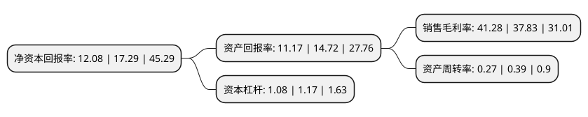

> 本页面由自动化程序生成于 2022年5月20日 01:40
> 内容可能存在错误，如有bug请提交issue至：https://github.com/Eroleice/doc-pi/issues
{.is-warning}

# 上市公司基本情况

## 基本资料

南京伟思医疗科技股份有限公司（以下简称“伟思医疗”）成立于2001年01月10日，南京市。于2020年07月21日在上交所科创板上市。

伟思医疗注册资本6,834.667万元，主要产品包括电刺激类，磁刺激类，电生理类设备，耗材及配件等康复医疗器械及产品，是中国康复医疗器械行业的技术创新驱动型企业，致力于在盆底及产后康复，神经康复，精神康复等细分领域为医疗及专业机构提供安全，有效的康复产品及整体解决方案。以下是详细信息：

- 公司名称: 南京伟思医疗科技股份有限公司
- 股票代码: 688580.SH
- 所在地: 江苏 - 南京市
- 成立日期: 2001年01月10日
- 注册资本: 6,834.667万元
- 法定代表人: 王志愚
- 主营业务: 主要产品包括电刺激类，磁刺激类，电生理类设备，耗材及配件等康复医疗器械及产品，是中国康复医疗器械行业的技术创新驱动型企业，致力于在盆底及产后康复，神经康复，精神康复等细分领域为医疗及专业机构提供安全，有效的康复产品及整体解决方案
- 公司官网: www.vishee.com
- 公司介绍: 公司是中国康复医疗器械行业的技术创新驱动型企业，公司持续而坚定地投入研发和技术创新，经过多年的积累，公司已经在电刺激、磁刺激、电生理等技术平台上掌握了具有自主知识产权的核心技术。在电刺激领域，公司将盆底表面肌电定量评估、生物反馈、神经肌肉电刺激、肌电触发电刺激等治疗技术整合运用于盆底及产后康复和神经康复领域，开发出了应用于脑卒中康复治疗的对侧控制电刺激技术；在磁刺激领域，公司是目前国内少数能够独立自主研发的企业，拥有代表当前临床和技术前沿的变频风冷、无线磁触发双通道MEP技术、高强度磁体线圈设计技术、高电流磁体电源设计技术、小型化磁刺激平台等核心技术。在康复机器人领域，公司参与了国家科技部和江苏省科技厅的康复机器人重点研究计划课题，已形成了包括外骨骼机器人设计、主被动多模态控制、智能步态控制、实时步态评估、动态减重、全自动跟踪机器人防摔车等核心技术，同时打造了康复机器人专用的硬件、控制、软件和算法平台。

## 股东及高管情况

上市公司第一大股东为王志愚，持股26,961,547股，占比39.45%，为上市公司实际控制人。

截至2022年04月11日，上市公司的前十大股东中，共有5名自然人股东，4名机构股东，1个产品账户，其中5%以上大股东共有3名。上市公司前十大股东明细如下：

> 截至2022年04月11日，上市公司前十大股东信息如下：

| 股东名称 | 持股数量（股） | 持股比例 |
| --- | --- | --- |
| 王志愚 | 26,961,547 | 39.45% |
| 胡平 | 11,227,132 | 16.43% |
| 南京志达投资管理咨询中心(有限合伙) | 5,667,943 | 8.29% |
| 深圳市阳和生物医药产业投资有限公司 | 3,005,686 | 4.4% |
| 南京志明达创业投资中心(有限合伙) | 915,888 | 1.34% |
| 上海阿杏投资管理有限公司-阿杏延安26号私募证券投资基金 | 744,815 | 1.09% |
| 长江证券创新投资(湖北)有限公司 | 683,466 | 1% |
| 苏彩龙 | 444,896 | 0.65% |
| 连庆明 | 391,993 | 0.57% |
| 赵光明 | 332,947 | 0.49% |

## 利润表分析

上市公司2021年总收入为4.3亿元，净利润为1.77亿元，实现盈利。

## 杜邦分析

> 数据列示周期：2021年 | 2020年 | 2019年
{.is-info}

上市公司的净资产收益率在近一年有所下降，下降幅度为-30.13%，其变化情况分解如下：
- 上市公司的销售毛利率在近一年上升了9.12%，可能是生产效率的提升、商品原材料价格下跌或商品价格的上涨所致。
- 上市公司的资产周转率在近一年下降了-30.77%，可能是源自于更慢的销售回款或库存管理效果下降。
- 上市公司的财务杠杆比率在近一年下降了-7.69%，可能是减少负债降低财务费用。

