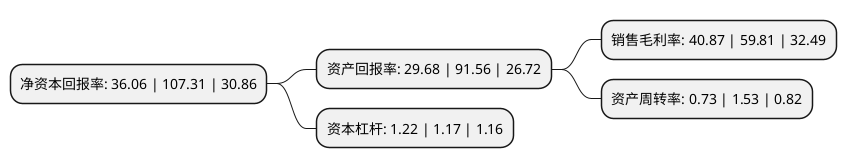

> 本页面由自动化程序生成于 2022年5月20日 01:40
> 内容可能存在错误，如有bug请提交issue至：https://github.com/Eroleice/doc-pi/issues
{.is-warning}

# 上市公司基本情况

## 基本资料

杭州奥泰生物技术股份有限公司（以下简称“奥泰生物”）成立于2009年04月17日，杭州市。于2021年03月25日在上交所科创板上市。

奥泰生物注册资本5,390.415万元，主营业务为体外诊断试剂的研发，生产和销售，主要产品为快速诊断试剂，包括毒品及药物滥用检测，传染病检测，妇女健康检测，肿瘤检测以及心脏标志物检测等五大系列。以下是详细信息：

- 公司名称: 杭州奥泰生物技术股份有限公司
- 股票代码: 688606.SH
- 所在地: 浙江 - 杭州市
- 成立日期: 2009年04月17日
- 注册资本: 5,390.415万元
- 法定代表人: 高飞
- 主营业务: 主营业务为体外诊断试剂的研发，生产和销售，主要产品为快速诊断试剂，包括毒品及药物滥用检测，传染病检测，妇女健康检测，肿瘤检测以及心脏标志物检测等五大系列
- 公司官网: www.alltests.com.cn
- 公司介绍: 公司是浙江省科学技术厅认定的高新技术企业，具有较强的技术研发和创新能力，公司专注于体外诊断行业中的POCT细分领域，主营业务为体外诊断试剂的研发、生产和销售，主要产品为快速诊断试剂，包括毒品及药物滥用检测、传染病检测、妇女健康检测、肿瘤检测以及心脏标志物检测等五大系列，产品种类多达700余种，产品广泛应用于临床检测、现场检测及个人健康管理等领域，能满足客户的多元化需求。在胶体金、乳胶等标记技术，单克隆抗体、多克隆抗体、基因重组抗原、合成抗原等生物原料技术以及免疫层析技术等生物领域的研究方面处于国内领先水平。公司十分重视海外市场发展战略，公司已在国际上主要的市场和区域取得百余项产品注册证书，同时，公司已通过了ISO9001:2015、ISO13485:2016等国际质量体系认证，以零缺陷通过了美国FDA质量管理体系现场审核，并取得了包括美国、加拿大、巴西、日本、澳大利亚等在内多个国家认可的MDSAP医疗器械单一审核程序认证，成为国内较早通过该项认证的企业之一。

## 股东及高管情况

上市公司第一大股东为杭州竞冠投资管理有限公司，持股12,495,000股，占比23.18%，**疑似为**上市公司实际控制人。

截至2022年03月31日，上市公司的前十大股东中，共有5名自然人股东，5名机构股东，其中5%以上大股东共有4名。上市公司前十大股东明细如下：

> 未能通过持股比例判定出上市公司实际控制人（持股30%以上）
> 可能存在通过间接持股、联合持股、协议控制等方式拥有实际控制权的主体，具体请参考上市公司定期公告！
{.is-warning}

> 截至2022年03月31日，上市公司前十大股东信息如下：

| 股东名称 | 持股数量（股） | 持股比例 |
| --- | --- | --- |
| 杭州竞冠投资管理有限公司 | 12,495,000 | 23.18% |
| 杭州群泽投资管理有限公司 | 10,150,000 | 18.83% |
| 高飞 | 4,200,000 | 7.79% |
| 徐建明 | 3,456,005 | 6.41% |
| 上海文叶商务咨询服务合伙企业(普通合伙) | 1,890,000 | 3.51% |
| 陆维克 | 1,750,000 | 3.25% |
| 杭州赛达投资合伙企业(有限合伙) | 1,414,145 | 2.62% |
| 姜正金 | 730,216 | 1.35% |
| 傅燕萍 | 700,000 | 1.3% |
| 杭州靖睿投资管理合伙企业(有限合伙) | 520,000 | 0.96% |

## 利润表分析

上市公司2021年总收入为18.73亿元，净利润为7.65亿元，实现盈利。

## 杜邦分析

> 数据列示周期：2021年 | 2020年 | 2019年
{.is-info}

上市公司的净资产收益率在近一年有所下降，下降幅度为-66.4%，其变化情况分解如下：
- 上市公司的销售毛利率在近一年下降了-31.67%，可能是生产效率的下降、商品原材料价格上涨或商品价格的下跌所致。
- 上市公司的资产周转率在近一年下降了-52.29%，可能是源自于更慢的销售回款或库存管理效果下降。
- 上市公司的财务杠杆比率在近一年上升了4.27%，可能是增加负债扩大生产规模。

