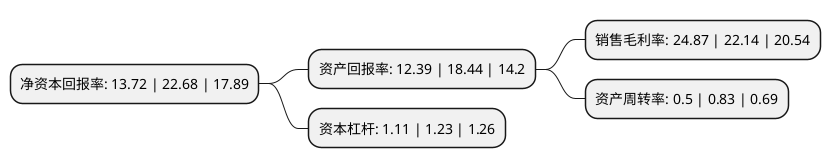

> 本页面由自动化程序生成于 2022年5月20日 01:40
> 内容可能存在错误，如有bug请提交issue至：https://github.com/Eroleice/doc-pi/issues
{.is-warning}

# 上市公司基本情况

## 基本资料

江苏康众数字医疗科技股份有限公司（以下简称“康众医疗”）成立于2007年05月23日，苏州市。于2021年02月01日在上交所科创板上市。

康众医疗注册资本8,812.903万元，主要产品为数字化X射线平板探测器，专业从事数字化X射线平板探测器研发，生产，销售和服务。以下是详细信息：

- 公司名称: 江苏康众数字医疗科技股份有限公司
- 股票代码: 688607.SH
- 所在地: 江苏 - 苏州市
- 成立日期: 2007年05月23日
- 注册资本: 8,812.903万元
- 法定代表人: 刘建强
- 主营业务: 主要产品为数字化X射线平板探测器，专业从事数字化X射线平板探测器研发，生产，销售和服务
- 公司官网: careray.cn
- 公司介绍: 公司自设立以来始终致力于深耕数字化X射线平板探测器行业，坚持自主研发和独立创新，产品应用从医疗普放逐渐延伸至乳腺、动态透视、放疗、口腔三维成像等领域，并进一步拓展至工业、安检、宠物医疗领域，产品形式从固定式发展出移动式、无线便携式等，并逐渐衍生出适配暗盒尺寸、低剂量等特点。经过十余年不懈努力，公司已成长为数字化X射线平板探测器行业内全球知名、国内领先的企业之一。公司拥有经验丰富的销售团队，产品销售遍及全国，并远销境外三十多个国家和地区，产品性能与品质获得了客户的广泛认可。公司还亦是行业标准《医用乳腺数字化X射线摄影用探测器》(YY/T1307—2016)和《医用电气设备数字X射线成像装置特性第1-1部分：量子探测效率的测定普通摄影用探测器》(YY/T0590.1—2018)的起草单位之一，产品具备一定的全球竞争力和较强的进口替代能力。

## 股东及高管情况

上市公司第一大股东为JIANQIANG LIU，持股12,810,000股，占比14.54%，**疑似为**上市公司实际控制人。

截至2022年03月31日，上市公司的前十大股东中，共有1名自然人股东，5名机构股东，2个产品账户，2个海外主体，其中5%以上大股东共有4名。上市公司前十大股东明细如下：

> 未能通过持股比例判定出上市公司实际控制人（持股30%以上）
> 可能存在通过间接持股、联合持股、协议控制等方式拥有实际控制权的主体，具体请参考上市公司定期公告！
{.is-warning}

> 截至2022年03月31日，上市公司前十大股东信息如下：

| 股东名称 | 持股数量（股） | 持股比例 |
| --- | --- | --- |
| JIANQIANG LIU | 12,810,000 | 14.54% |
| LIU,JIANQIANG | 12,810,000 | 14.54% |
| 暢城有限公司 | 12,629,380 | 14.33% |
| 中新苏州工业园区创业投资有限公司 | 8,965,203 | 10.17% |
| 高鹏 | 4,110,000 | 4.66% |
| 苏州康诚企业管理咨询服务有限公司 | 3,535,000 | 4.01% |
| 广州市玄元投资管理有限公司-玄元科新233号私募证券投资基金 | 2,399,013 | 2.72% |
| 中信证券-招商银行-中信证券康众医疗员工参与科创板战略配售集合资产管理计划 | 1,735,347 | 1.97% |
| 江苏乾融资本管理有限公司-苏州乾融新声创业投资合伙企业(有限合伙) | 1,685,163 | 1.91% |
| 苏州胡杨林智源投资中心(有限合伙) | 1,591,858 | 1.81% |

## 利润表分析

上市公司2021年总收入为3.41亿元，净利润为0.85亿元，实现盈利。

## 杜邦分析

> 数据列示周期：2021年 | 2020年 | 2019年
{.is-info}

上市公司的净资产收益率在近一年有所下降，下降幅度为-39.51%，其变化情况分解如下：
- 上市公司的销售毛利率在近一年上升了12.33%，可能是生产效率的提升、商品原材料价格下跌或商品价格的上涨所致。
- 上市公司的资产周转率在近一年下降了-39.76%，可能是源自于更慢的销售回款或库存管理效果下降。
- 上市公司的财务杠杆比率在近一年下降了-9.76%，可能是减少负债降低财务费用。

