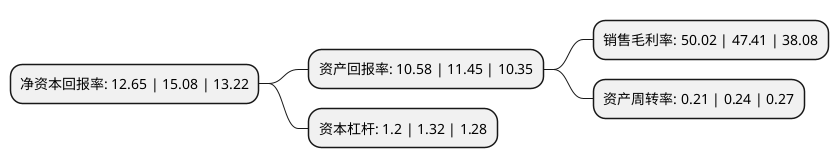

> 本页面由自动化程序生成于 2022年5月20日 01:40
> 内容可能存在错误，如有bug请提交issue至：https://github.com/Eroleice/doc-pi/issues
{.is-warning}

# 上市公司基本情况

## 基本资料

奥精医疗科技股份有限公司（以下简称“奥精医疗”）成立于2004年12月22日，北京市。于2021年05月21日在上交所科创板上市。

奥精医疗注册资本13,333.333万元，专注于高端生物医用材料及相关医疗器械产品的研发，生产及销售以下是详细信息：

- 公司名称: 奥精医疗科技股份有限公司
- 股票代码: 688613.SH
- 所在地: 北京 - 北京市
- 成立日期: 2004年12月22日
- 注册资本: 13,333.333万元
- 法定代表人: 胡刚
- 主营业务: 专注于高端生物医用材料及相关医疗器械产品的研发，生产及销售
- 公司官网: www.allgensmed.cn
- 公司介绍: 公司是一家专注于高端生物医用材料及相关医疗器械产品的研发、生产及销售的国家级高新技术企业。自成立以来，发行人始终以通过产品和技术的持续创新满足临床需求为导向，主要围绕矿化胶原人工骨修复材料领域进行研究与开发，于2011年推出了矿化胶原人工骨修复材料医疗器械产品，完成了矿化胶原人工骨修复材料的临床转化和产业化，并建立了具有完整知识产权的体外仿生矿化技术平台,公司的“骼金”、“齿贝”、“颅瑞”产品均已取得中国第III类医疗器械产品注册证，分别用于骨科、口腔或整形外科、神经外科的骨缺损修复，已应用于包括北京协和医院、北京积水潭医院、北京大学人民医院、北京天坛医院、河北医科大学第三医院、上海第六人民医院、上海第九人民医院、上海长征医院、广州南方医院、浙江大学医学院附属第二医院、中南大学湘雅医院、武汉同济医院、武汉协和医院、江苏省口腔医院、南京市口腔医院等国内知名三甲医院在内的百余家医院，临床使用超过百万例；“BonGold”产品已取得美国FDA510(k)市场准入许可，用于骨科的骨缺损修复，成为我国首个也是目前唯一获得美国FDA510(k)市场准入许可的国产人工骨修复产品。

## 股东及高管情况

上市公司第一大股东为嘉兴华控股权投资基金合伙企业(有限合伙)，持股12,976,445股，占比9.73%，**疑似为**上市公司实际控制人。

截至2022年03月31日，上市公司的前十大股东中，共有1名自然人股东，5名机构股东，2个产品账户，2个海外主体，其中5%以上大股东共有7名。上市公司前十大股东明细如下：

> 未能通过持股比例判定出上市公司实际控制人（持股30%以上）
> 可能存在通过间接持股、联合持股、协议控制等方式拥有实际控制权的主体，具体请参考上市公司定期公告！
{.is-warning}

> 上市公司第一大股东持股不超过10%，请检查是否存在公司控制权风险！
{.is-danger}

> 截至2022年03月31日，上市公司前十大股东信息如下：

| 股东名称 | 持股数量（股） | 持股比例 |
| --- | --- | --- |
| 嘉兴华控股权投资基金合伙企业(有限合伙) | 12,976,445 | 9.73% |
| 北京奇伦天佑创业投资有限公司 | 12,090,933 | 9.07% |
| Eric Gang Hu(胡刚) | 9,487,066 | 7.12% |
| HU ERIC GANG | 9,487,066 | 7.12% |
| 北京银河九天信息咨询中心(有限合伙) | 7,760,001 | 5.82% |
| 上海百奥财富医疗投资合伙企业(有限合伙) | 7,544,445 | 5.66% |
| 奥精医疗科技股份有限公司未确认持有人证券专用账户 | 7,423,759 | 5.57% |
| 崔福斋 | 6,334,793 | 4.75% |
| 国投创合(杭州)创业投资管理有限公司-杭州创合精选创业投资合伙企业(有限合伙) | 5,839,492 | 4.38% |
| 宁波泽泓子悦投资管理有限公司-杭州镜心创业投资合伙企业(有限合伙) | 4,311,110 | 3.23% |

## 利润表分析

上市公司2021年总收入为2.36亿元，净利润为1.18亿元，实现盈利。

## 杜邦分析

> 数据列示周期：2021年 | 2020年 | 2019年
{.is-info}

上市公司的净资产收益率在近一年有所下降，下降幅度为-16.11%，其变化情况分解如下：
- 上市公司的销售毛利率在近一年上升了5.51%，可能是生产效率的提升、商品原材料价格下跌或商品价格的上涨所致。
- 上市公司的资产周转率在近一年下降了-12.5%，可能是源自于更慢的销售回款或库存管理效果下降。
- 上市公司的财务杠杆比率在近一年下降了-9.09%，可能是减少负债降低财务费用。

