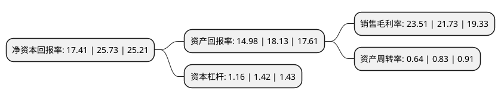

> 本页面由自动化程序生成于 2022年5月20日 01:40
> 内容可能存在错误，如有bug请提交issue至：https://github.com/Eroleice/doc-pi/issues
{.is-warning}

# 上市公司基本情况

## 基本资料

深圳惠泰医疗器械股份有限公司（以下简称“惠泰医疗”）成立于2002年06月17日，深圳市。于2021年01月07日在上交所科创板上市。

惠泰医疗注册资本6,667万元，已上市的产品包括电生理，冠脉通路和外周血管介入医疗器械，专注于电生理和血管介入医疗器械的研发，生产和销售。以下是详细信息：

- 公司名称: 深圳惠泰医疗器械股份有限公司
- 股票代码: 688617.SH
- 所在地: 广东 - 深圳市
- 成立日期: 2002年06月17日
- 注册资本: 6,667万元
- 法定代表人: 成正辉
- 主营业务: 已上市的产品包括电生理，冠脉通路和外周血管介入医疗器械，专注于电生理和血管介入医疗器械的研发，生产和销售
- 公司官网: www.aptmed.com
- 公司介绍: 公司是国产电生理和血管介入医疗器械品种品类齐全、规模领先、具有较强市场竞争力的企业之一，也是能够与国外产品形成强有力竞争的为数不多的企业之一。公司在电生理、血管介入医疗器械的研发和生产领域拥有丰富的技术积累和人才储备，攻关并掌握了“钢丝网加强挤出”、“亲水涂层”、“异种合金对接”等多种国外垄断的通路类产品必备产业化技术，同时具备独立生产导管、球囊、导丝等多种血管介入产品的高端生产制造能力。公司坚持自主研发创新，同时积极发掘临床需求，利用公司在行业内领先的生产制造能力实现可充分满足临床需求产品的产业化。截至2020年3月31日，公司共拥有国内外专利证书60项，其中国内发明专利39项，国外发明专利2项。经过多年的发展，公司已在境内外建立了完善的销售网络，覆盖全国31个省、自治区和直辖市的700余家三甲医院及680余家县市级二甲医院，并出口至欧洲、美洲、东南亚的80多个国家和地区。

## 股东及高管情况

上市公司第一大股东为成正辉，持股16,685,027股，占比25.03%，**疑似为**上市公司实际控制人。

截至2022年03月31日，上市公司的前十大股东中，共有3名自然人股东，6名机构股东，1个海外主体，其中5%以上大股东共有2名。上市公司前十大股东明细如下：

> 未能通过持股比例判定出上市公司实际控制人（持股30%以上）
> 可能存在通过间接持股、联合持股、协议控制等方式拥有实际控制权的主体，具体请参考上市公司定期公告！
{.is-warning}

> 截至2022年03月31日，上市公司前十大股东信息如下：

| 股东名称 | 持股数量（股） | 持股比例 |
| --- | --- | --- |
| 成正辉 | 16,685,027 | 25.03% |
| 成灵 | 5,000,442 | 7.5% |
| 启明维创(上海)股权投资中心(有限合伙) | 2,812,419 | 4.22% |
| QM33 LIMITED | 2,750,000 | 4.12% |
| 深圳市惠深企业管理中心(有限合伙) | 2,500,000 | 3.75% |
| 苏州启元股权投资管理合伙企业(有限合伙)-苏州工业园区启华三期投资中心(有限合伙) | 2,266,188 | 3.4% |
| 苏州启元股权投资管理合伙企业(有限合伙)-苏州工业园区启明融科股权投资合伙企业(有限合伙) | 2,201,500 | 3.3% |
| 苏州启明创智股权投资合伙企业(有限合伙) | 2,187,513 | 3.28% |
| 南通富星企业管理中心(有限合伙) | 2,118,403 | 3.18% |
| 徐轶青 | 2,000,287 | 3% |

## 利润表分析

上市公司2021年总收入为8.28亿元，净利润为1.94亿元，实现盈利。

## 杜邦分析

> 数据列示周期：2021年 | 2020年 | 2019年
{.is-info}

上市公司的净资产收益率在近一年有所下降，下降幅度为-32.34%，其变化情况分解如下：
- 上市公司的销售毛利率在近一年上升了8.19%，可能是生产效率的提升、商品原材料价格下跌或商品价格的上涨所致。
- 上市公司的资产周转率在近一年下降了-22.89%，可能是源自于更慢的销售回款或库存管理效果下降。
- 上市公司的财务杠杆比率在近一年下降了-18.31%，可能是减少负债降低财务费用。

