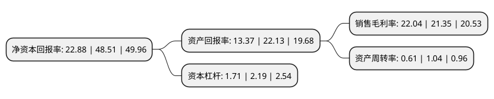

> 本页面由自动化程序生成于 2022年5月20日 01:40
> 内容可能存在错误，如有bug请提交issue至：https://github.com/Eroleice/doc-pi/issues
{.is-warning}

# 上市公司基本情况

## 基本资料

北京阳光诺和药物研究股份有限公司（以下简称“阳光诺和”）成立于2009年03月09日，北京市。于2021年06月21日在上交所科创板上市。

阳光诺和注册资本8,000万元，公司主营业务是为医药企业提供专业化研发外包服务，致力于协助中国医药制造企业加速实现进口替代和自主创新。主要产品:索磷布韦片，缬沙坦氢氯噻嗪片，缬沙坦氨氯地平片(Ⅰ)，恩替卡韦片。以下是详细信息：

- 公司名称: 北京阳光诺和药物研究股份有限公司
- 股票代码: 688621.SH
- 所在地: 北京 - 北京市
- 成立日期: 2009年03月09日
- 注册资本: 8,000万元
- 法定代表人: 刘宇晶
- 主营业务: 公司主营业务是为医药企业提供专业化研发外包服务，致力于协助中国医药制造企业加速实现进口替代和自主创新主要产品:索磷布韦片，缬沙坦氢氯噻嗪片，缬沙坦氨氯地平片(Ⅰ)，恩替卡韦片
- 公司官网: www.sun-novo.com
- 公司介绍: 公司是以医药产业技术研发和API中间体贸易为核心的高科技企业。公司主营业务涵盖仿制药开发、一致性评价及创新药开发等方面的综合研发服务，服务内容主要包括药学研究、临床试验和生物分析。药学研究服务包括原料药与制剂工艺研究、质量标准和稳定性研究等；临床试验服务包括I-IV期临床试验研究、生物等效性试验(BE)研究；生物分析服务包括运用先进的质谱分析平台、免疫分析平台、细胞分析平台、分子生物学分析平台进行方法开发、方法验证、生物样本检测研究等。2018年度、2019年度，公司连续获得中华全国工商业联合会医药业商会授予的“中国医药研发公司20强”称号，公司在“药学+临床”综合型CRO公司中，具有较强的市场影响力。

## 股东及高管情况

上市公司第一大股东为利虔，持股22,069,500股，占比27.59%，**疑似为**上市公司实际控制人。

截至2022年03月31日，上市公司的前十大股东中，共有4名自然人股东，5名机构股东，1个产品账户，其中5%以上大股东共有2名。上市公司前十大股东明细如下：

> 未能通过持股比例判定出上市公司实际控制人（持股30%以上）
> 可能存在通过间接持股、联合持股、协议控制等方式拥有实际控制权的主体，具体请参考上市公司定期公告！
{.is-warning}

> 截至2022年03月31日，上市公司前十大股东信息如下：

| 股东名称 | 持股数量（股） | 持股比例 |
| --- | --- | --- |
| 利虔 | 22,069,500 | 27.59% |
| 刘宇晶 | 4,333,701 | 5.42% |
| 杭州方汭投资合伙企业(有限合伙) | 2,852,306 | 3.57% |
| 托新权 | 2,400,000 | 3% |
| 邵妍 | 2,400,000 | 3% |
| 珠海景祥资本管理有限公司-佛山市景祥创利股权投资合伙企业(有限合伙) | 2,025,001 | 2.53% |
| 兴证证券资管-杭州银行-兴证资管鑫众阳光诺和1号员工战略配售集合资产管理计划 | 2,000,000 | 2.5% |
| 杭州凯泰民德投资合伙企业(有限合伙) | 1,840,000 | 2.3% |
| 民生证券投资有限公司 | 1,644,225 | 2.06% |
| 广州广发信德一期健康产业投资企业(有限合伙) | 1,607,783 | 2.01% |

## 利润表分析

上市公司2021年总收入为4.93亿元，净利润为1.08亿元，实现盈利。

## 杜邦分析

> 数据列示周期：2021年 | 2020年 | 2019年
{.is-info}

上市公司的净资产收益率在近一年有所下降，下降幅度为-52.83%，其变化情况分解如下：
- 上市公司的销售毛利率在近一年上升了3.23%，可能是生产效率的提升、商品原材料价格下跌或商品价格的上涨所致。
- 上市公司的资产周转率在近一年下降了-41.35%，可能是源自于更慢的销售回款或库存管理效果下降。
- 上市公司的财务杠杆比率在近一年下降了-21.92%，可能是减少负债降低财务费用。

