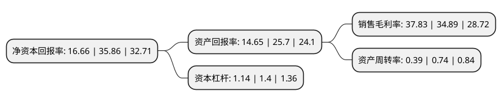

> 本页面由自动化程序生成于 2022年5月20日 01:40
> 内容可能存在错误，如有bug请提交issue至：https://github.com/Eroleice/doc-pi/issues
{.is-warning}

# 上市公司基本情况

## 基本资料

青岛海泰新光科技股份有限公司（以下简称“海泰新光”）成立于2003年06月11日，青岛市。于2021年02月26日在上交所科创板上市。

海泰新光注册资本8,698万元，主要从事医用内窥镜器械和光学产品的研发，生产和销售。以下是详细信息：

- 公司名称: 青岛海泰新光科技股份有限公司
- 股票代码: 688677.SH
- 所在地: 山东 - 青岛市
- 成立日期: 2003年06月11日
- 注册资本: 8,698万元
- 法定代表人: 郑安民
- 主营业务: 主要从事医用内窥镜器械和光学产品的研发，生产和销售
- 公司官网: www.novelbeam.com
- 公司介绍: 公司是医用成像器械行业的高新技术企业，主要从事医用内窥镜器械和光学产品的研发、生产和销售。自2003年成立以来，公司始终秉持“以科技创新关怀人类健康，引领品质生活”的愿景和“诚信、创新、优质、高效”的价值观，坚持医用成像器械领域的自主研发与创新。公司聚焦光学和微创医疗器械技术，围绕“光学技术、精密机械技术、电子技术及数字图像技术”四大技术平台形成了光学系统设计、光学加工、光学镀膜、光学系统集成与检测、精密机械设计及封装、电子控制、数字图像处理等多项核心技术，技术水平达到行业先进水平，共取得27项境内专利(包括发明专利16项，实用新型专利9项，外观专利2项)和3项境外专利(均为发明专利)。经过多年不断的技术研发和经验积累，公司树立了良好的品牌形象，科研创新实力获得了权威机构的认可。公司先后承担了多项国家及省市重点科技项目，陆续获评多项荣誉，并被认定为青岛市内窥镜专家工作站、青岛市复合内窥镜工程研究中心、青岛市企业技术中心和青岛市精密光学应用国际科技合作基地。

## 股东及高管情况

上市公司第一大股东为青岛普奥达企业管理服务有限公司，持股10,920,000股，占比12.55%，**疑似为**上市公司实际控制人。

截至2022年05月13日，上市公司的前十大股东中，共有2名自然人股东，6名机构股东，2个海外主体，其中5%以上大股东共有8名。上市公司前十大股东明细如下：

> 未能通过持股比例判定出上市公司实际控制人（持股30%以上）
> 可能存在通过间接持股、联合持股、协议控制等方式拥有实际控制权的主体，具体请参考上市公司定期公告！
{.is-warning}

> 截至2022年05月13日，上市公司前十大股东信息如下：

| 股东名称 | 持股数量（股） | 持股比例 |
| --- | --- | --- |
| 青岛普奥达企业管理服务有限公司 | 10,920,000 | 12.55% |
| 郑安民 | 10,500,000 | 12.07% |
| 郑安民 | 10,500,000 | 12.07% |
| FOREAL SPECTRUM, INC. | 10,000,000 | 11.5% |
| FOREAL SPECTRUM, INC. | 10,000,000 | 11.5% |
| 上海德丰杰龙升创业投资合伙企业(有限合伙) | 6,000,000 | 6.9% |
| 上海德丰杰龙升创业投资合伙企业(有限合伙) | 5,668,000 | 6.5164% |
| 上海欧奈尔创业投资中心(有限合伙) | 5,400,000 | 6.21% |
| 深圳德慧九方投资管理中心(有限合伙)-广州德慧股权投资合伙企业(有限合伙) | 4,176,000 | 4.8% |
| 青岛劲邦劲诚创业投资合伙企业(有限合伙) | 2,620,000 | 3.01% |

## 利润表分析

上市公司2021年总收入为3.09亿元，净利润为1.17亿元，实现盈利。

## 杜邦分析

> 数据列示周期：2021年 | 2020年 | 2019年
{.is-info}

上市公司的净资产收益率在近一年有所下降，下降幅度为-53.54%，其变化情况分解如下：
- 上市公司的销售毛利率在近一年上升了8.43%，可能是生产效率的提升、商品原材料价格下跌或商品价格的上涨所致。
- 上市公司的资产周转率在近一年下降了-47.3%，可能是源自于更慢的销售回款或库存管理效果下降。
- 上市公司的财务杠杆比率在近一年下降了-18.57%，可能是减少负债降低财务费用。

