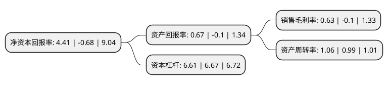

> 本页面由自动化程序生成于 2022年5月20日 01:01
> 内容可能存在错误，如有bug请提交issue至：https://github.com/Eroleice/doc-pi/issues
{.is-warning}

# 上市公司基本情况

## 基本资料

深圳市海王生物工程股份有限公司（以下简称“海王生物”）成立于1992年12月13日，深圳市。于1998年12月18日在深交所主板上市。

海王生物注册资本275,083.326万元，主要业务:医药制造，医药商业流通。主要产品:银杏叶片，博宁，银得菲，海王金樽，海王牛初乳，α-2b干扰素，白介素，海王眼之宝，葡萄糖注射液，复方氨基酸注射液，复方甘草片(合剂)，新福菌素针，海菊颗粒等。以下是详细信息：

- 公司名称: 深圳市海王生物工程股份有限公司
- 股票代码: 000078.SZ
- 所在地: 广东 - 深圳市
- 成立日期: 1992年12月13日
- 注册资本: 275,083.326万元
- 法定代表人: 张锋
- 主营业务: 医药制造，医药商业流通主要产品:银杏叶片，博宁，银得菲，海王金樽，海王牛初乳，α-2b干扰素，白介素，海王眼之宝，葡萄糖注射液，复方氨基酸注射液，复方甘草片(合剂)，新福菌素针，海菊颗粒等
- 公司官网: null
- 公司介绍: 公司是一家致力于医药制造、商业流通和零售连锁的医药类上市公司，公司的医药制造和医药商业流通业务稳步增长，渠道和终端体系建设稳步推进，医药商业流通系统继续保持健康快速发展，“阳光集中配送”业务不断深化和完善，对公司的业绩贡献有了明显的提升。公司作为国内专业从事医药商业流通的药品服务商，根据国家产业政策和行业整合趋势，科学规划发展布局，加强上下游渠道开拓的同时充分利用资本市场提高自身经营发展水平，实现规模、效益的稳步提升。同时，在新版GMP认证、药品招标采购、药品成本及人力资源成本上升等条件下，公司医药工业体系内各公司坚持专业化、规范化的发展思路，稳步推进生产运营，医药工业体系业务维持平稳增长。

## 股东及高管情况

上市公司第一大股东为深圳海王集团股份有限公司，持股1,216,445,128股，占比44.22%，为上市公司实际控制人。

截至2022年03月31日，上市公司的前十大股东中，共有7名自然人股东，2名机构股东，1个海外主体，其中5%以上大股东共有1名。上市公司前十大股东明细如下：

> 截至2022年03月31日，上市公司前十大股东信息如下：

| 股东名称 | 持股数量（股） | 持股比例 |
| --- | --- | --- |
| 深圳海王集团股份有限公司 | 1,216,445,128 | 44.22% |
| 香港中央结算有限公司(陆股通) | 29,216,395 | 1.06% |
| 孔宪俊 | 20,000,000 | 0.73% |
| 刘占军 | 11,498,793 | 0.42% |
| 中国国际金融香港资产管理有限公司-客户资金2 | 7,925,942 | 0.29% |
| 史晓明 | 6,800,027 | 0.25% |
| 孙银锁 | 5,800,050 | 0.21% |
| 黄楚彬 | 5,006,000 | 0.18% |
| 张超 | 4,865,000 | 0.18% |
| 徐瑞君 | 4,333,000 | 0.16% |

## 利润表分析

上市公司2021年总收入为410.53亿元，净利润为2.57亿元，实现盈利。

## 杜邦分析

> 数据列示周期：2021年 | 2020年 | 2019年
{.is-info}

上市公司的净资产收益率在近一年有所下降，下降幅度为-748.53%，其变化情况分解如下：
- 上市公司的销售毛利率在近一年下降了-730%，可能是生产效率的下降、商品原材料价格上涨或商品价格的下跌所致。
- 上市公司的资产周转率在近一年上升了7.07%，可能是源自于更快的销售回款或库存管理效果提升。
- 上市公司的财务杠杆比率在近一年下降了-0.9%，可能是减少负债降低财务费用。

