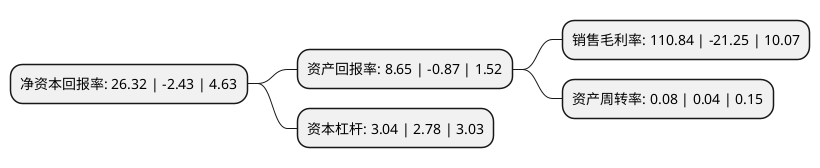

> 本页面由自动化程序生成于 2022年5月20日 01:03
> 内容可能存在错误，如有bug请提交issue至：https://github.com/Eroleice/doc-pi/issues
{.is-warning}

# 上市公司基本情况

## 基本资料

荣丰控股集团股份有限公司（以下简称“荣丰控股”）成立于1992年08月08日，青岛市。于1996年12月10日在深交所主板上市。

荣丰控股注册资本14,684.189万元，主要业务:房地产开发业务以下是详细信息：

- 公司名称: 荣丰控股集团股份有限公司
- 股票代码: 000668.SZ
- 所在地: 山东 - 青岛市
- 成立日期: 1992年08月08日
- 注册资本: 14,684.189万元
- 法定代表人: 王征
- 主营业务: 房地产开发业务
- 公司官网: www.rongfengholding.com
- 公司介绍: 公司系一家于深圳证券交易所挂牌上市之A股房地产上市公司，具有由建设部颁发的房地产开发企业二级资质。经营范围为：房地产开发经营、商品房销售、租赁；物业管理；建筑装修；园林绿化；实业投资；投资管理(国家有专项审批的项目经审批后方可经营)。公司主业明确，现有项目运营稳定，能够为公司提供良好的业绩支撑；公司财务状况良好，资产负债率较低，财务结构比较稳健；公司主要股东和关联方在资金等方面给予了公司有力的支持，为公司在建项目的顺利推进提供了有力支撑；公司拥有完善的治理结构和决策议事的内部管理制度，运营规范，为公司经营活动的有序开展提供了有力保障。

## 股东及高管情况

上市公司第一大股东为盛世达投资有限公司，持股59,926,083股，占比40.81%，为上市公司实际控制人。

截至2022年03月31日，上市公司的前十大股东中，共有7名自然人股东，3名机构股东，其中5%以上大股东共有1名。上市公司前十大股东明细如下：

> 截至2022年03月31日，上市公司前十大股东信息如下：

| 股东名称 | 持股数量（股） | 持股比例 |
| --- | --- | --- |
| 盛世达投资有限公司 | 59,926,083 | 40.81% |
| 玲珑集团有限公司 | 3,439,200 | 2.34% |
| 王秀荣 | 2,703,500 | 1.84% |
| 王白云 | 1,929,500 | 1.31% |
| 陈照军 | 1,280,600 | 0.87% |
| 湖北正熵资产管理有限公司 | 1,280,000 | 0.87% |
| 王召军 | 1,205,991 | 0.82% |
| 周永忠 | 1,153,500 | 0.79% |
| 王坚宏 | 1,047,700 | 0.71% |
| 王家骥 | 994,600 | 0.68% |

## 利润表分析

上市公司2021年总收入为2.52亿元，净利润为2.79亿元，实现盈利。

## 杜邦分析

> 数据列示周期：2021年 | 2020年 | 2019年
{.is-info}

上市公司的净资产收益率在近一年有所下降，下降幅度为-1183.13%，其变化情况分解如下：
- 上市公司的销售毛利率在近一年下降了-621.6%，可能是生产效率的下降、商品原材料价格上涨或商品价格的下跌所致。
- 上市公司的资产周转率在近一年上升了100%，可能是源自于更快的销售回款或库存管理效果提升。
- 上市公司的财务杠杆比率在近一年上升了9.35%，可能是增加负债扩大生产规模。

