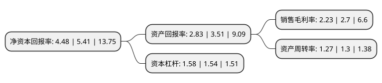

> 本页面由自动化程序生成于 2022年5月20日 01:03
> 内容可能存在错误，如有bug请提交issue至：https://github.com/Eroleice/doc-pi/issues
{.is-warning}

# 上市公司基本情况

## 基本资料

浙江震元股份有限公司（以下简称“浙江震元”）成立于1993年04月02日，绍兴市。于1997年04月10日在深交所主板上市。

浙江震元注册资本33,412.329万元，主要业务:医药商业的批发，零售和医药工业产品销售。以下是详细信息：

- 公司名称: 浙江震元股份有限公司
- 股票代码: 000705.SZ
- 所在地: 浙江 - 绍兴市
- 成立日期: 1993年04月02日
- 注册资本: 33,412.329万元
- 法定代表人: 吴海明
- 主营业务: 医药商业的批发，零售和医药工业产品销售
- 公司官网: www.zjzy.com
- 公司介绍: 公司系科、工、贸于一体的大型医药上市公司，主要生产经营中药材、中药饮片、中成药、化学原料药、化学药制剂、抗生素、生化药品、生物制品、医疗器械、化学试剂、玻璃仪器等，是国家GSP认证企业。控股子公司浙江震元制药有限公司，集研发、生产、销售于一体，是制霉素国内独家生产企业和全球最大的罗红霉素生产厂商，专业生产大环内酯类、氨基糖苷类、头孢菌素类、抗真菌类、心血管类等药物，所有生产线均通过国家GMP和ISO9001质量体系、ISO14001环境体系的认证，产品远销欧美、东南亚、韩国等国家和地区。公司先后被授予中国服务业500强企业、中国100强医药企业、中华老字号品牌价值百强企业、省服务业80强企业、省医药商业10强企业、省级文明单位、绍兴市首批劳动关系和谐企业等荣誉，“震元堂”被国家商务部认定为首批“中华老字号”，“震元”品牌被评为“亚洲名优品牌奖”，“震元”商标为浙江省著名商标。

## 股东及高管情况

上市公司第一大股东为绍兴震元健康产业集团有限公司，持股83,300,474股，占比24.93%，**疑似为**上市公司实际控制人。

截至2022年03月31日，上市公司的前十大股东中，共有7名自然人股东，1名机构股东，2个产品账户，其中5%以上大股东共有1名。上市公司前十大股东明细如下：

> 未能通过持股比例判定出上市公司实际控制人（持股30%以上）
> 可能存在通过间接持股、联合持股、协议控制等方式拥有实际控制权的主体，具体请参考上市公司定期公告！
{.is-warning}

> 截至2022年03月31日，上市公司前十大股东信息如下：

| 股东名称 | 持股数量（股） | 持股比例 |
| --- | --- | --- |
| 绍兴震元健康产业集团有限公司 | 83,300,474 | 24.93% |
| 王申 | 8,466,020 | 2.53% |
| 蒋仕波 | 4,970,000 | 1.49% |
| 深圳市南方鑫泰私募证券基金管理有限公司-南方鑫泰-私募学院菁英145号基金 | 4,900,000 | 1.47% |
| 秋植炜 | 4,900,000 | 1.47% |
| 王美花 | 3,570,000 | 1.07% |
| 钟依阳 | 3,000,000 | 0.9% |
| 诸彩凤 | 2,465,101 | 0.74% |
| 深圳市南方鑫泰私募证券基金管理有限公司-南方鑫泰3号私募基金 | 2,400,000 | 0.72% |
| 季爱琴 | 2,265,000 | 0.68% |

## 利润表分析

上市公司2021年总收入为36.12亿元，净利润为0.8亿元，实现盈利。

## 杜邦分析

> 数据列示周期：2021年 | 2020年 | 2019年
{.is-info}

上市公司的净资产收益率在近一年有所下降，下降幅度为-17.19%，其变化情况分解如下：
- 上市公司的销售毛利率在近一年下降了-17.41%，可能是生产效率的下降、商品原材料价格上涨或商品价格的下跌所致。
- 上市公司的资产周转率在近一年下降了-2.31%，可能是源自于更慢的销售回款或库存管理效果下降。
- 上市公司的财务杠杆比率在近一年上升了2.6%，可能是增加负债扩大生产规模。

