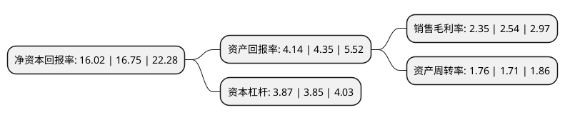

> 本页面由自动化程序生成于 2022年5月20日 01:09
> 内容可能存在错误，如有bug请提交issue至：https://github.com/Eroleice/doc-pi/issues
{.is-warning}

# 上市公司基本情况

## 基本资料

嘉事堂药业股份有限公司（以下简称“嘉事堂”）成立于1997年04月22日，北京市。于2010年08月18日在深交所中小板上市。

嘉事堂注册资本29,170.712万元，公司一直从事医药批发，连锁零售业务，经营与医药批发，零售相关的医药物流业务，在满足公司自身医药批发，零售需求的基础上，开展第三方医药物流配送业务。以下是详细信息：

- 公司名称: 嘉事堂药业股份有限公司
- 股票代码: 002462.SZ
- 所在地: 北京 - 北京市
- 成立日期: 1997年04月22日
- 注册资本: 29,170.712万元
- 法定代表人: 续文利
- 主营业务: 公司一直从事医药批发，连锁零售业务，经营与医药批发，零售相关的医药物流业务，在满足公司自身医药批发，零售需求的基础上，开展第三方医药物流配送业务
- 公司官网: www.cachet.com.cn
- 公司介绍: 公司是北京市直营药店的龙头企业，国内药品经营企业中规模化、现代化、专业化的医药物流中心，现已逐步成长为业务覆盖全国的医疗综合服务商。公司专注于以医药批发、零售为主营业务模式的医药商业经营，在北京地区取得较为明显的行业地位和竞争优势,连锁零售在北京地区拥有数百家全资直营药店，连续多年被评为全国医药零售二十强企业。公司形成了以医药商业为主导、以医药物流为依托，辅以医药工业的综合性现代医药企业经营格局。连锁零售为北京地区最大的直营药店网络，品牌知名度名列前茅；医药分销为北京地区两家社区医院药品配送商，覆盖二、三级医院的销售网络；医药物流为北京地区三家第三方药品配送试点企业；药品生产拥有多个较大的OTC产品销售网络。

## 股东及高管情况

上市公司第一大股东为中国光大医疗健康产业有限公司，持股41,876,431股，占比14.36%，**疑似为**上市公司实际控制人。

截至2022年03月31日，上市公司的前十大股东中，共有3名自然人股东，5名机构股东，2名其他股东，其中5%以上大股东共有2名。上市公司前十大股东明细如下：

> 未能通过持股比例判定出上市公司实际控制人（持股30%以上）
> 可能存在通过间接持股、联合持股、协议控制等方式拥有实际控制权的主体，具体请参考上市公司定期公告！
{.is-warning}

> 截至2022年03月31日，上市公司前十大股东信息如下：

| 股东名称 | 持股数量（股） | 持股比例 |
| --- | --- | --- |
| 中国光大医疗健康产业有限公司 | 41,876,431 | 14.36% |
| 中国光大集团股份公司 | 41,180,805 | 14.12% |
| 北京海淀置业集团有限公司 | 12,760,800 | 4.37% |
| 中协宾馆 | 12,169,368 | 4.17% |
| 北京市朝阳区人民政府国有资产监督管理委员会 | 7,043,022 | 2.41% |
| 施建刚 | 5,050,000 | 1.73% |
| 北京市盛丰顺业投资经营有限责任公司 | 5,014,826 | 1.72% |
| 中央汇金资产管理有限责任公司 | 4,361,100 | 1.5% |
| 北京市房山区人民政府国有资产监督管理委员会 | 2,856,337 | 0.98% |
| 张惠朋 | 1,800,000 | 0.62% |

## 利润表分析

上市公司2021年总收入为256.25亿元，净利润为6.01亿元，实现盈利。

## 杜邦分析

> 数据列示周期：2021年 | 2020年 | 2019年
{.is-info}

上市公司的净资产收益率在近一年有所下降，下降幅度为-4.36%，其变化情况分解如下：
- 上市公司的销售毛利率在近一年下降了-7.48%，可能是生产效率的下降、商品原材料价格上涨或商品价格的下跌所致。
- 上市公司的资产周转率在近一年上升了2.92%，可能是源自于更快的销售回款或库存管理效果提升。
- 上市公司的财务杠杆比率在近一年上升了0.52%，可能是增加负债扩大生产规模。

