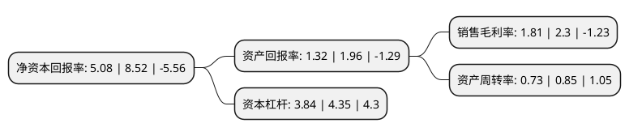

> 本页面由自动化程序生成于 2022年5月20日 01:10
> 内容可能存在错误，如有bug请提交issue至：https://github.com/Eroleice/doc-pi/issues
{.is-warning}

# 上市公司基本情况

## 基本资料

瑞康医药集团股份有限公司（以下简称“瑞康医药”）成立于2004年09月21日，烟台市。于2011年06月10日在深交所中小板上市。

瑞康医药注册资本150,471.047万元，以规模以上医院及基础医疗市场的直接销售为主营业务。以下是详细信息：

- 公司名称: 瑞康医药集团股份有限公司
- 股票代码: 002589.SZ
- 所在地: 山东 - 烟台市
- 成立日期: 2004年09月21日
- 注册资本: 150,471.047万元
- 法定代表人: 韩旭
- 主营业务: 以规模以上医院及基础医疗市场的直接销售为主营业务
- 公司官网: www.realcan.cn
- 公司介绍: 公司自成立以来一直致力于打造直接面向医疗机构和零售渠道的直销网络，目前瑞康医药已经成长为向全国医疗机构直销药品、医疗器械、医用耗材，同时提供医疗信息化服务、医院管理咨询服务、院内物流服务和医院后勤服务的综合服务商，是全国药品、医疗器械流通行业的领军企业，销售网络覆盖全国31个省份(直辖市)。公司在“提升业务管理水平达成内涵式增长”、“新型业务创新性发展”的战略引领下，一方面稳固药品、器械等优势业务的核心地位，对业务流程实施精细化管理，提升公司运营水平、控制管理费用、提高资金使用效率，重视对医疗机构终端的把控和服务能力的提升，达成内涵式增长。另一方面，顺应国家出台的行业改革政策和由此催生出的新业态与新需求，积极探索新型业务，创造新的发展机会，增加多个新的利润增长点，通过独特的合伙人机制，将“瑞康模式”和公司在山东省内形成的高效管理制度在全国复制，从而实现全国业务一盘棋、协同增效，达成在国家医改“控费”和“增效”的大背景下，公司的经营收入和利润实现跨越式增长。

## 股东及高管情况

上市公司第一大股东为张仁华，持股256,968,159股，占比17.08%，**疑似为**上市公司实际控制人。

截至2022年03月31日，上市公司的前十大股东中，共有4名自然人股东，5名机构股东，1个产品账户，其中5%以上大股东共有2名。上市公司前十大股东明细如下：

> 未能通过持股比例判定出上市公司实际控制人（持股30%以上）
> 可能存在通过间接持股、联合持股、协议控制等方式拥有实际控制权的主体，具体请参考上市公司定期公告！
{.is-warning}

> 截至2022年03月31日，上市公司前十大股东信息如下：

| 股东名称 | 持股数量（股） | 持股比例 |
| --- | --- | --- |
| 张仁华 | 256,968,159 | 17.08% |
| 韩旭 | 187,491,897 | 12.46% |
| 荆州招商慧泽医药投资合伙企业(有限合伙) | 75,235,525 | 5% |
| 江阴毅达高新股权投资合伙企业(有限合伙) | 30,441,184 | 2.02% |
| 长城国融投资管理有限公司 | 26,845,667 | 1.78% |
| 于忠勇 | 16,018,010 | 1.06% |
| 徐飞 | 15,123,600 | 1.01% |
| 上海艾动实业有限公司 | 12,162,101 | 0.81% |
| 瑞康医药集团股份有限公司-第二期员工持股计划 | 9,029,634 | 0.6% |
| 青岛城投金融控股集团有限公司 | 8,100,000 | 0.54% |

## 利润表分析

上市公司2021年总收入为210.59亿元，净利润为3.82亿元，实现盈利。

## 杜邦分析

> 数据列示周期：2021年 | 2020年 | 2019年
{.is-info}

上市公司的净资产收益率在近一年有所下降，下降幅度为-40.38%，其变化情况分解如下：
- 上市公司的销售毛利率在近一年下降了-21.3%，可能是生产效率的下降、商品原材料价格上涨或商品价格的下跌所致。
- 上市公司的资产周转率在近一年下降了-14.12%，可能是源自于更慢的销售回款或库存管理效果下降。
- 上市公司的财务杠杆比率在近一年下降了-11.72%，可能是减少负债降低财务费用。

