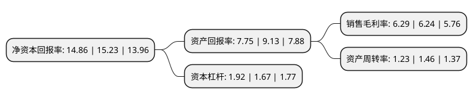

> 本页面由自动化程序生成于 2022年5月20日 01:11
> 内容可能存在错误，如有bug请提交issue至：https://github.com/Eroleice/doc-pi/issues
{.is-warning}

# 上市公司基本情况

## 基本资料

一心堂药业集团股份有限公司（以下简称“一心堂”）成立于2000年11月08日，昆明市。于2014年07月02日在深交所中小板上市。

一心堂注册资本59,618.053万元，公司所处的行业为医药流通行业，主营业务为医药零售连锁和医药批发业务，其中医药零售连锁是公司的核心业务。公司主要经营范围包括中药，西药及医疗器械等产品的经营销售，主要收入来源为连锁直营门店医药销售收入。以下是详细信息：

- 公司名称: 一心堂药业集团股份有限公司
- 股票代码: 002727.SZ
- 所在地: 云南 - 昆明市
- 成立日期: 2000年11月08日
- 注册资本: 59,618.053万元
- 法定代表人: 阮鸿献
- 主营业务: 公司所处的行业为医药流通行业，主营业务为医药零售连锁和医药批发业务，其中医药零售连锁是公司的核心业务公司主要经营范围包括中药，西药及医疗器械等产品的经营销售，主要收入来源为连锁直营门店医药销售收入
- 公司官网: www.hx8886.com
- 公司介绍: 公司是一家以药品经营为主的大型零售连锁企业，主营业务为医药零售连锁和医药批发业务，其中医药零售连锁是公司的核心业务。公司开设了千余家直营连锁药店，遍及云南、贵州、广西、四川、山西、重庆、天津、上海、海南、河南等多个省，连续多年蝉联全国医药零售连锁十强企业。公司药真价实品种全，依托规模直营优势，每年通过大批量的采购带给消费者价格尽量低的药品。通过完善的五级质量管理体系，进入公司销售的药品都会受到全程质量监控与跟踪，确保药品质量可控。公司始终以健康类产品经营为核心，致力于为广大民众提供专业、全面的健康解决方案。在全面发展线下业务的同时，公司积极迎接互联网和移动互联网化，建设全渠道的销售网络、全渠道沟通网络和全渠道的服务网络。

## 股东及高管情况

上市公司第一大股东为阮鸿献，持股182,131,790股，占比30.55%，为上市公司实际控制人。

截至2022年03月31日，上市公司的前十大股东中，共有5名自然人股东，1名机构股东，2个产品账户，2个海外主体，其中5%以上大股东共有6名。上市公司前十大股东明细如下：

> 截至2022年03月31日，上市公司前十大股东信息如下：

| 股东名称 | 持股数量（股） | 持股比例 |
| --- | --- | --- |
| 阮鸿献 | 182,131,790 | 30.55% |
| 阮鸿献 | 182,131,790 | 30.5498% |
| 刘琼 | 77,964,100 | 13.08% |
| 刘琼 | 77,964,100 | 13.08% |
| 广州白云山医药集团股份有限公司 | 35,966,991 | 6.03% |
| 香港中央结算有限公司(陆股通) | 30,408,742 | 5.1% |
| 香港中央结算有限公司(陆股通) | 29,637,721 | 4.97% |
| 中国建设银行股份有限公司-工银瑞信前沿医疗股票型证券投资基金 | 6,000,000 | 1.01% |
| 韩红昌 | 4,915,604 | 0.82% |
| 中国银行股份有限公司-富国积极成长一年定期开放混合型证券投资基金 | 4,108,797 | 0.69% |

## 利润表分析

上市公司2021年总收入为145.87亿元，净利润为9.17亿元，实现盈利。

## 杜邦分析

> 数据列示周期：2021年 | 2020年 | 2019年
{.is-info}

上市公司的净资产收益率在近一年有所下降，下降幅度为-2.43%，其变化情况分解如下：
- 上市公司的销售毛利率在近一年上升了0.8%，可能是生产效率的提升、商品原材料价格下跌或商品价格的上涨所致。
- 上市公司的资产周转率在近一年下降了-15.75%，可能是源自于更慢的销售回款或库存管理效果下降。
- 上市公司的财务杠杆比率在近一年上升了14.97%，可能是增加负债扩大生产规模。

