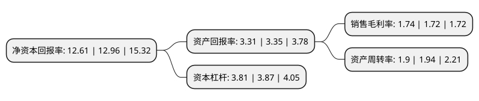

> 本页面由自动化程序生成于 2022年5月20日 01:12
> 内容可能存在错误，如有bug请提交issue至：https://github.com/Eroleice/doc-pi/issues
{.is-warning}

# 上市公司基本情况

## 基本资料

鹭燕医药股份有限公司（以下简称“鹭燕医药”）成立于2008年09月03日，厦门市。于2016年02月18日在深交所中小板上市。

鹭燕医药注册资本38,851.674万元，主要以福建省为目标市场，以药品，中药饮片，医疗器械，疫苗等分销及医药零售连锁为主营业务。公司主要经营药品，中药饮片，医疗器械，疫苗等。以下是详细信息：

- 公司名称: 鹭燕医药股份有限公司
- 股票代码: 002788.SZ
- 所在地: 福建 - 厦门市
- 成立日期: 2008年09月03日
- 注册资本: 38,851.674万元
- 法定代表人: 吴金祥
- 主营业务: 主要以福建省为目标市场，以药品，中药饮片，医疗器械，疫苗等分销及医药零售连锁为主营业务公司主要经营药品，中药饮片，医疗器械，疫苗等
- 公司官网: www.luyan.com.cn
- 公司介绍: 公司是一家以生产和经营人类健康产品为核心产业的医药集团，于2016年2月18日在深交所正式挂牌上市。近年来，鹭燕医药面对新时期、新机遇，借助资本市场的力量和上市公司的平台，大力推进横向扩张和纵向发展，积极导入以信息化、智能化为引领的“三维立体”发展战略，公司各项事业呈现出积极向上的新的发展新格局，企业综合实力和行业地位进一步提升。目前，公司已在福建、江西、四川、安徽、海南、中国香港等地区扩张布局，实现了跨区域的快速发展。同时，公司借助渠道及品牌优势，积极向研发与制造、医疗、养老、养生等产业链上下游延伸，构建大健康生态圈，努力把公司建设成为人类健康产业中一流的全球化企业。鹭燕医药是中国服务业500强、中国医药流通企业五十强、福建省百强企业。

## 股东及高管情况

上市公司第一大股东为厦门麦迪肯科技有限公司，持股138,030,674股，占比35.53%，为上市公司实际控制人。

截至2022年03月31日，上市公司的前十大股东中，共有5名自然人股东，4名机构股东，1个海外主体，其中5%以上大股东共有1名。上市公司前十大股东明细如下：

> 截至2022年03月31日，上市公司前十大股东信息如下：

| 股东名称 | 持股数量（股） | 持股比例 |
| --- | --- | --- |
| 厦门麦迪肯科技有限公司 | 138,030,674 | 35.53% |
| 厦门铭源红桥高科创业投资有限合伙企业(有限合伙) | 5,881,192 | 1.51% |
| 李卫阳 | 4,936,545 | 1.27% |
| 厦门三态科技有限公司 | 4,464,221 | 1.15% |
| 王珺 | 4,451,699 | 1.15% |
| 张珺瑛 | 3,590,676 | 0.92% |
| JPMORGAN CHASE BANK,NATIONAL ASSOCIATION | 2,837,572 | 0.73% |
| 中国国际金融香港资产管理有限公司-客户资金2 | 2,511,044 | 0.65% |
| 朱明国 | 1,680,000 | 0.43% |
| 张继华 | 1,359,250 | 0.35% |

## 利润表分析

上市公司2021年总收入为175.45亿元，净利润为3.04亿元，实现盈利。

## 杜邦分析

> 数据列示周期：2021年 | 2020年 | 2019年
{.is-info}

上市公司的净资产收益率在近一年有所下降，下降幅度为-2.7%，其变化情况分解如下：
- 上市公司的销售毛利率在近一年上升了1.16%，可能是生产效率的提升、商品原材料价格下跌或商品价格的上涨所致。
- 上市公司的资产周转率在近一年下降了-2.06%，可能是源自于更慢的销售回款或库存管理效果下降。
- 上市公司的财务杠杆比率在近一年下降了-1.55%，可能是减少负债降低财务费用。

