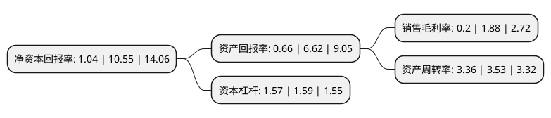

> 本页面由自动化程序生成于 2022年5月20日 01:21
> 内容可能存在错误，如有bug请提交issue至：https://github.com/Eroleice/doc-pi/issues
{.is-warning}

# 上市公司基本情况

## 基本资料

四川合纵药易购医药股份有限公司（以下简称“药易购”）成立于2007年04月28日，成都市。于2021年01月27日在深交所创业板上市。

药易购注册资本9,566.668万元，公司通过创新的互联网及大数据技术，高效的仓储及物流系统，完善的品类管理以及全方位，多层次的服务体系等，逐步减少院外市场中间流通环节，为广大的社区医药终端和基层医疗机构提供便捷，高效，低成本的医药流通服务。以下是详细信息：

- 公司名称: 四川合纵药易购医药股份有限公司
- 股票代码: 300937.SZ
- 所在地: 四川 - 成都市
- 成立日期: 2007年04月28日
- 注册资本: 9,566.668万元
- 法定代表人: 李燕飞
- 主营业务: 公司通过创新的互联网及大数据技术，高效的仓储及物流系统，完善的品类管理以及全方位，多层次的服务体系等，逐步减少院外市场中间流通环节，为广大的社区医药终端和基层医疗机构提供便捷，高效，低成本的医药流通服务
- 公司官网: www.hezongyy.com
- 公司介绍: 公司是一家专注于“院外市场”的医药流通综合服务商。公司通过创新的互联网及大数据技术、高效的仓储及物流系统、完善的品类管理以及全方位、多层次的服务体系等，逐步减少院外市场中间流通环节，为广大的社区医药终端和基层医疗机构提供便捷、高效、低成本的医药流通服务。公司旨在提供方便快捷的采购体验和及时高效的配送服务，能够有效提高对医药终端的服务效率，以增强终端客户的采购黏性，提升终端覆盖率及单客采购量，促进公司业绩持续稳定增长。公司已成为西南地区领先的医药流通企业，被工信部、商务部等部委联合授予“中国互联网医药行业百强企业”，被中国医药供应链联盟评为“最具投资价值医药电商企业”。

## 股东及高管情况

上市公司第一大股东为李燕飞，持股35,370,000股，占比36.97%，为上市公司实际控制人。

截至2022年03月31日，上市公司的前十大股东中，共有4名自然人股东，4名机构股东，2个产品账户，其中5%以上大股东共有3名。上市公司前十大股东明细如下：

> 截至2022年03月31日，上市公司前十大股东信息如下：

| 股东名称 | 持股数量（股） | 持股比例 |
| --- | --- | --- |
| 李燕飞 | 35,370,000 | 36.97% |
| 成都市合森投资管理中心(有限合伙) | 6,800,000 | 7.11% |
| 田文书 | 6,000,000 | 6.27% |
| 周跃武 | 3,300,000 | 3.45% |
| 成都博源新航创业投资基金合伙企业(有限合伙) | 3,155,400 | 3.3% |
| 四川海特航空创业投资基金合伙企业(有限合伙) | 2,507,900 | 2.62% |
| 李锦 | 2,400,000 | 2.51% |
| 嘉兴海容陆号股权投资合伙企业(有限合伙) | 2,386,263 | 2.49% |
| 成都市合齐投资管理中心(有限合伙) | 1,430,000 | 1.49% |
| 成都博源天鸿投资合伙企业(有限合伙) | 1,067,700 | 1.12% |

## 利润表分析

上市公司2021年总收入为34亿元，净利润为0.06亿元，实现盈利。

## 杜邦分析

> 数据列示周期：2021年 | 2020年 | 2019年
{.is-info}

上市公司的净资产收益率在近一年有所下降，下降幅度为-90.14%，其变化情况分解如下：
- 上市公司的销售毛利率在近一年下降了-89.36%，可能是生产效率的下降、商品原材料价格上涨或商品价格的下跌所致。
- 上市公司的资产周转率在近一年下降了-4.82%，可能是源自于更慢的销售回款或库存管理效果下降。
- 上市公司的财务杠杆比率在近一年下降了-1.26%，可能是减少负债降低财务费用。

