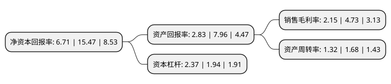

> 本页面由自动化程序生成于 2022年5月20日 01:22
> 内容可能存在错误，如有bug请提交issue至：https://github.com/Eroleice/doc-pi/issues
{.is-warning}

# 上市公司基本情况

## 基本资料

漱玉平民大药房连锁股份有限公司（以下简称“漱玉平民”）成立于1999年01月21日，济南市。于2021年07月05日在深交所创业板上市。

漱玉平民注册资本40,534万元，公司一直专注于医药及健康相关产品的零售业务，依托连锁门店线下渠道和互联网线上平台，为消费者提供安全，丰富，优质的健康产品，致力于成为行业内具有影响力的健康产业集团。以下是详细信息：

- 公司名称: 漱玉平民大药房连锁股份有限公司
- 股票代码: 301017.SZ
- 所在地: 山东 - 济南市
- 成立日期: 1999年01月21日
- 注册资本: 40,534万元
- 法定代表人: 秦光霞
- 主营业务: 公司一直专注于医药及健康相关产品的零售业务，依托连锁门店线下渠道和互联网线上平台，为消费者提供安全，丰富，优质的健康产品，致力于成为行业内具有影响力的健康产业集团
- 公司官网: www.shuyupingmin.com
- 公司介绍: 公司是山东省第一家平价药房。漱玉平民大药房坚持“明明白白购药，实实在在便宜--漱玉平民大药房为您节省每一分钱”的经营理念；遵守“药品真、价格低、服务好、待人诚”的经营宗旨，使公司的经济效益、社会效益不断提高，赢得了广大消费者的信赖与支持。公司及部分门店先后荣获“省、市、区级消费者满意单位”、“山东省诚信企业”、“山东省百姓口碑最佳荣誉单位”、“山东省最具成长性中小企业”、“山东省商业名牌企业”、“山东省商业服务名牌”、“山东省商业服务业先进企业”、“山东省民企帮村先进单位”、“济南市文明诚信药店”、“计量价格信得过单位”、“重合同守信用单位”、“济南市优秀民营企业”、“AAA级诚信企业”等多项荣誉称号，“漱玉平民”品牌被评为济南市著名商标。

## 股东及高管情况

上市公司第一大股东为李文杰，持股142,560,000股，占比35.17%，为上市公司实际控制人。

截至2022年03月31日，上市公司的前十大股东中，共有2名自然人股东，6名机构股东，2个产品账户，其中5%以上大股东共有5名。上市公司前十大股东明细如下：

> 截至2022年03月31日，上市公司前十大股东信息如下：

| 股东名称 | 持股数量（股） | 持股比例 |
| --- | --- | --- |
| 李文杰 | 142,560,000 | 35.17% |
| 秦光霞 | 73,440,000 | 18.12% |
| 济南漱玉锦云投资合伙企业(有限合伙) | 45,600,000 | 11.25% |
| 济南漱玉通成投资合伙企业(有限合伙) | 38,400,000 | 9.47% |
| 阿里健康科技(中国)有限公司 | 34,080,000 | 8.41% |
| 华泰紫金投资有限责任公司-南京华泰大健康一号股权投资合伙企业(有限合伙) | 16,078,800 | 3.97% |
| 济南漱玉锦阳投资合伙企业(有限合伙) | 14,400,000 | 3.55% |
| 华泰证券资管-浦发银行-华泰漱玉平民家园1号创业板员工持股集合资产管理计划 | 2,405,700 | 0.59% |
| 中信证券股份有限公司 | 527,119 | 0.13% |
| 华润元大基金-华泰证券-华润元大基金慧享集合资产管理计划 | 525,972 | 0.13% |

## 利润表分析

上市公司2021年总收入为53.21亿元，净利润为1.14亿元，实现盈利。

## 杜邦分析

> 数据列示周期：2021年 | 2020年 | 2019年
{.is-info}

上市公司的净资产收益率在近一年有所下降，下降幅度为-56.63%，其变化情况分解如下：
- 上市公司的销售毛利率在近一年下降了-54.55%，可能是生产效率的下降、商品原材料价格上涨或商品价格的下跌所致。
- 上市公司的资产周转率在近一年下降了-21.43%，可能是源自于更慢的销售回款或库存管理效果下降。
- 上市公司的财务杠杆比率在近一年上升了22.16%，可能是增加负债扩大生产规模。

