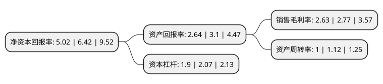

> 本页面由自动化程序生成于 2022年5月20日 01:23
> 内容可能存在错误，如有bug请提交issue至：https://github.com/Eroleice/doc-pi/issues
{.is-warning}

# 上市公司基本情况

## 基本资料

湖南达嘉维康医药产业股份有限公司（以下简称“达嘉维康”）成立于2002年10月24日，长沙市。于2021年12月07日在深交所创业板上市。

达嘉维康注册资本20,650.57万元，主要从事药品，生物制品，医疗器械等产品的分销及零售业务。以下是详细信息：

- 公司名称: 湖南达嘉维康医药产业股份有限公司
- 股票代码: 301126.SZ
- 所在地: 湖南 - 长沙市
- 成立日期: 2002年10月24日
- 注册资本: 20,650.57万元
- 法定代表人: 王毅清
- 主营业务: 主要从事药品，生物制品，医疗器械等产品的分销及零售业务
- 公司官网: www.djwk.com.cn
- 公司介绍: 公司作为区域性医药流通企业，主要从事药品、生物制品、医疗器械等产品的分销及零售业务。公司依托批零一体化，发挥供应链优势，发展专业药房新零售模式，并通过向供应链上下游延伸开展增值服务，逐步向医药服务商转型。公司已与1000余家国内外优质供应商保持了长期稳定的合作关系，主要经营的药品、中药饮片、医疗器械等品种品规一万余种，并且充分发挥批零一体化渠道服务优势，向供应链上下游延伸开展增值服务，不断加强与药品生产企业的深度战略合作，提高对重磅新品的开发力度，持续扩大品种优势。近年来，公司积极推进DTP药房布局，招股说明书签署日，开设19家DTP专业药房，形成了以长沙市为中心，覆盖湖南全省14个地市州的DTP药房布局，经营新特药品种品规194个，凭借专业药房的规范化管理，2019年通过《零售药店经营特殊疾病药品服务规范》(“特药药房标准”)，成为全国第一批达标药店，并荣获“2019年度十大DTP药房”、“2019年中国药品零售最具竞争力优秀门店”。

## 股东及高管情况

上市公司第一大股东为王毅清，持股70,144,219股，占比33.97%，为上市公司实际控制人。

截至2022年03月31日，上市公司的前十大股东中，共有4名自然人股东，6名机构股东，其中5%以上大股东共有2名。上市公司前十大股东明细如下：

> 截至2022年03月31日，上市公司前十大股东信息如下：

| 股东名称 | 持股数量（股） | 持股比例 |
| --- | --- | --- |
| 王毅清 | 70,144,219 | 33.97% |
| 钟雪松 | 21,088,356 | 10.21% |
| 长沙同嘉投资管理合伙企业(有限合伙) | 9,800,000 | 4.75% |
| 宁波梅山保税港区量吉股权投资合伙企业(有限合伙) | 9,315,294 | 4.51% |
| 老百姓大药房连锁股份有限公司 | 6,300,000 | 3.05% |
| 桐乡稼沃云枫股权投资合伙企业(有限合伙) | 5,714,285 | 2.77% |
| 农银(湖南)壹号股权投资企业(有限合伙) | 5,000,000 | 2.42% |
| 宁波梅山保税港区淳康股权投资合伙企业(有限合伙) | 4,970,421 | 2.41% |
| 刘建强 | 4,320,653 | 2.09% |
| 熊燕 | 4,000,000 | 1.94% |

## 利润表分析

上市公司2021年总收入为25.92亿元，净利润为0.68亿元，实现盈利。

## 杜邦分析

> 数据列示周期：2021年 | 2020年 | 2019年
{.is-info}

上市公司的净资产收益率在近一年有所下降，下降幅度为-21.81%，其变化情况分解如下：
- 上市公司的销售毛利率在近一年下降了-5.05%，可能是生产效率的下降、商品原材料价格上涨或商品价格的下跌所致。
- 上市公司的资产周转率在近一年下降了-10.71%，可能是源自于更慢的销售回款或库存管理效果下降。
- 上市公司的财务杠杆比率在近一年下降了-8.21%，可能是减少负债降低财务费用。

