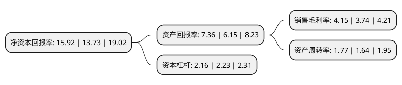

> 本页面由自动化程序生成于 2022年5月20日 01:27
> 内容可能存在错误，如有bug请提交issue至：https://github.com/Eroleice/doc-pi/issues
{.is-warning}

# 上市公司基本情况

## 基本资料

国药集团药业股份有限公司（以下简称“国药股份”）成立于1999年12月21日，北京市。于2002年11月27日在上交所主板上市。

国药股份注册资本75,450.3万元，主要业务:医药商业，医药工业。以下是详细信息：

- 公司名称: 国药集团药业股份有限公司
- 股票代码: 600511.SH
- 所在地: 北京 - 北京市
- 成立日期: 1999年12月21日
- 注册资本: 75,450.3万元
- 法定代表人: 姜修昌
- 主营业务: 医药商业，医药工业
- 公司官网: www.cncm.com.cn
- 公司介绍: 公司是世界500强企业—中国医药集团旗下的医药商业上市公司，是中国最大的药品及医疗保健产品分销商及领先的供应链服务商——国药控股股份有限公司的子公司。公司以经营麻特药品和高端处方药为主要特色，立足北京市场辐射全国医药市场，致力于为客户提供专业的第三方医药物流服务。公司拥有自主开发并独立运营的B2B医药电子商务网站——国药商城，主要针对全国中小城市零售终端药店及营利性医疗机构，通过建立零售分销和零售学术两支队伍，深入全国各地，采用线下推广与线上交易相结合的营销方式，致力于全面覆盖全国零售终端。

## 股东及高管情况

上市公司第一大股东为国药控股股份有限公司，持股412,841,745股，占比54.72%，为上市公司实际控制人。

截至2022年03月31日，上市公司的前十大股东中，共有3名自然人股东，5名机构股东，1个产品账户，1个海外主体，其中5%以上大股东共有1名。上市公司前十大股东明细如下：

> 截至2022年03月31日，上市公司前十大股东信息如下：

| 股东名称 | 持股数量（股） | 持股比例 |
| --- | --- | --- |
| 国药控股股份有限公司 | 412,841,745 | 54.72% |
| 香港中央结算有限公司(陆股通) | 12,982,503 | 1.72% |
| 北京康辰药业股份有限公司 | 10,236,189 | 1.36% |
| 北京畅新易达投资顾问有限公司 | 7,336,039 | 0.97% |
| 罗素清 | 2,118,237 | 0.28% |
| 上汽颀臻(上海)资产管理有限公司-上汽投资-颀瑞1号 | 2,010,917 | 0.27% |
| 宁波建奇启航股权投资合伙企业(有限合伙) | 1,798,063 | 0.24% |
| 中国农业银行股份有限公司-中证500交易型开放式指数证券投资基金 | 1,770,330 | 0.23% |
| 尹秋月 | 1,743,900 | 0.23% |
| 刘忠山 | 1,686,900 | 0.22% |

## 利润表分析

上市公司2021年总收入为464.68亿元，净利润为19.28亿元，实现盈利。

## 杜邦分析

> 数据列示周期：2021年 | 2020年 | 2019年
{.is-info}

上市公司的净资产收益率在近一年有所上升，上升幅度为15.95%，其变化情况分解如下：
- 上市公司的销售毛利率在近一年上升了10.96%，可能是生产效率的提升、商品原材料价格下跌或商品价格的上涨所致。
- 上市公司的资产周转率在近一年上升了7.93%，可能是源自于更快的销售回款或库存管理效果提升。
- 上市公司的财务杠杆比率在近一年下降了-3.14%，可能是减少负债降低财务费用。

