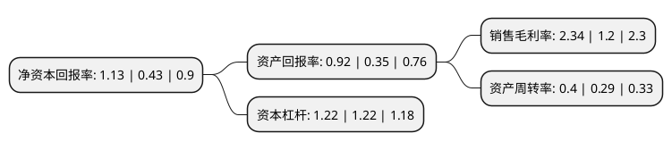

> 本页面由自动化程序生成于 2022年5月20日 01:27
> 内容可能存在错误，如有bug请提交issue至：https://github.com/Eroleice/doc-pi/issues
{.is-warning}

# 上市公司基本情况

## 基本资料

北海国发川山生物股份有限公司（以下简称“国发股份”）成立于1993年01月22日，北海市。于2003年01月14日在上交所主板上市。

国发股份注册资本52,419.835万元，主营业务为括医药制造及医药流通产业，农药产业，还涉及酒店和环保主要产品:农药产品，医药产品以下是详细信息：

- 公司名称: 北海国发川山生物股份有限公司
- 股票代码: 600538.SH
- 所在地: 广西 - 北海市
- 成立日期: 1993年01月22日
- 注册资本: 52,419.835万元
- 法定代表人: 潘利斌
- 主营业务: 主营业务为括医药制造及医药流通产业，农药产业，还涉及酒店和环保主要产品:农药产品，医药产品
- 公司官网: www.gofar.com.cn
- 公司介绍: 公司成立于1993年，是由广西、西藏、内蒙等民族地区部分企业联合发起，由清华大学、中科院海洋研究所、农业部规划设计研究院等大专院所参股、合作的，是全国唯一一家从事海水珍珠贝类(合浦南珠)、藻类、甲壳类等特色生物资源综合开发、加工的沪市A股上市公司(股票代码：600538)。公司是全国农产品加工业示范企业和全国少数民族特需用品定点生产企业，是科技部和广西壮族自治区认定的高新技术企业，也是广西壮族自治区农业产业化重点龙头企业和专利工作试点企业。公司主营业务为医药产业、文化酒店产业，下属企业主要分布于广西、深圳、北京等省(区)，初步建立了全国性的市场营销网络和区域性的产品与服务品牌。

## 股东及高管情况

上市公司第一大股东为朱蓉娟，持股90,400,542股，占比17.25%，**疑似为**上市公司实际控制人。

截至2022年03月31日，上市公司的前十大股东中，共有7名自然人股东，3名机构股东，其中5%以上大股东共有2名。上市公司前十大股东明细如下：

> 未能通过持股比例判定出上市公司实际控制人（持股30%以上）
> 可能存在通过间接持股、联合持股、协议控制等方式拥有实际控制权的主体，具体请参考上市公司定期公告！
{.is-warning}

> 截至2022年03月31日，上市公司前十大股东信息如下：

| 股东名称 | 持股数量（股） | 持股比例 |
| --- | --- | --- |
| 朱蓉娟 | 90,400,542 | 17.25% |
| 广西国发投资集团有限公司 | 27,328,371 | 5.21% |
| 彭韬 | 22,514,600 | 4.3% |
| 北海市路港建设投资开发有限公司 | 19,353,064 | 3.69% |
| 康贤通 | 18,027,549 | 3.44% |
| 姚芳媛 | 14,000,000 | 2.67% |
| 广州菁慧典通投资管理企业(有限合伙) | 11,616,529 | 2.22% |
| 潘利斌 | 10,350,050 | 1.97% |
| 舒琬婷 | 6,386,861 | 1.22% |
| 张素芬 | 6,290,000 | 1.2% |

## 利润表分析

上市公司2021年总收入为4.24亿元，净利润为0.09亿元，实现盈利。

## 杜邦分析

> 数据列示周期：2021年 | 2020年 | 2019年
{.is-info}

上市公司的净资产收益率在近一年有所上升，上升幅度为162.79%，其变化情况分解如下：
- 上市公司的销售毛利率在近一年上升了95%，可能是生产效率的提升、商品原材料价格下跌或商品价格的上涨所致。
- 上市公司的资产周转率在近一年上升了37.93%，可能是源自于更快的销售回款或库存管理效果提升。
- 上市公司的财务杠杆比率在近一年下降了0%，可能是减少负债降低财务费用。

