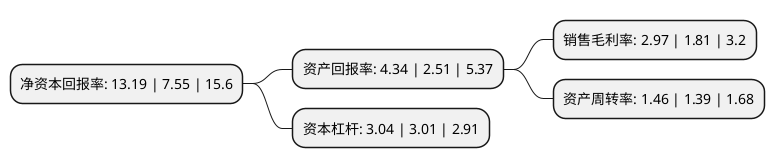

> 本页面由自动化程序生成于 2022年5月20日 01:29
> 内容可能存在错误，如有bug请提交issue至：https://github.com/Eroleice/doc-pi/issues
{.is-warning}

# 上市公司基本情况

## 基本资料

哈药集团人民同泰医药股份有限公司（以下简称“人民同泰”）成立于1994年02月19日，哈尔滨市。于1994年02月24日在上交所主板上市。

人民同泰注册资本57,988.86万元，主营业务:医药批发，医药零售等医药商业业务。以下是详细信息：

- 公司名称: 哈药集团人民同泰医药股份有限公司
- 股票代码: 600829.SH
- 所在地: 黑龙江 - 哈尔滨市
- 成立日期: 1994年02月19日
- 注册资本: 57,988.86万元
- 法定代表人: 刘波
- 主营业务: 主营业务:医药批发，医药零售等医药商业业务
- 公司官网: www.hyrmtt.com.cn
- 公司介绍: 公司于2015年4月经重大资产重组后由哈药集团三精制药股份有限公司更名而来，公司控股股东是哈药集团股份有限公司。公司现有哈药集团医药有限公司和哈药集团三精医院投资管理有限公司两家全资子公司，主营医药批发和零售业务，是国内知名的药品流通企业，黑龙江省医药商业的龙头企业。公司以先进的经营理念和专业化的优质服务，树立起“从商有德、诚信服务”的医药商业领导品牌，在全国医药商业的各项排名榜上，均处于领先地位。公司批发业务拥有健全、强大的销售网络，既覆盖了全省的终端医疗；建立了辐射全省的稳固、快速的商业分销渠道，具有很强的市场调拨能力，已拓展到吉林、内蒙古等省外市场。黑龙江省大型三级医院100%全覆盖，在黑龙江省内各三级甲等医院的销售额均列第一名，大中型批发企业和连锁药店100%覆盖。伴随基药的深入推广，省内基层医疗卫生机构覆盖率达60%以上。目前批发企业共有销售网点2800多家，具有强大的网络覆盖能力和市场掌控能力。

## 股东及高管情况

上市公司第一大股东为哈药集团股份有限公司，持股433,894,354股，占比74.82%，为上市公司实际控制人。

截至2022年03月31日，上市公司的前十大股东中，共有6名自然人股东，2名机构股东，1个产品账户，1个海外主体，其中5%以上大股东共有1名。上市公司前十大股东明细如下：

> 截至2022年03月31日，上市公司前十大股东信息如下：

| 股东名称 | 持股数量（股） | 持股比例 |
| --- | --- | --- |
| 哈药集团股份有限公司 | 433,894,354 | 74.82% |
| 方韶军 | 4,527,295 | 0.78% |
| UBS   AG | 3,658,471 | 0.63% |
| 姚志平 | 1,706,901 | 0.29% |
| 吴爱德 | 1,100,000 | 0.19% |
| 黄菊霞 | 1,075,006 | 0.19% |
| 中国民生银行股份有限公司-金元顺安元启灵活配置混合型证券投资基金 | 1,071,300 | 0.18% |
| 中国国际金融香港资产管理有限公司-客户资金2 | 1,001,464 | 0.17% |
| 付银凤 | 755,400 | 0.13% |
| 李晨 | 740,000 | 0.13% |

## 利润表分析

上市公司2021年总收入为93.15亿元，净利润为2.76亿元，实现盈利。

## 杜邦分析

> 数据列示周期：2021年 | 2020年 | 2019年
{.is-info}

上市公司的净资产收益率在近一年有所上升，上升幅度为74.7%，其变化情况分解如下：
- 上市公司的销售毛利率在近一年上升了64.09%，可能是生产效率的提升、商品原材料价格下跌或商品价格的上涨所致。
- 上市公司的资产周转率在近一年上升了5.04%，可能是源自于更快的销售回款或库存管理效果提升。
- 上市公司的财务杠杆比率在近一年上升了1%，可能是增加负债扩大生产规模。

