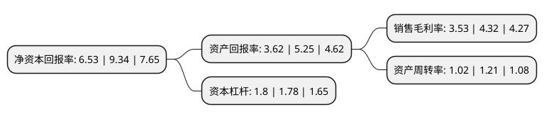

> 本页面由自动化程序生成于 2022年5月20日 01:29
> 内容可能存在错误，如有bug请提交issue至：https://github.com/Eroleice/doc-pi/issues
{.is-warning}

# 上市公司基本情况

## 基本资料

上海第一医药股份有限公司（以下简称“第一医药”）成立于1992年09月23日，上海市。于1994年02月24日在上交所主板上市。

第一医药注册资本22,308.635万元，医药零售及批发以下是详细信息：

- 公司名称: 上海第一医药股份有限公司
- 股票代码: 600833.SH
- 所在地: 上海 - 上海市
- 成立日期: 1992年09月23日
- 注册资本: 22,308.635万元
- 法定代表人: 孙伟
- 主营业务: 医药零售及批发
- 公司官网: www.shdyyy.com.cn
- 公司介绍: 公司是一家以药品零售、批发为主业的公众性上市公司，是以批发和零售为主的医药流通企业。在零售方面，公司拥有大型医药零售旗舰店--“上海第一医药商店”，同时还拥有一批著名的专业药店，如“冠心药房”，以及百年老字号特色药房，如“五洲大药房”、“老德记药房”等；在专业经营方面，公司旗下具有历史悠久的号称“化剂元老”、“天平大王”的上海长城华美仪器化剂有限公司。在上海市医疗体制改革中，公司下属的医药一店、灵林药房、博山药房等药房已被定为上海市医保定点药房。公司作为医药零售业的老字号，主要以名、新、优、特、全为经营特色，追求在全国医药零售业中的销售第一，服务第一，信誉第一。公司具有国家颁发的GSP认证资质，拥有遍布全市多家连锁网点和一支获得国家执业药师资质的人才队伍，在线上和线下从事着药学专业服务。

## 股东及高管情况

上市公司第一大股东为百联集团有限公司，持股100,274,734股，占比44.95%，为上市公司实际控制人。

截至2022年03月31日，上市公司的前十大股东中，共有5名自然人股东，5名机构股东，其中5%以上大股东共有1名。上市公司前十大股东明细如下：

> 截至2022年03月31日，上市公司前十大股东信息如下：

| 股东名称 | 持股数量（股） | 持股比例 |
| --- | --- | --- |
| 百联集团有限公司 | 100,274,734 | 44.95% |
| 吉林敖东药业集团股份有限公司 | 10,821,394 | 4.85% |
| 上海达安房产开发有限公司 | 1,704,716 | 0.76% |
| 上海南上海商业房地产有限公司 | 1,268,467 | 0.57% |
| 邱淑芳 | 1,071,500 | 0.48% |
| 霍昌英 | 1,001,600 | 0.45% |
| 徐莉莉 | 1,000,000 | 0.45% |
| 邱贵新 | 748,700 | 0.34% |
| 熊国萍 | 737,000 | 0.33% |
| 辽宁申华控股股份有限公司 | 647,986 | 0.29% |

## 利润表分析

上市公司2021年总收入为13.98亿元，净利润为0.49亿元，实现盈利。

## 杜邦分析

> 数据列示周期：2021年 | 2020年 | 2019年
{.is-info}

上市公司的净资产收益率在近一年有所下降，下降幅度为-30.09%，其变化情况分解如下：
- 上市公司的销售毛利率在近一年下降了-18.29%，可能是生产效率的下降、商品原材料价格上涨或商品价格的下跌所致。
- 上市公司的资产周转率在近一年下降了-15.7%，可能是源自于更慢的销售回款或库存管理效果下降。
- 上市公司的财务杠杆比率在近一年上升了1.12%，可能是增加负债扩大生产规模。

