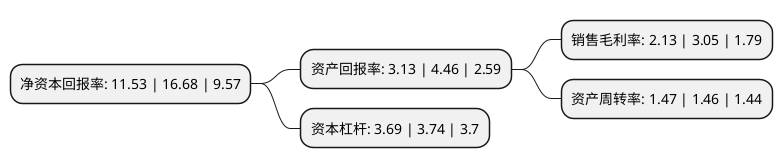

> 本页面由自动化程序生成于 2022年5月20日 01:30
> 内容可能存在错误，如有bug请提交issue至：https://github.com/Eroleice/doc-pi/issues
{.is-warning}

# 上市公司基本情况

## 基本资料

九州通医药集团股份有限公司（以下简称“九州通”）成立于1999年03月09日，武汉市。于2010年11月02日在上交所主板上市。

九州通注册资本187,386.944万元，主营业务为药品，医疗器械等产品的批发，零售连锁及药品生产和研发以及有关增值服务业务。主要产品多潘立酮片(吗丁啉)，氯雷他定片(开瑞坦)，复方氨基酸螯合钙胶囊(乐力)，硝酸咪康唑乳膏(达克宁)，硝苯地平缓释片Ⅱ(伲福达)等;健胃消食片，复方丹参滴丸，感冒灵颗粒，排毒养颜胶囊，脑心通胶囊(步长)等，阿胶，丹参，京牛黄，冬虫夏草，红花等，玻璃体温计(口腔型)，电子血压计，康祝拔罐器，台式血压计，血糖仪等;左炔诺孕酮片(毓婷)，米非司酮片，去氧孕烯炔雌醇片(妈富隆)，米索前列醇片，壬苯醇醚栓(连德尔)等，哈药六牌钙加锌口服液，三精牌葡萄糖酸锌口服液，新盖中盖高钙片(低糖)，碧生源常润茶，朴雪乳酸亚铁口服液，京都念慈菴蜜炼川贝枇杷膏，丁桂儿脐贴(宝宝一贴灵)，桂林西瓜霜(喷剂)，珠珀猴枣散，邦廸防水创可贴等;六神花露水，双飞人爽水，蛇脂维肤膏，半月清腋露等。以下是详细信息：

- 公司名称: 九州通医药集团股份有限公司
- 股票代码: 600998.SH
- 所在地: 湖北 - 武汉市
- 成立日期: 1999年03月09日
- 注册资本: 187,386.944万元
- 法定代表人: 刘长云
- 主营业务: 主营业务为药品，医疗器械等产品的批发，零售连锁及药品生产和研发以及有关增值服务业务主要产品多潘立酮片(吗丁啉)，氯雷他定片(开瑞坦)，复方氨基酸螯合钙胶囊(乐力)，硝酸咪康唑乳膏(达克宁)，硝苯地平缓释片Ⅱ(伲福达)等;健胃消食片，复方丹参滴丸，感冒灵颗粒，排毒养颜胶囊，脑心通胶囊(步长)等，阿胶，丹参，京牛黄，冬虫夏草，红花等，玻璃体温计(口腔型)，电子血压计，康祝拔罐器，台式血压计，血糖仪等;左炔诺孕酮片(毓婷)，米非司酮片，去氧孕烯炔雌醇片(妈富隆)，米索前列醇片，壬苯醇醚栓(连德尔)等，哈药六牌钙加锌口服液，三精牌葡萄糖酸锌口服液，新盖中盖高钙片(低糖)，碧生源常润茶，朴雪乳酸亚铁口服液，京都念慈菴蜜炼川贝枇杷膏，丁桂儿脐贴(宝宝一贴灵)，桂林西瓜霜(喷剂)，珠珀猴枣散，邦廸防水创可贴等;六神花露水，双飞人爽水，蛇脂维肤膏，半月清腋露等
- 公司官网: www.jztey.com
- 公司介绍: 公司是一家以西药、中药、器械为主要经营产品，以医疗机构、批发企业、零售药店为主要客户对象，并为客户提供信息、物流等各项增值服务的大型企业集团。公司坚持打造品牌中药材，建立中药产业集团，围绕“强品牌、强产品、强营销，重基础、重人才、重效益”的经营主线，推动中药产业链五大板块协同发展。公司秉持“技术让服务更卓越”的理念，并致力于现代物流技术和信息技术的开发和应用，通过自行设计、规划、系统集成，广泛使用了具有自主知识产权的仓储管理系统(LMIS)、设备控制系统(WCS)、运输管理系统(TMS)、第三方物流平台、药品监管码采集等系统，是具备独立整合物流规划、物流实施、系统集成能力的医药分销企业，并获得了“中国物流改革开放30年旗帜企业”的荣誉称号。公司近年来获得“国家5A级物流企业”、“湖北省守合同重信用企业”、“中国社会责任感优秀企业”、“湖北企业100强”、“中国民营企业服务业100强”、“中国企业500强”等多项荣誉称号。

## 股东及高管情况

上市公司第一大股东为上海弘康实业投资有限公司，持股404,441,118股，占比21.58%，**疑似为**上市公司实际控制人。

截至2022年04月26日，上市公司的前十大股东中，共有6名机构股东，1个产品账户，3个海外主体，其中5%以上大股东共有6名。上市公司前十大股东明细如下：

> 未能通过持股比例判定出上市公司实际控制人（持股30%以上）
> 可能存在通过间接持股、联合持股、协议控制等方式拥有实际控制权的主体，具体请参考上市公司定期公告！
{.is-warning}

> 截至2022年04月26日，上市公司前十大股东信息如下：

| 股东名称 | 持股数量（股） | 持股比例 |
| --- | --- | --- |
| 上海弘康实业投资有限公司 | 404,441,118 | 21.58% |
| 狮龙国际集团(香港)有限公司 | 213,894,000 | 11.41% |
| 中山广银投资有限公司 | 124,624,583 | 6.65% |
| 北京点金投资有限公司 | 102,763,876 | 5.48% |
| 楚昌投资集团有限公司 | 102,113,898 | 5.45% |
| 中国信达资产管理股份有限公司 | 100,000,000 | 5.34% |
| 楚昌投资-海通证券-19楚昌EB01担保及信托财产专户 | 63,500,000 | 3.39% |
| 楚昌投资-海通证券-19楚昌EB02担保及信托财产专户 | 60,000,000 | 3.2% |
| 香港中央结算有限公司(陆股通) | 37,162,592 | 1.98% |
| 北京博润银泰投资管理有限公司-博润银泰多策略7号私募证券投资基金 | 32,294,523 | 1.72% |

## 利润表分析

上市公司2021年总收入为1,224.07亿元，净利润为26.08亿元，实现盈利。

## 杜邦分析

> 数据列示周期：2021年 | 2020年 | 2019年
{.is-info}

上市公司的净资产收益率在近一年有所下降，下降幅度为-30.88%，其变化情况分解如下：
- 上市公司的销售毛利率在近一年下降了-30.16%，可能是生产效率的下降、商品原材料价格上涨或商品价格的下跌所致。
- 上市公司的资产周转率在近一年上升了0.68%，可能是源自于更快的销售回款或库存管理效果提升。
- 上市公司的财务杠杆比率在近一年下降了-1.34%，可能是减少负债降低财务费用。

