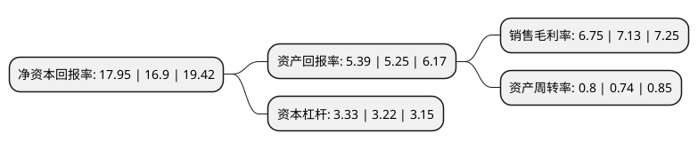

> 本页面由自动化程序生成于 2022年5月20日 01:32
> 内容可能存在错误，如有bug请提交issue至：https://github.com/Eroleice/doc-pi/issues
{.is-warning}

# 上市公司基本情况

## 基本资料

上海润达医疗科技股份有限公司（以下简称“润达医疗”）成立于1999年01月06日，上海市。于2015年05月27日在上交所主板上市。

润达医疗注册资本57,953.84万元，主营业务为主要向各类医学实验室提供体外诊断产品及专业技术支持的综合服务。主要提供产品为体外诊断仪器和配套试剂。以下是详细信息：

- 公司名称: 上海润达医疗科技股份有限公司
- 股票代码: 603108.SH
- 所在地: 上海 - 上海市
- 成立日期: 1999年01月06日
- 注册资本: 57,953.84万元
- 法定代表人: 赵伟东
- 主营业务: 主营业务为主要向各类医学实验室提供体外诊断产品及专业技术支持的综合服务主要提供产品为体外诊断仪器和配套试剂
- 公司官网: www.rundamedical.com
- 公司介绍: 公司是一家立足华东、辐射全国的医学实验室综合服务商，主营业务为通过自有综合服务体系向各类医学实验室提供体外诊断产品及专业技术支持的综合服务。自设立以来，公司一直致力于搭建中国体外诊断产品流通与服务平台，为国内各类型医疗机构提供高品质、全领域的体外诊断综合服务,满足国内各类型医疗机构的个性化需求，目前已成为国内体外诊断产品流通与服务行业的领先企业之一。公司的综合服务体系主要包括较为齐全的产品组合选择方案、专业技术服务团队与服务网络、信息化管理的仓储物流配送系统，能够为各类医学实验室的检验工作提供全方位技术支持服务，也能够为产品供应商提供完善的销售支持及客户渠道管理等综合服务。历经十余年的发展，公司以华东为核心区域构建了区域覆盖面广、客户依赖度高的服务网络和综合服务体系，持续地为两千多家医疗机构的日常检验工作提供全面解决方案，赢得了客户的长期信赖并形成持续合作。

## 股东及高管情况

上市公司第一大股东为杭州市拱墅区国有投资控股集团有限公司，持股116,000,000股，占比20.02%，**疑似为**上市公司实际控制人。

截至2022年03月31日，上市公司的前十大股东中，共有4名自然人股东，3名机构股东，3个产品账户，其中5%以上大股东共有3名。上市公司前十大股东明细如下：

> 未能通过持股比例判定出上市公司实际控制人（持股30%以上）
> 可能存在通过间接持股、联合持股、协议控制等方式拥有实际控制权的主体，具体请参考上市公司定期公告！
{.is-warning}

> 截至2022年03月31日，上市公司前十大股东信息如下：

| 股东名称 | 持股数量（股） | 持股比例 |
| --- | --- | --- |
| 杭州市拱墅区国有投资控股集团有限公司 | 116,000,000 | 20.02% |
| 朱文怡 | 54,938,408 | 9.48% |
| 刘辉 | 42,028,771 | 7.25% |
| 卫明 | 21,461,784 | 3.7% |
| 冯荣 | 16,856,088 | 2.91% |
| 中国建设银行股份有限公司-中欧价值发现股票型证券投资基金 | 16,199,073 | 2.8% |
| 九江昊诚投资管理中心(有限合伙) | 14,989,162 | 2.59% |
| 东营东创投资合伙企业(有限合伙) | 14,989,162 | 2.59% |
| 西藏博恩资产管理有限公司-博恩添富7号私募证券投资基金 | 11,441,704 | 1.97% |
| 中国工商银行股份有限公司-中欧潜力价值灵活配置混合型证券投资基金 | 10,758,890 | 1.86% |

## 利润表分析

上市公司2021年总收入为88.6亿元，净利润为5.98亿元，实现盈利。

## 杜邦分析

> 数据列示周期：2021年 | 2020年 | 2019年
{.is-info}

上市公司的净资产收益率在近一年有所上升，上升幅度为6.21%，其变化情况分解如下：
- 上市公司的销售毛利率在近一年下降了-5.33%，可能是生产效率的下降、商品原材料价格上涨或商品价格的下跌所致。
- 上市公司的资产周转率在近一年上升了8.11%，可能是源自于更快的销售回款或库存管理效果提升。
- 上市公司的财务杠杆比率在近一年上升了3.42%，可能是增加负债扩大生产规模。

