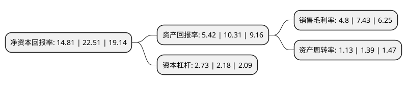

> 本页面由自动化程序生成于 2022年5月20日 01:33
> 内容可能存在错误，如有bug请提交issue至：https://github.com/Eroleice/doc-pi/issues
{.is-warning}

# 上市公司基本情况

## 基本资料

大参林医药集团股份有限公司（以下简称“大参林”）成立于1999年02月12日，广州市。于2017年07月31日在上交所主板上市。

大参林注册资本79,092.962万元，主营业务:专注于中西成药，参茸滋补药材及中药饮片，保健品，医疗器械及其他商品的直营连锁零售业务，致力于为消费者提供优质实惠的健康产品和专业周到的服务。以下是详细信息：

- 公司名称: 大参林医药集团股份有限公司
- 股票代码: 603233.SH
- 所在地: 广东 - 广州市
- 成立日期: 1999年02月12日
- 注册资本: 79,092.962万元
- 法定代表人: 柯云峰
- 主营业务: 主营业务:专注于中西成药，参茸滋补药材及中药饮片，保健品，医疗器械及其他商品的直营连锁零售业务，致力于为消费者提供优质实惠的健康产品和专业周到的服务
- 公司官网: www.dslyy.com
- 公司介绍: 公司是全国规模领先的大型医药零售企业，一直专注于中西成药、参茸滋补药材及中药饮片、保健品、医疗器械及其他商品的直营连锁零售业务，致力于为消费者提供优质实惠的健康产品和专业周到的服务，尤其在参茸滋补药材领域形成了自主品牌为主、覆盖高中低各档次产品、满足不同消费人群需求的业务特色。公司旗下直营或参股门店遍布广东、广西、河南、江西、福建、浙江、贵州、江苏、河北、陕西、内蒙古等国内多个省份，总销售全国排名前列。

## 股东及高管情况

上市公司第一大股东为柯云峰，持股168,466,561股，占比21.3%，**疑似为**上市公司实际控制人。

截至2022年03月31日，上市公司的前十大股东中，共有8名自然人股东，1个产品账户，1个海外主体，其中5%以上大股东共有3名。上市公司前十大股东明细如下：

> 未能通过持股比例判定出上市公司实际控制人（持股30%以上）
> 可能存在通过间接持股、联合持股、协议控制等方式拥有实际控制权的主体，具体请参考上市公司定期公告！
{.is-warning}

> 截至2022年03月31日，上市公司前十大股东信息如下：

| 股东名称 | 持股数量（股） | 持股比例 |
| --- | --- | --- |
| 柯云峰 | 168,466,561 | 21.3% |
| 柯金龙 | 159,466,562 | 20.16% |
| 柯康保 | 123,744,960 | 15.65% |
| 上海高毅资产管理合伙企业(有限合伙)-高毅邻山1号远望基金 | 30,000,000 | 3.79% |
| 柯舟 | 28,480,000 | 3.6% |
| 香港中央结算有限公司(陆股通) | 17,732,936 | 2.24% |
| 宋茗 | 15,318,277 | 1.94% |
| 刘景荣 | 14,924,372 | 1.89% |
| 梁嘉盈 | 8,289,892 | 1.05% |
| 明晓晖 | 7,630,392 | 0.96% |

## 利润表分析

上市公司2021年总收入为167.59亿元，净利润为8.04亿元，实现盈利。

## 杜邦分析

> 数据列示周期：2021年 | 2020年 | 2019年
{.is-info}

上市公司的净资产收益率在近一年有所下降，下降幅度为-34.21%，其变化情况分解如下：
- 上市公司的销售毛利率在近一年下降了-35.4%，可能是生产效率的下降、商品原材料价格上涨或商品价格的下跌所致。
- 上市公司的资产周转率在近一年下降了-18.71%，可能是源自于更慢的销售回款或库存管理效果下降。
- 上市公司的财务杠杆比率在近一年上升了25.23%，可能是增加负债扩大生产规模。

